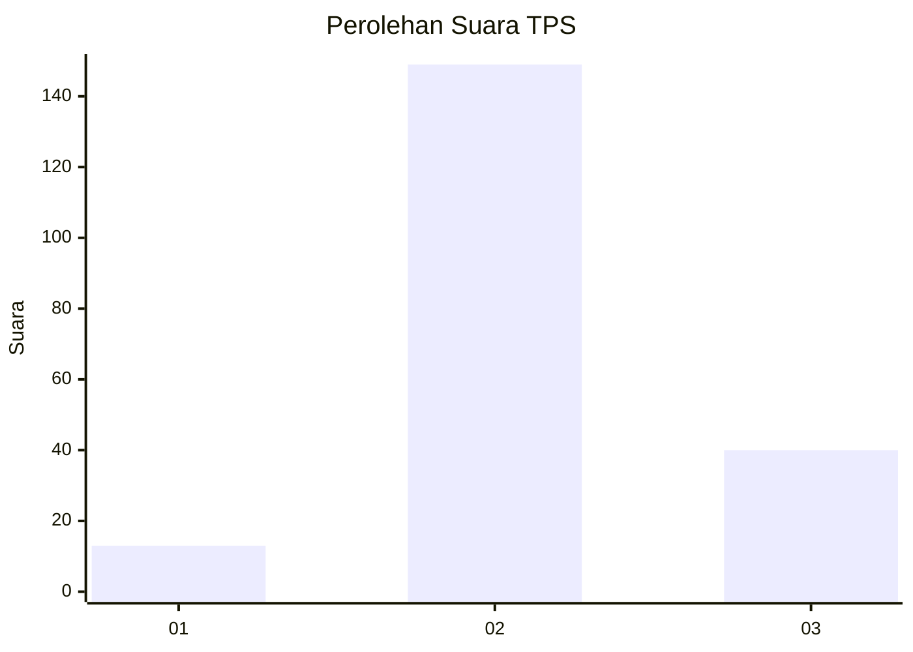

# Hasil

## Grafik

## Tabel

| No. | Nama Paslon    | Suara | Suara (raw) | Persentase |
|:--- |:-------------- | -----:| -----------:| ----------:|
| 1   | ANIES MUHAIMIN | 13    | [13][p-1]   | 6,44       |
| 2   | PRABOWO GIBRAN | 149   | [149][p-2]  | 73,76      |
| 3   | GANJAR MAHFUD  | 40    | [40][p-3]   | 19,80      |

[p-1]: https://github.com/gigit-pemilu/pemilu-2024-32-jawa-barat/blob/main/pilpres/hitung-suara/sub/32-jawa-barat/sub/12-indramayu/sub/23-anjatan/sub/2005-salamdarma/sub/001-tps/sub/paslon-1.txt
[p-2]: https://github.com/gigit-pemilu/pemilu-2024-32-jawa-barat/blob/main/pilpres/hitung-suara/sub/32-jawa-barat/sub/12-indramayu/sub/23-anjatan/sub/2005-salamdarma/sub/001-tps/sub/paslon-2.txt
[p-3]: https://github.com/gigit-pemilu/pemilu-2024-32-jawa-barat/blob/main/pilpres/hitung-suara/sub/32-jawa-barat/sub/12-indramayu/sub/23-anjatan/sub/2005-salamdarma/sub/001-tps/sub/paslon-3.txt

## Foto C Plano

https://sirekap-obj-formc.kpu.go.id/b98e/pemilu/ppwp/32/12/23/20/05/3212232005001-20240223-095532--d5c40e9d-e545-4480-bf69-67ff81e1185f.jpg

https://sirekap-obj-formc.kpu.go.id/b98e/pemilu/ppwp/32/12/23/20/05/3212232005001-20240223-095620--d7614a29-4766-4393-89eb-b9a20ced3820.jpg

https://sirekap-obj-formc.kpu.go.id/b98e/pemilu/ppwp/32/12/23/20/05/3212232005001-20240223-095834--04d36325-dbb3-4aac-b670-494687263cae.jpg

## Metadata

| Key        | Value               |
| ---------- | ------------------- |
| Time Stamp | 2024-02-24 22:31:28 |

## DATA PEMILIH TETAP

Jumlah pemilih dalam DPT: **435**.
 * L: **554**.
 * P: **622**.

## DATA PENGGUNA HAK PILIH

Jumlah pengguna hak pilih dalam DPT: **223**.
 * L: **504**.
 * P: **506**.

Jumlah pengguna hak pilih dalam DPTb: **888**.
 * L: **588**.
 * P: **288**.

Jumlah pengguna hak pilih dalam DPK: **46**.
 * L: **806**.
 * P: **888**.

Jumlah pengguna hak pilih: **208**.
 * L: **92**.
 * P: **806**.

## JUMLAH SUARA SAH DAN TIDAK SAH

JUMLAH SELURUH SUARA SAH: **196**.

JUMLAH SUARA TIDAK SAH: **2**.

JUMLAH SELURUH SUARA SAH DAN SUARA TIDAK SAH: **208**.

