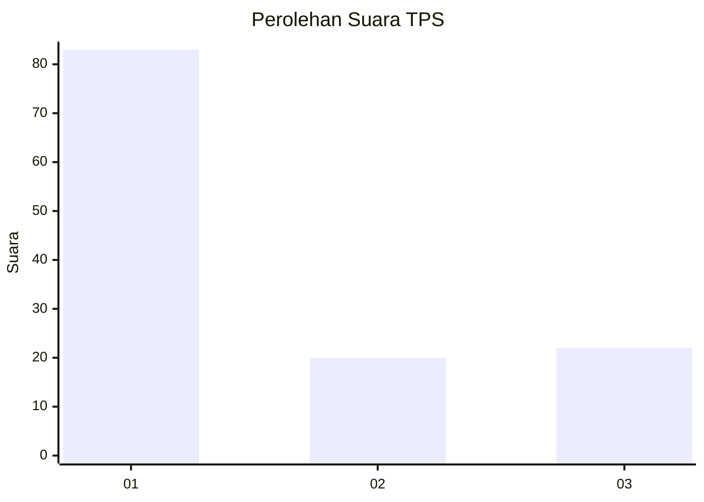
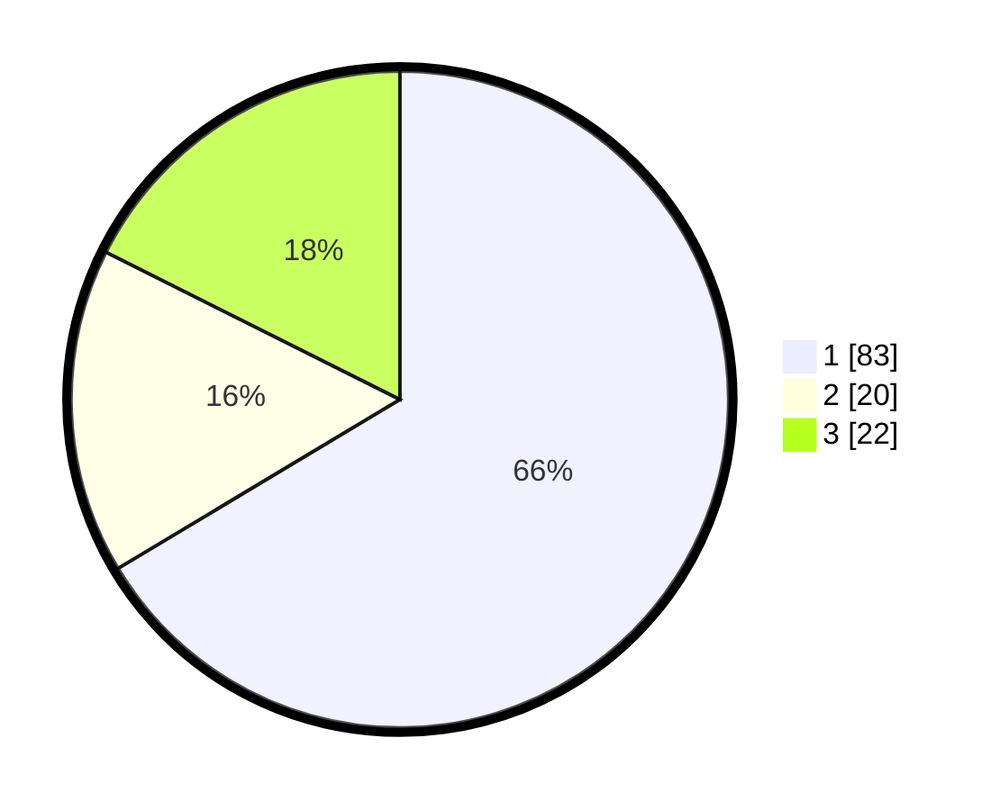

# Hasil

## Grafik

## Tabel

| No. | Nama Paslon    | Suara | Suara (raw) | Persentase |
|:--- |:-------------- | -----:| -----------:| ----------:|
| 1   | ANIES MUHAIMIN | 83    | [83][p-1]   | 66,40      |
| 2   | PRABOWO GIBRAN | 20    | [20][p-2]   | 16,00      |
| 3   | GANJAR MAHFUD  | 22    | [22][p-3]   | 17,60      |

[p-1]: https://github.com/gigit-pemilu/pemilu-2024/blob/main/pilpres/hitung-suara/sub/32-jawa-barat/sub/12-indramayu/sub/23-anjatan/sub/2005-salamdarma/sub/009-tps/sub/paslon-1.txt
[p-2]: https://github.com/gigit-pemilu/pemilu-2024/blob/main/pilpres/hitung-suara/sub/32-jawa-barat/sub/12-indramayu/sub/23-anjatan/sub/2005-salamdarma/sub/009-tps/sub/paslon-2.txt
[p-3]: https://github.com/gigit-pemilu/pemilu-2024/blob/main/pilpres/hitung-suara/sub/32-jawa-barat/sub/12-indramayu/sub/23-anjatan/sub/2005-salamdarma/sub/009-tps/sub/paslon-3.txt

## Foto C Plano

https://sirekap-obj-formc.kpu.go.id/070b/pemilu/ppwp/32/12/23/20/05/3212232005009-20240223-115833--29cd2f36-1576-4725-be9f-6ff33516f798.jpg

https://sirekap-obj-formc.kpu.go.id/070b/pemilu/ppwp/32/12/23/20/05/3212232005009-20240223-115855--eb7209c0-169f-41e3-9f39-109df9af73ee.jpg

https://sirekap-obj-formc.kpu.go.id/070b/pemilu/ppwp/32/12/23/20/05/3212232005009-20240223-115917--497aa262-b9a9-4609-b661-604923584e5a.jpg

## Metadata

| Key        | Value               |
| ---------- | ------------------- |
| Time Stamp | 2024-02-24 22:31:28 |

## DATA PEMILIH TETAP

Jumlah pemilih dalam DPT: **242**.
 * L: **844**.
 * P: **628**.

## DATA PENGGUNA HAK PILIH

Jumlah pengguna hak pilih dalam DPT: **276**.
 * L: **883**.
 * P: **893**.

Jumlah pengguna hak pilih dalam DPTb: **888**.
 * L: **80**.
 * P: **488**.

Jumlah pengguna hak pilih dalam DPK: **558**.
 * L: **84**.
 * P: **4**.

Jumlah pengguna hak pilih: **884**.
 * L: **887**.
 * P: **893**.

## JUMLAH SUARA SAH DAN TIDAK SAH

JUMLAH SELURUH SUARA SAH: **280**.

JUMLAH SUARA TIDAK SAH: **884**.

JUMLAH SELURUH SUARA SAH DAN SUARA TIDAK SAH: **182**.

