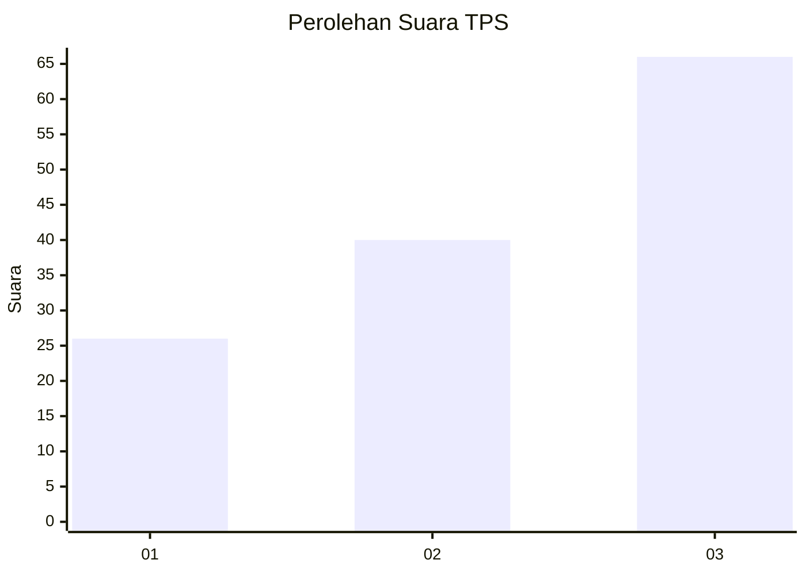
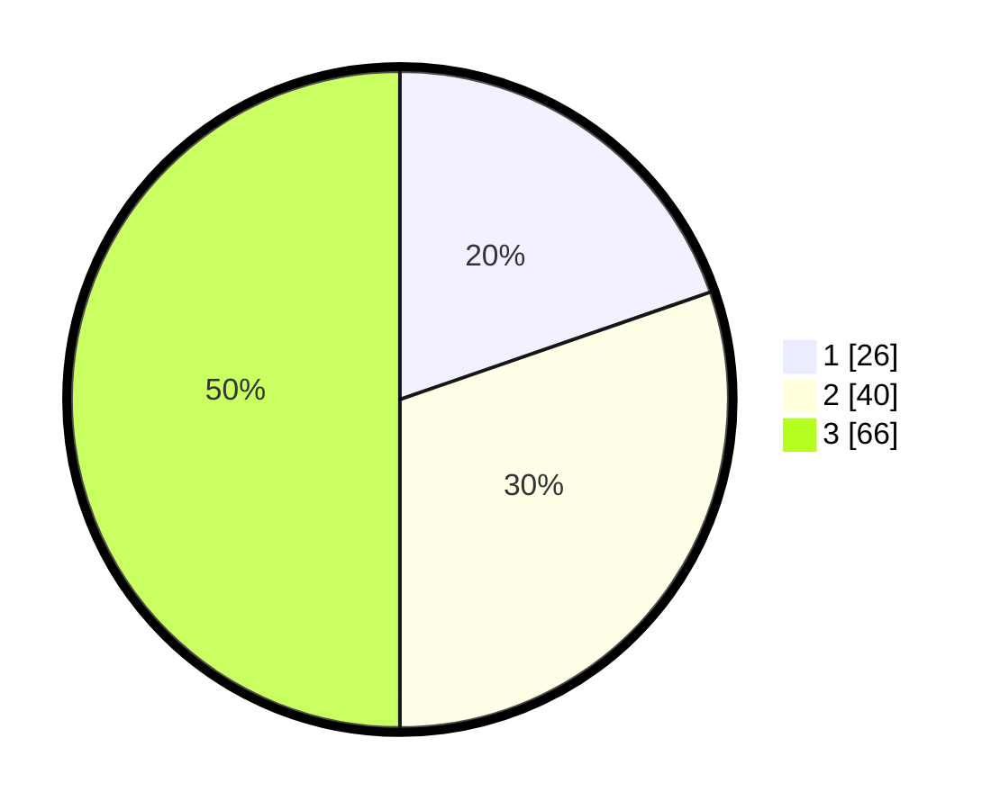

# Hasil

## Grafik

## Tabel

| No. | Nama Paslon    | Suara | Suara (raw) | Persentase |
|:--- |:-------------- | -----:| -----------:| ----------:|
| 1   | ANIES MUHAIMIN | 26    | [26][p-1]   | 19,70      |
| 2   | PRABOWO GIBRAN | 40    | [40][p-2]   | 30,30      |
| 3   | GANJAR MAHFUD  | 66    | [66][p-3]   | 50,00      |

[p-1]: https://github.com/gigit-pemilu/pemilu-2024-32-jawa-barat/blob/main/pilpres/hitung-suara/sub/32-jawa-barat/sub/12-indramayu/sub/23-anjatan/sub/2005-salamdarma/sub/013-tps/sub/paslon-1.txt
[p-2]: https://github.com/gigit-pemilu/pemilu-2024-32-jawa-barat/blob/main/pilpres/hitung-suara/sub/32-jawa-barat/sub/12-indramayu/sub/23-anjatan/sub/2005-salamdarma/sub/013-tps/sub/paslon-2.txt
[p-3]: https://github.com/gigit-pemilu/pemilu-2024-32-jawa-barat/blob/main/pilpres/hitung-suara/sub/32-jawa-barat/sub/12-indramayu/sub/23-anjatan/sub/2005-salamdarma/sub/013-tps/sub/paslon-3.txt

## Foto C Plano

https://sirekap-obj-formc.kpu.go.id/cd25/pemilu/ppwp/32/12/23/20/05/3212232005013-20240222-204647--ea1371b0-217a-42ec-9d41-e0b489337069.jpg

https://sirekap-obj-formc.kpu.go.id/cd25/pemilu/ppwp/32/12/23/20/05/3212232005013-20240222-204756--f5f597ec-d15f-483d-9ea6-4537f9415c1b.jpg

https://sirekap-obj-formc.kpu.go.id/cd25/pemilu/ppwp/32/12/23/20/05/3212232005013-20240222-204847--a5003e27-dc69-477e-b07b-ca47b0f8c352.jpg

## Metadata

| Key        | Value               |
| ---------- | ------------------- |
| Time Stamp | 2024-02-22 21:00:00 |

## DATA PEMILIH TETAP

Jumlah pemilih dalam DPT: **292**.
 * L: **445**.
 * P: **58**.

## DATA PENGGUNA HAK PILIH

Jumlah pengguna hak pilih dalam DPT: **245**.
 * L: **898**.
 * P: **880**.

Jumlah pengguna hak pilih dalam DPTb: **88**.
 * L: **8**.
 * P: **0**.

Jumlah pengguna hak pilih dalam DPK: **8**.
 * L: **88**.
 * P: **88**.

Jumlah pengguna hak pilih: **238**.
 * L: **663**.
 * P: **470**.

## JUMLAH SUARA SAH DAN TIDAK SAH

JUMLAH SELURUH SUARA SAH: **202**.

JUMLAH SUARA TIDAK SAH: **9**.

JUMLAH SELURUH SUARA SAH DAN SUARA TIDAK SAH: **241**.

