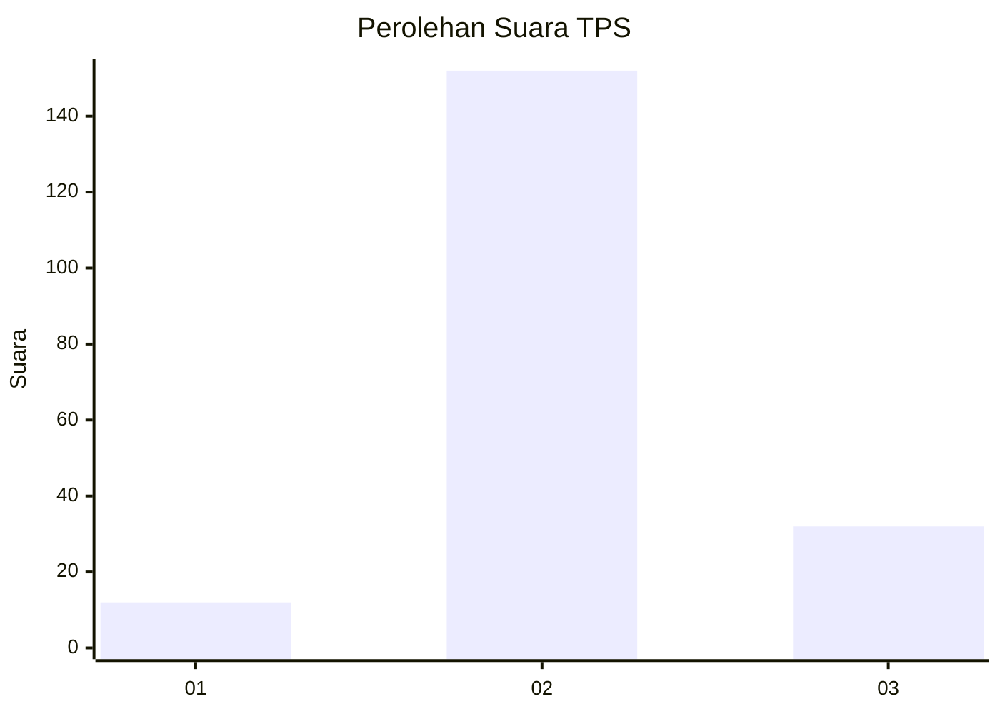
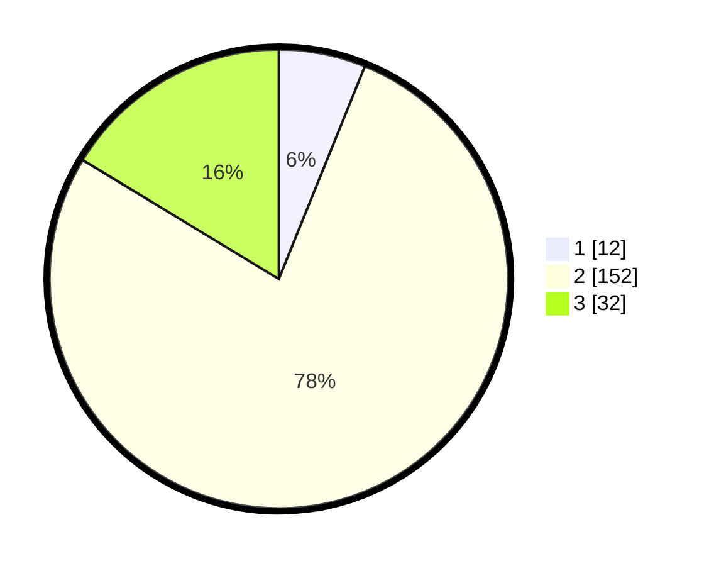

# Hasil

## Grafik

## Tabel

| No. | Nama Paslon    | Suara | Suara (raw) | Persentase |
|:--- |:-------------- | -----:| -----------:| ----------:|
| 1   | ANIES MUHAIMIN | 12    | [12][p-1]   | 6,12       |
| 2   | PRABOWO GIBRAN | 152   | [152][p-2]  | 77,55      |
| 3   | GANJAR MAHFUD  | 32    | [32][p-3]   | 16,33      |

[p-1]: https://github.com/gigit-pemilu/pemilu-2024/blob/main/pilpres/hitung-suara/sub/32-jawa-barat/sub/12-indramayu/sub/24-sukra/sub/2001-bogor/sub/003-tps/sub/paslon-1.txt
[p-2]: https://github.com/gigit-pemilu/pemilu-2024/blob/main/pilpres/hitung-suara/sub/32-jawa-barat/sub/12-indramayu/sub/24-sukra/sub/2001-bogor/sub/003-tps/sub/paslon-2.txt
[p-3]: https://github.com/gigit-pemilu/pemilu-2024/blob/main/pilpres/hitung-suara/sub/32-jawa-barat/sub/12-indramayu/sub/24-sukra/sub/2001-bogor/sub/003-tps/sub/paslon-3.txt

## Foto C Plano

https://sirekap-obj-formc.kpu.go.id/73d0/pemilu/ppwp/32/12/24/20/01/3212242001003-20240219-102125--9d48ab1d-f9c4-414e-a057-e238119b5c48.jpg

https://sirekap-obj-formc.kpu.go.id/73d0/pemilu/ppwp/32/12/24/20/01/3212242001003-20240219-102517--be557b74-1414-4f30-b753-a4a29ac56a92.jpg

https://sirekap-obj-formc.kpu.go.id/73d0/pemilu/ppwp/32/12/24/20/01/3212242001003-20240219-102556--ea046abf-f27c-47f9-9330-a1465a6086d1.jpg

## Metadata

| Key        | Value               |
| ---------- | ------------------- |
| Time Stamp | 2024-02-20 16:00:00 |

