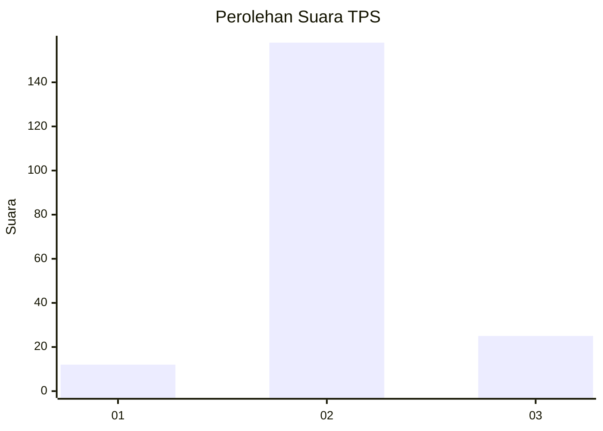
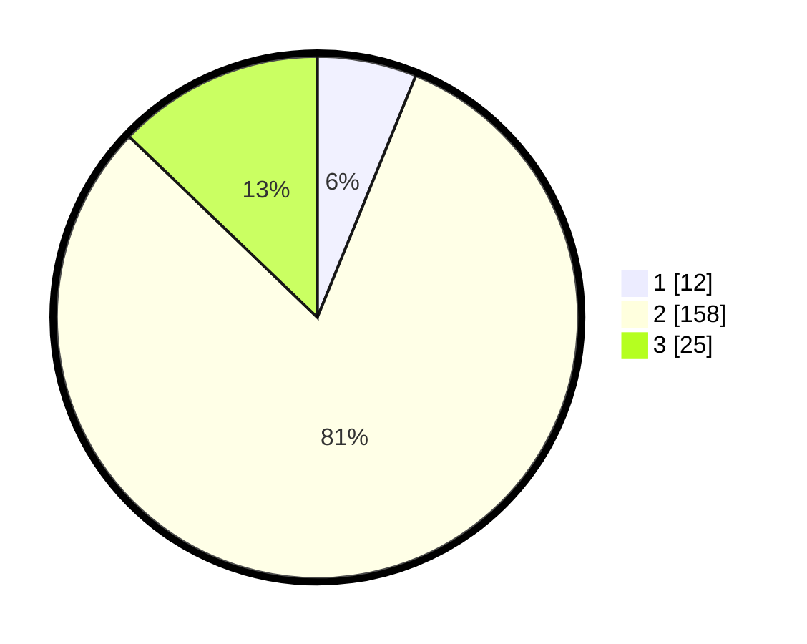

# Hasil

## Grafik

## Tabel

| No. | Nama Paslon    | Suara | Suara (raw) | Persentase |
|:--- |:-------------- | -----:| -----------:| ----------:|
| 1   | ANIES MUHAIMIN | 12    | [12][p-1]   | 6,15       |
| 2   | PRABOWO GIBRAN | 158   | [158][p-2]  | 81,03      |
| 3   | GANJAR MAHFUD  | 25    | [25][p-3]   | 12,82      |

[p-1]: https://github.com/gigit-pemilu/pemilu-2024-32-jawa-barat/blob/main/pilpres/hitung-suara/sub/32-jawa-barat/sub/12-indramayu/sub/24-sukra/sub/2001-bogor/sub/004-tps/sub/paslon-1.txt
[p-2]: https://github.com/gigit-pemilu/pemilu-2024-32-jawa-barat/blob/main/pilpres/hitung-suara/sub/32-jawa-barat/sub/12-indramayu/sub/24-sukra/sub/2001-bogor/sub/004-tps/sub/paslon-2.txt
[p-3]: https://github.com/gigit-pemilu/pemilu-2024-32-jawa-barat/blob/main/pilpres/hitung-suara/sub/32-jawa-barat/sub/12-indramayu/sub/24-sukra/sub/2001-bogor/sub/004-tps/sub/paslon-3.txt

## Foto C Plano

https://sirekap-obj-formc.kpu.go.id/72a9/pemilu/ppwp/32/12/24/20/01/3212242001004-20240219-103236--b764e843-b4f5-4e53-beac-52602b49c245.jpg

https://sirekap-obj-formc.kpu.go.id/72a9/pemilu/ppwp/32/12/24/20/01/3212242001004-20240219-103516--ed7a842f-a189-4c76-ac3e-9e21ea47a62f.jpg

https://sirekap-obj-formc.kpu.go.id/72a9/pemilu/ppwp/32/12/24/20/01/3212242001004-20240219-103713--bd53b950-c57e-4de4-8aad-4d5a2f4d72e0.jpg

## Metadata

| Key        | Value               |
| ---------- | ------------------- |
| Time Stamp | 2024-02-20 16:00:00 |

