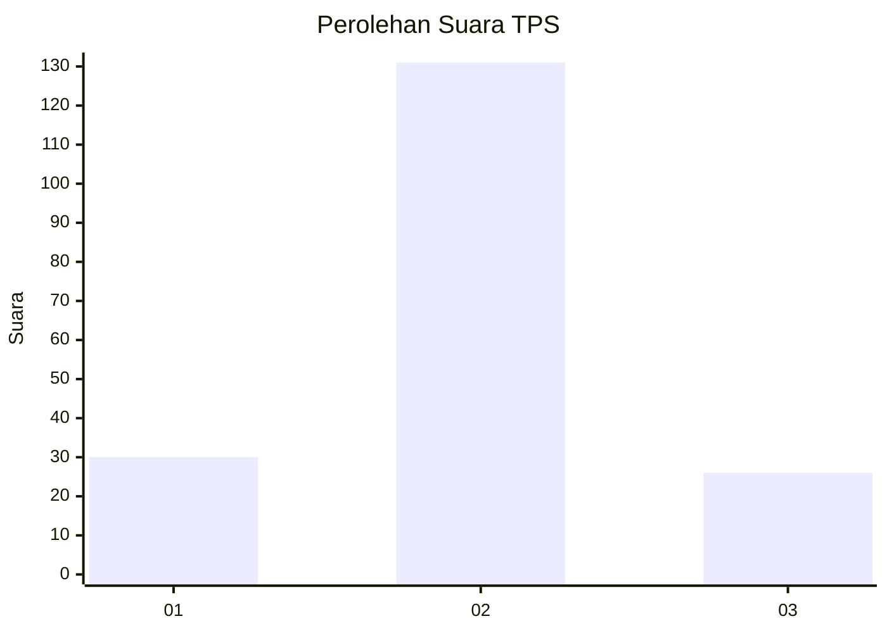

# Hasil

## Grafik

## Tabel

| No. | Nama Paslon    | Suara | Suara (raw) | Persentase |
|:--- |:-------------- | -----:| -----------:| ----------:|
| 1   | ANIES MUHAIMIN | 30    | [30][p-1]   | 16,04      |
| 2   | PRABOWO GIBRAN | 131   | [131][p-2]  | 70,05      |
| 3   | GANJAR MAHFUD  | 26    | [26][p-3]   | 13,90      |

[p-1]: https://github.com/gigit-pemilu/pemilu-2024-32-jawa-barat/blob/main/pilpres/hitung-suara/sub/32-jawa-barat/sub/12-indramayu/sub/24-sukra/sub/2001-bogor/sub/006-tps/sub/paslon-1.txt
[p-2]: https://github.com/gigit-pemilu/pemilu-2024-32-jawa-barat/blob/main/pilpres/hitung-suara/sub/32-jawa-barat/sub/12-indramayu/sub/24-sukra/sub/2001-bogor/sub/006-tps/sub/paslon-2.txt
[p-3]: https://github.com/gigit-pemilu/pemilu-2024-32-jawa-barat/blob/main/pilpres/hitung-suara/sub/32-jawa-barat/sub/12-indramayu/sub/24-sukra/sub/2001-bogor/sub/006-tps/sub/paslon-3.txt

## Foto C Plano

https://sirekap-obj-formc.kpu.go.id/786b/pemilu/ppwp/32/12/24/20/01/3212242001006-20240219-105154--dd942372-cfc8-4bd8-acc4-c5eafe7471cf.jpg

https://sirekap-obj-formc.kpu.go.id/786b/pemilu/ppwp/32/12/24/20/01/3212242001006-20240219-105231--1c0c3657-b016-4301-a38c-6ea214e396b5.jpg

https://sirekap-obj-formc.kpu.go.id/786b/pemilu/ppwp/32/12/24/20/01/3212242001006-20240219-105324--1f7264a6-6571-4739-8f59-ca54b80a39cc.jpg

## Metadata

| Key        | Value               |
| ---------- | ------------------- |
| Time Stamp | 2024-02-20 16:00:00 |

