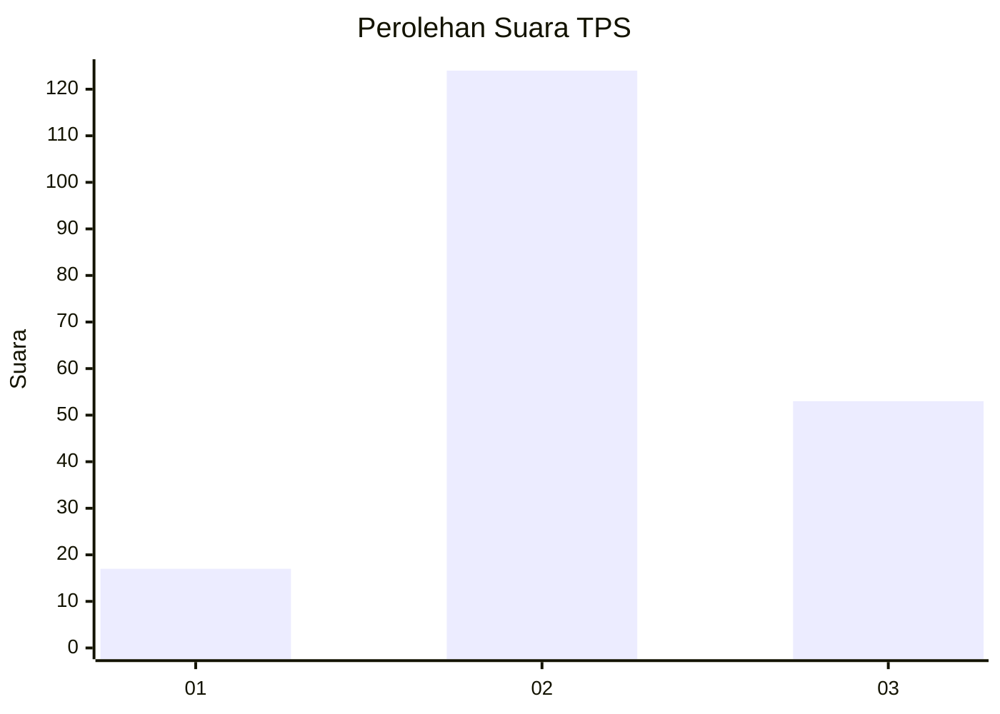
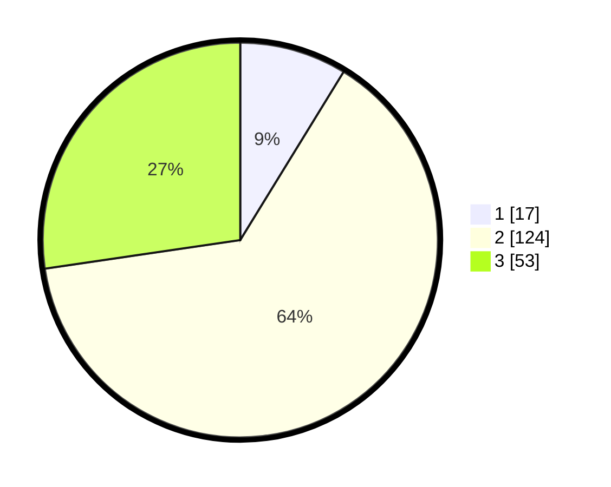

# Hasil

## Grafik

## Tabel

| No. | Nama Paslon    | Suara | Suara (raw) | Persentase |
|:--- |:-------------- | -----:| -----------:| ----------:|
| 1   | ANIES MUHAIMIN | 17    | [17][p-1]   | 8,76       |
| 2   | PRABOWO GIBRAN | 124   | [124][p-2]  | 63,92      |
| 3   | GANJAR MAHFUD  | 53    | [53][p-3]   | 27,32      |

[p-1]: https://github.com/gigit-pemilu/pemilu-2024-32-jawa-barat/blob/main/pilpres/hitung-suara/sub/32-jawa-barat/sub/12-indramayu/sub/24-sukra/sub/2001-bogor/sub/007-tps/sub/paslon-1.txt
[p-2]: https://github.com/gigit-pemilu/pemilu-2024-32-jawa-barat/blob/main/pilpres/hitung-suara/sub/32-jawa-barat/sub/12-indramayu/sub/24-sukra/sub/2001-bogor/sub/007-tps/sub/paslon-2.txt
[p-3]: https://github.com/gigit-pemilu/pemilu-2024-32-jawa-barat/blob/main/pilpres/hitung-suara/sub/32-jawa-barat/sub/12-indramayu/sub/24-sukra/sub/2001-bogor/sub/007-tps/sub/paslon-3.txt

## Foto C Plano

https://sirekap-obj-formc.kpu.go.id/f45f/pemilu/ppwp/32/12/24/20/01/3212242001007-20240219-105252--18929d37-68f4-4ddd-8384-6fa302c8e211.jpg

https://sirekap-obj-formc.kpu.go.id/f45f/pemilu/ppwp/32/12/24/20/01/3212242001007-20240219-105340--76867fe4-213d-45e7-acad-17a9a1cf16b0.jpg

https://sirekap-obj-formc.kpu.go.id/f45f/pemilu/ppwp/32/12/24/20/01/3212242001007-20240219-105424--89c361ad-ed39-47ff-b2b9-efb8f93ebecb.jpg

## Metadata

| Key        | Value               |
| ---------- | ------------------- |
| Time Stamp | 2024-02-20 16:00:00 |

