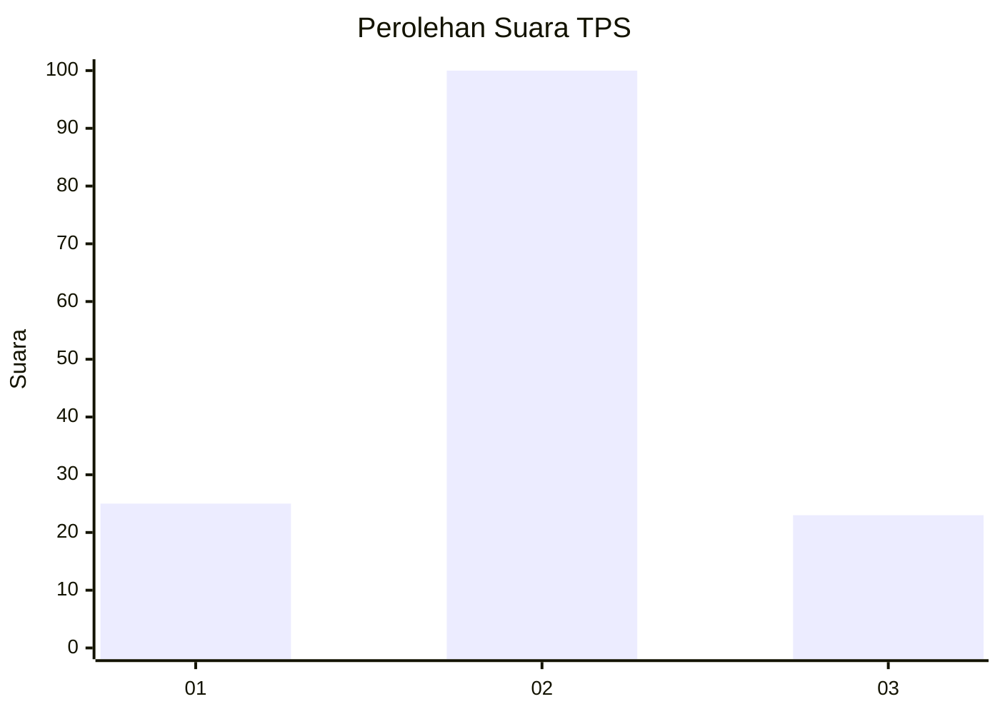
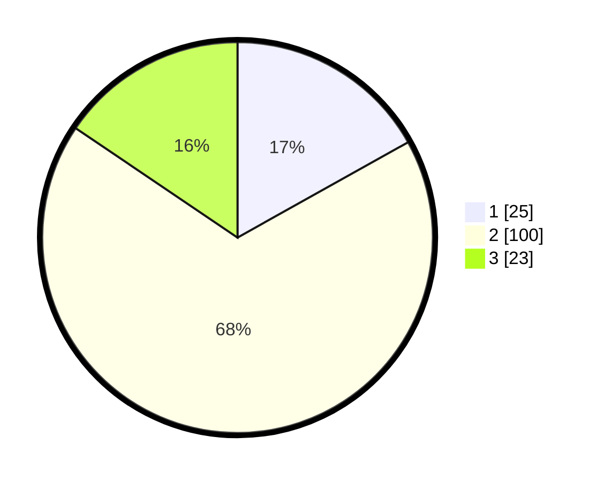

# Hasil

## Grafik

## Tabel

| No. | Nama Paslon    | Suara | Suara (raw) | Persentase |
|:--- |:-------------- | -----:| -----------:| ----------:|
| 1   | ANIES MUHAIMIN | 25    | [25][p-1]   | 16,89      |
| 2   | PRABOWO GIBRAN | 100   | [100][p-2]  | 67,57      |
| 3   | GANJAR MAHFUD  | 23    | [23][p-3]   | 15,54      |

[p-1]: https://github.com/gigit-pemilu/pemilu-2024/blob/main/pilpres/hitung-suara/sub/32-jawa-barat/sub/12-indramayu/sub/24-sukra/sub/2002-sukra/sub/007-tps/sub/paslon-1.txt
[p-2]: https://github.com/gigit-pemilu/pemilu-2024/blob/main/pilpres/hitung-suara/sub/32-jawa-barat/sub/12-indramayu/sub/24-sukra/sub/2002-sukra/sub/007-tps/sub/paslon-2.txt
[p-3]: https://github.com/gigit-pemilu/pemilu-2024/blob/main/pilpres/hitung-suara/sub/32-jawa-barat/sub/12-indramayu/sub/24-sukra/sub/2002-sukra/sub/007-tps/sub/paslon-3.txt

## Foto C Plano

https://sirekap-obj-formc.kpu.go.id/06d2/pemilu/ppwp/32/12/24/20/02/3212242002007-20240219-105628--8c91dd42-0b6d-4f88-8f35-2b61d240a2fd.jpg

https://sirekap-obj-formc.kpu.go.id/06d2/pemilu/ppwp/32/12/24/20/02/3212242002007-20240219-105713--1d1a2b41-0128-48f4-9a05-b9b3424788bd.jpg

https://sirekap-obj-formc.kpu.go.id/06d2/pemilu/ppwp/32/12/24/20/02/3212242002007-20240219-105755--8653bc90-ead1-4d8b-8d60-d88bb1e0fb14.jpg

## Metadata

| Key        | Value               |
| ---------- | ------------------- |
| Time Stamp | 2024-02-20 16:00:00 |

