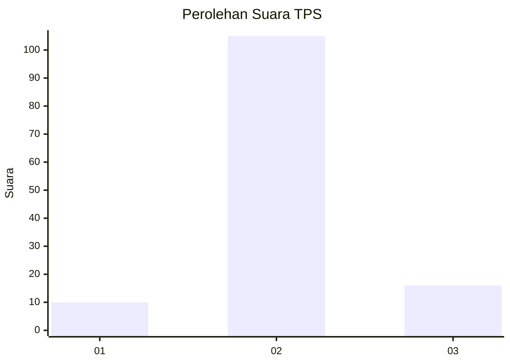
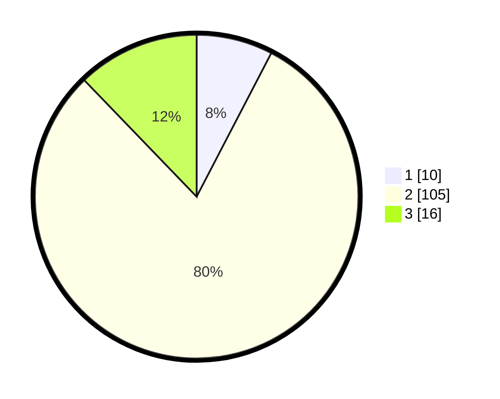

# Hasil

## Grafik

## Tabel

| No. | Nama Paslon    | Suara | Suara (raw) | Persentase |
|:--- |:-------------- | -----:| -----------:| ----------:|
| 1   | ANIES MUHAIMIN | 10    | [10][p-1]   | 7,63       |
| 2   | PRABOWO GIBRAN | 105   | [105][p-2]  | 80,15      |
| 3   | GANJAR MAHFUD  | 16    | [16][p-3]   | 12,21      |

[p-1]: https://github.com/gigit-pemilu/pemilu-2024/blob/main/pilpres/hitung-suara/sub/32-jawa-barat/sub/12-indramayu/sub/24-sukra/sub/2003-ujunggebang/sub/006-tps/sub/paslon-1.txt
[p-2]: https://github.com/gigit-pemilu/pemilu-2024/blob/main/pilpres/hitung-suara/sub/32-jawa-barat/sub/12-indramayu/sub/24-sukra/sub/2003-ujunggebang/sub/006-tps/sub/paslon-2.txt
[p-3]: https://github.com/gigit-pemilu/pemilu-2024/blob/main/pilpres/hitung-suara/sub/32-jawa-barat/sub/12-indramayu/sub/24-sukra/sub/2003-ujunggebang/sub/006-tps/sub/paslon-3.txt

## Foto C Plano

https://sirekap-obj-formc.kpu.go.id/3e3b/pemilu/ppwp/32/12/24/20/03/3212242003006-20240214-230310--7845bb63-c999-470f-bcc5-6d036c1262c9.jpg

https://sirekap-obj-formc.kpu.go.id/3e3b/pemilu/ppwp/32/12/24/20/03/3212242003006-20240214-210709--98f321bb-ad86-4bce-83a2-e55b749c3635.jpg

https://sirekap-obj-formc.kpu.go.id/3e3b/pemilu/ppwp/32/12/24/20/03/3212242003006-20240214-141636--eae788d8-9282-4fad-9493-71af5af4a0db.jpg

## Metadata

| Key        | Value               |
| ---------- | ------------------- |
| Time Stamp | 2024-02-15 00:41:44 |

