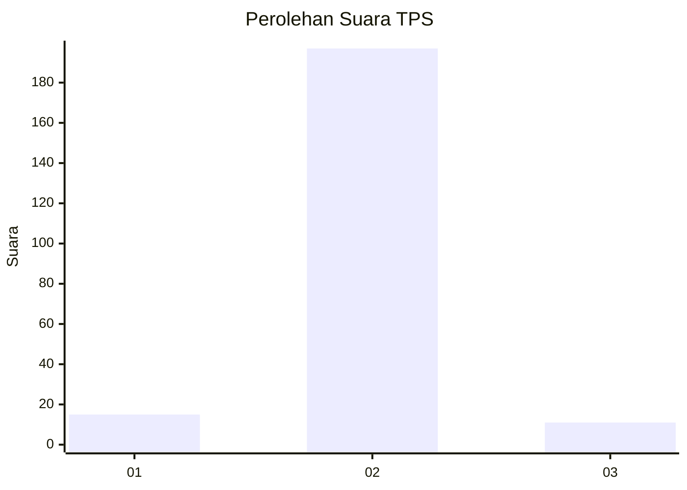
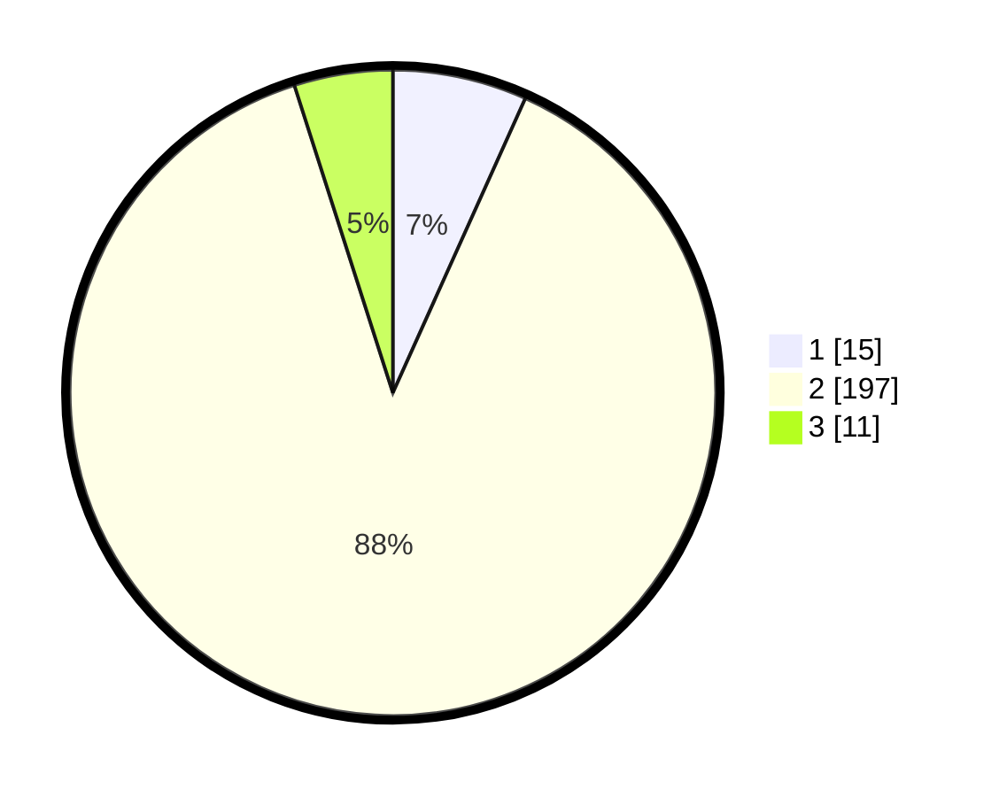

# Hasil

## Grafik

## Tabel

| No. | Nama Paslon    | Suara | Suara (raw) | Persentase |
|:--- |:-------------- | -----:| -----------:| ----------:|
| 1   | ANIES MUHAIMIN | 15    | [15][p-1]   | 6,73       |
| 2   | PRABOWO GIBRAN | 197   | [197][p-2]  | 88,34      |
| 3   | GANJAR MAHFUD  | 11    | [11][p-3]   | 4,93       |

[p-1]: https://github.com/gigit-pemilu/pemilu-2024-32-jawa-barat/blob/main/pilpres/hitung-suara/sub/32-jawa-barat/sub/12-indramayu/sub/25-gantar/sub/2001-bantarwaru/sub/001-tps/sub/paslon-1.txt
[p-2]: https://github.com/gigit-pemilu/pemilu-2024-32-jawa-barat/blob/main/pilpres/hitung-suara/sub/32-jawa-barat/sub/12-indramayu/sub/25-gantar/sub/2001-bantarwaru/sub/001-tps/sub/paslon-2.txt
[p-3]: https://github.com/gigit-pemilu/pemilu-2024-32-jawa-barat/blob/main/pilpres/hitung-suara/sub/32-jawa-barat/sub/12-indramayu/sub/25-gantar/sub/2001-bantarwaru/sub/001-tps/sub/paslon-3.txt

## Foto C Plano

https://sirekap-obj-formc.kpu.go.id/bfe5/pemilu/ppwp/32/12/25/20/01/3212252001001-20240214-141000--b505f31d-8fc6-4ed0-9272-589b8fb70d33.jpg

https://sirekap-obj-formc.kpu.go.id/bfe5/pemilu/ppwp/32/12/25/20/01/3212252001001-20240214-141704--8eafd638-c801-4130-959d-f94fe5dc08e1.jpg

https://sirekap-obj-formc.kpu.go.id/bfe5/pemilu/ppwp/32/12/25/20/01/3212252001001-20240214-141212--ab4c4adb-264b-4401-b18e-762810877242.jpg

## Metadata

| Key        | Value               |
| ---------- | ------------------- |
| Time Stamp | 2024-02-16 00:30:27 |

