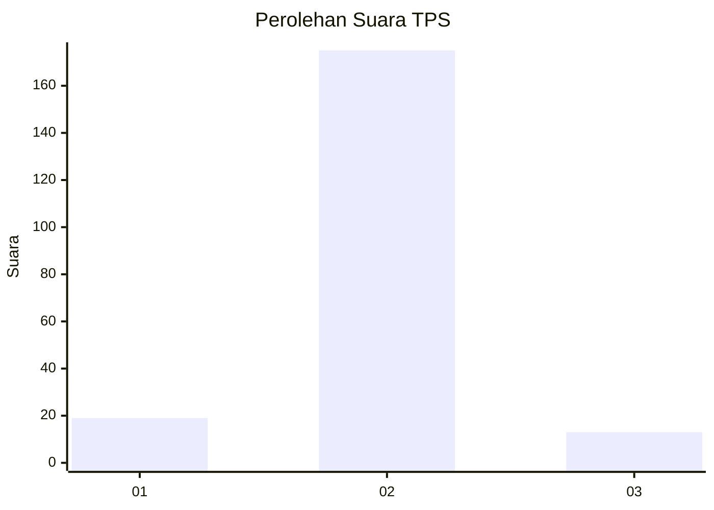
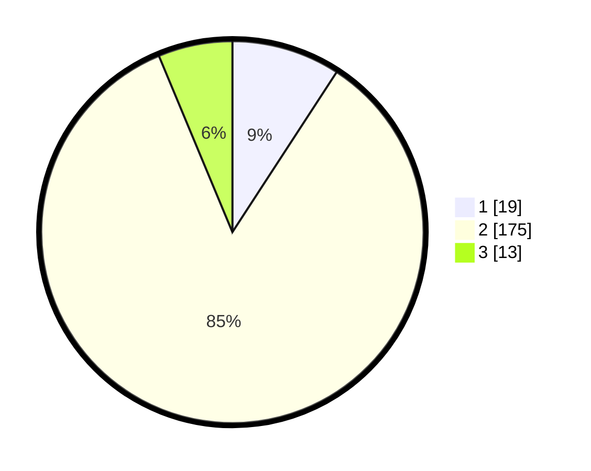

# Hasil

## Grafik

## Tabel

| No. | Nama Paslon    | Suara | Suara (raw) | Persentase |
|:--- |:-------------- | -----:| -----------:| ----------:|
| 1   | ANIES MUHAIMIN | 19    | [19][p-1]   | 9,18       |
| 2   | PRABOWO GIBRAN | 175   | [175][p-2]  | 84,54      |
| 3   | GANJAR MAHFUD  | 13    | [13][p-3]   | 6,28       |

[p-1]: https://github.com/gigit-pemilu/pemilu-2024/blob/main/pilpres/hitung-suara/sub/32-jawa-barat/sub/12-indramayu/sub/25-gantar/sub/2001-bantarwaru/sub/002-tps/sub/paslon-1.txt
[p-2]: https://github.com/gigit-pemilu/pemilu-2024/blob/main/pilpres/hitung-suara/sub/32-jawa-barat/sub/12-indramayu/sub/25-gantar/sub/2001-bantarwaru/sub/002-tps/sub/paslon-2.txt
[p-3]: https://github.com/gigit-pemilu/pemilu-2024/blob/main/pilpres/hitung-suara/sub/32-jawa-barat/sub/12-indramayu/sub/25-gantar/sub/2001-bantarwaru/sub/002-tps/sub/paslon-3.txt

## Foto C Plano

https://sirekap-obj-formc.kpu.go.id/0a61/pemilu/ppwp/32/12/25/20/01/3212252001002-20240218-135626--b06ec7d1-f960-4b9a-ae77-0a4a9a1cd666.jpg

https://sirekap-obj-formc.kpu.go.id/0a61/pemilu/ppwp/32/12/25/20/01/3212252001002-20240218-135651--6ec82613-a6b4-45aa-9569-7c5fd0142865.jpg

https://sirekap-obj-formc.kpu.go.id/0a61/pemilu/ppwp/32/12/25/20/01/3212252001002-20240218-135716--d3b34d9f-111b-44a6-96cc-17e388ee70f9.jpg

## Metadata

| Key        | Value               |
| ---------- | ------------------- |
| Time Stamp | 2024-02-20 11:00:00 |

