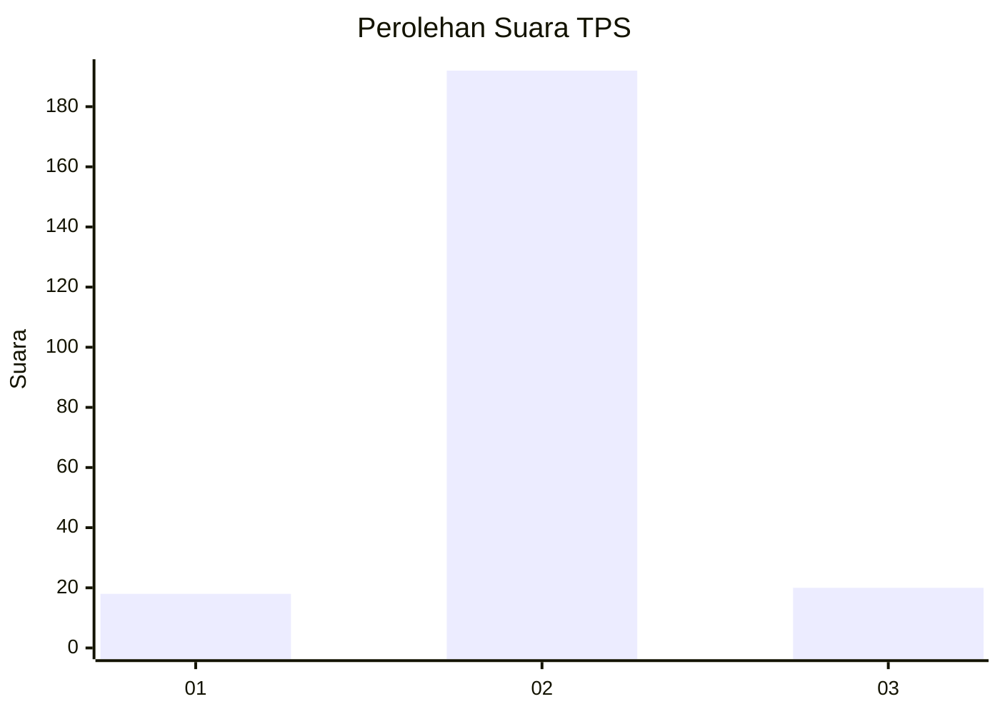
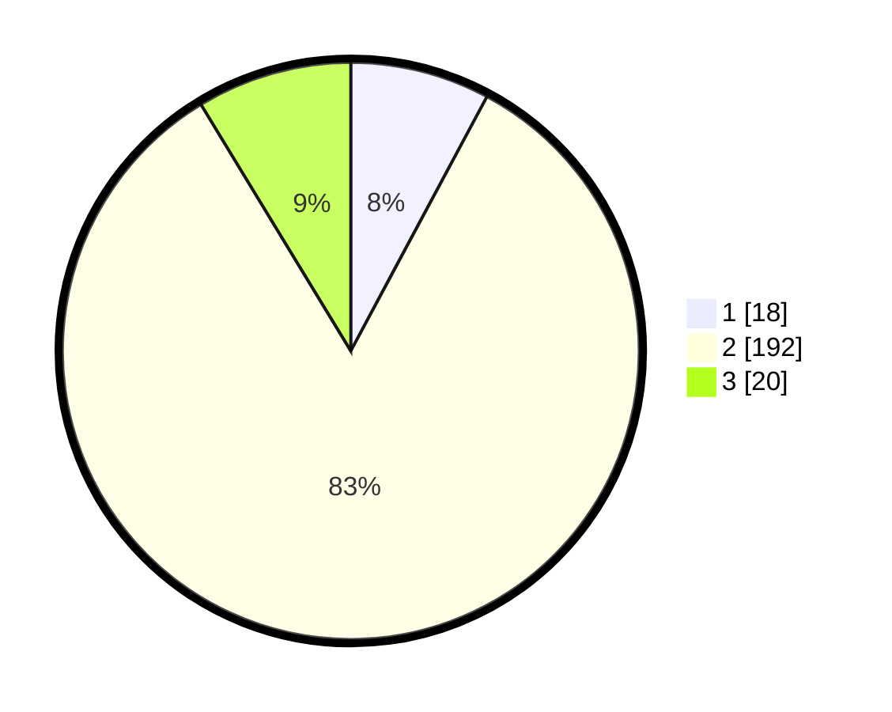

# Hasil

## Grafik

## Tabel

| No. | Nama Paslon    | Suara | Suara (raw) | Persentase |
|:--- |:-------------- | -----:| -----------:| ----------:|
| 1   | ANIES MUHAIMIN | 18    | [18][p-1]   | 7,83       |
| 2   | PRABOWO GIBRAN | 192   | [192][p-2]  | 83,48      |
| 3   | GANJAR MAHFUD  | 20    | [20][p-3]   | 8,70       |

[p-1]: https://github.com/gigit-pemilu/pemilu-2024/blob/main/pilpres/hitung-suara/sub/32-jawa-barat/sub/12-indramayu/sub/25-gantar/sub/2001-bantarwaru/sub/003-tps/sub/paslon-1.txt
[p-2]: https://github.com/gigit-pemilu/pemilu-2024/blob/main/pilpres/hitung-suara/sub/32-jawa-barat/sub/12-indramayu/sub/25-gantar/sub/2001-bantarwaru/sub/003-tps/sub/paslon-2.txt
[p-3]: https://github.com/gigit-pemilu/pemilu-2024/blob/main/pilpres/hitung-suara/sub/32-jawa-barat/sub/12-indramayu/sub/25-gantar/sub/2001-bantarwaru/sub/003-tps/sub/paslon-3.txt

## Foto C Plano

https://sirekap-obj-formc.kpu.go.id/318a/pemilu/ppwp/32/12/25/20/01/3212252001003-20240218-152156--6de29b0f-a1a7-42cd-8863-297df18b8c53.jpg

https://sirekap-obj-formc.kpu.go.id/318a/pemilu/ppwp/32/12/25/20/01/3212252001003-20240218-152231--f6936212-e696-4a71-9ac0-df707e921bc7.jpg

https://sirekap-obj-formc.kpu.go.id/318a/pemilu/ppwp/32/12/25/20/01/3212252001003-20240218-152343--0e970203-67e5-4421-98cb-6c6befed397d.jpg

## Metadata

| Key        | Value               |
| ---------- | ------------------- |
| Time Stamp | 2024-02-20 11:00:00 |

