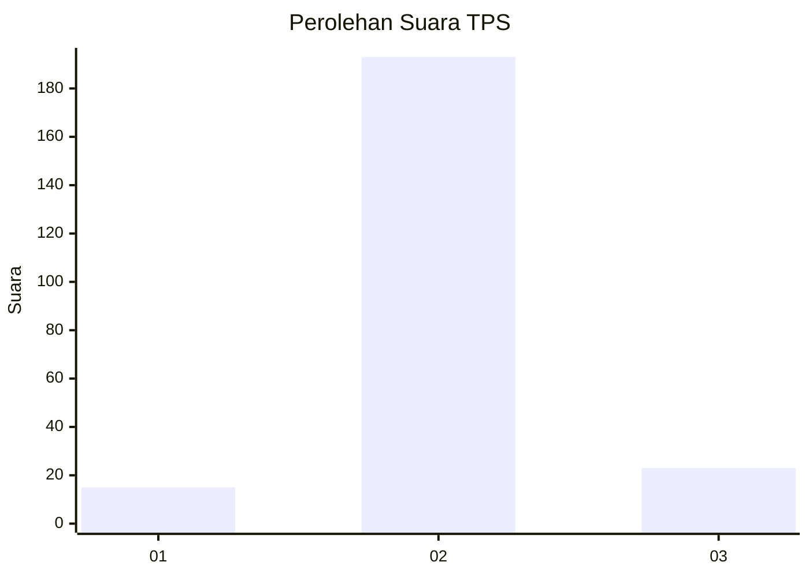
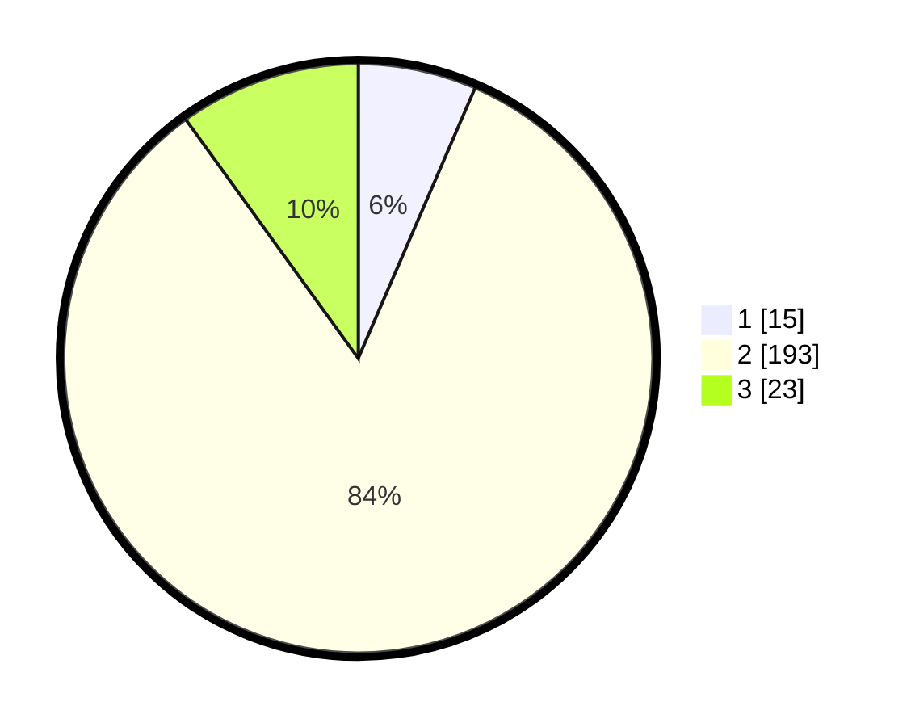

# Hasil

## Grafik

## Tabel

| No. | Nama Paslon    | Suara | Suara (raw) | Persentase |
|:--- |:-------------- | -----:| -----------:| ----------:|
| 1   | ANIES MUHAIMIN | 15    | [15][p-1]   | 6,49       |
| 2   | PRABOWO GIBRAN | 193   | [193][p-2]  | 83,55      |
| 3   | GANJAR MAHFUD  | 23    | [23][p-3]   | 9,96       |

[p-1]: https://github.com/gigit-pemilu/pemilu-2024/blob/main/pilpres/hitung-suara/sub/32-jawa-barat/sub/12-indramayu/sub/25-gantar/sub/2001-bantarwaru/sub/004-tps/sub/paslon-1.txt
[p-2]: https://github.com/gigit-pemilu/pemilu-2024/blob/main/pilpres/hitung-suara/sub/32-jawa-barat/sub/12-indramayu/sub/25-gantar/sub/2001-bantarwaru/sub/004-tps/sub/paslon-2.txt
[p-3]: https://github.com/gigit-pemilu/pemilu-2024/blob/main/pilpres/hitung-suara/sub/32-jawa-barat/sub/12-indramayu/sub/25-gantar/sub/2001-bantarwaru/sub/004-tps/sub/paslon-3.txt

## Foto C Plano

https://sirekap-obj-formc.kpu.go.id/993f/pemilu/ppwp/32/12/25/20/01/3212252001004-20240218-165011--61e4a846-2000-467a-b834-36d5e6110fdd.jpg

https://sirekap-obj-formc.kpu.go.id/993f/pemilu/ppwp/32/12/25/20/01/3212252001004-20240218-164955--79863134-45a7-44d7-b26f-d164428d5b81.jpg

https://sirekap-obj-formc.kpu.go.id/993f/pemilu/ppwp/32/12/25/20/01/3212252001004-20240218-164938--b56a1627-fc52-47f3-b48d-95d32a579384.jpg

## Metadata

| Key        | Value               |
| ---------- | ------------------- |
| Time Stamp | 2024-02-20 11:00:00 |

