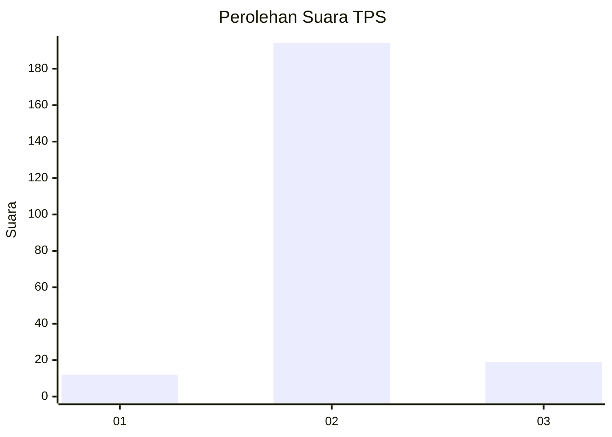
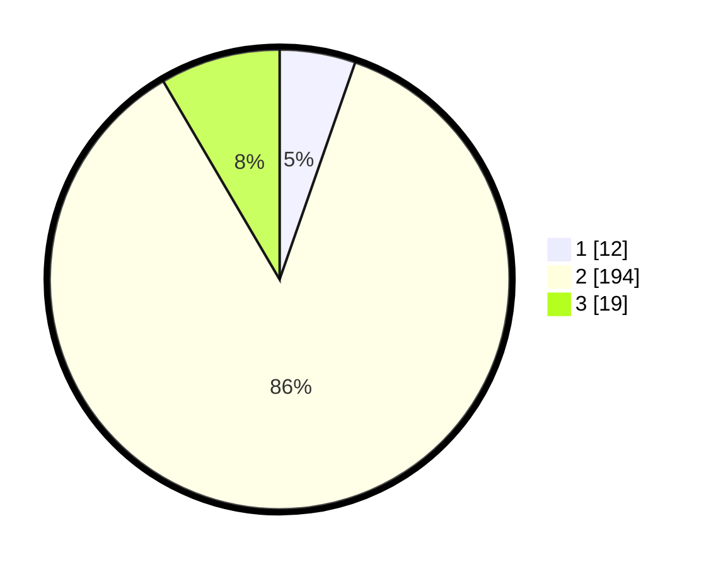

# Hasil

## Grafik

## Tabel

| No. | Nama Paslon    | Suara | Suara (raw) | Persentase |
|:--- |:-------------- | -----:| -----------:| ----------:|
| 1   | ANIES MUHAIMIN | 12    | [12][p-1]   | 5,33       |
| 2   | PRABOWO GIBRAN | 194   | [194][p-2]  | 86,22      |
| 3   | GANJAR MAHFUD  | 19    | [19][p-3]   | 8,44       |

[p-1]: https://github.com/gigit-pemilu/pemilu-2024-32-jawa-barat/blob/main/pilpres/hitung-suara/sub/32-jawa-barat/sub/12-indramayu/sub/25-gantar/sub/2001-bantarwaru/sub/005-tps/sub/paslon-1.txt
[p-2]: https://github.com/gigit-pemilu/pemilu-2024-32-jawa-barat/blob/main/pilpres/hitung-suara/sub/32-jawa-barat/sub/12-indramayu/sub/25-gantar/sub/2001-bantarwaru/sub/005-tps/sub/paslon-2.txt
[p-3]: https://github.com/gigit-pemilu/pemilu-2024-32-jawa-barat/blob/main/pilpres/hitung-suara/sub/32-jawa-barat/sub/12-indramayu/sub/25-gantar/sub/2001-bantarwaru/sub/005-tps/sub/paslon-3.txt

## Foto C Plano

https://sirekap-obj-formc.kpu.go.id/bdb4/pemilu/ppwp/32/12/25/20/01/3212252001005-20240214-192918--59242334-8db5-4b2e-85b2-a29389e88ba2.jpg

https://sirekap-obj-formc.kpu.go.id/bdb4/pemilu/ppwp/32/12/25/20/01/3212252001005-20240214-141447--279f524f-7ef3-42bb-baf3-8d2b1eb5017a.jpg

https://sirekap-obj-formc.kpu.go.id/bdb4/pemilu/ppwp/32/12/25/20/01/3212252001005-20240214-194315--3a3bcb00-52d1-46f9-a4fa-dbeb344cab04.jpg

## Metadata

| Key        | Value               |
| ---------- | ------------------- |
| Time Stamp | 2024-02-14 21:46:01 |

