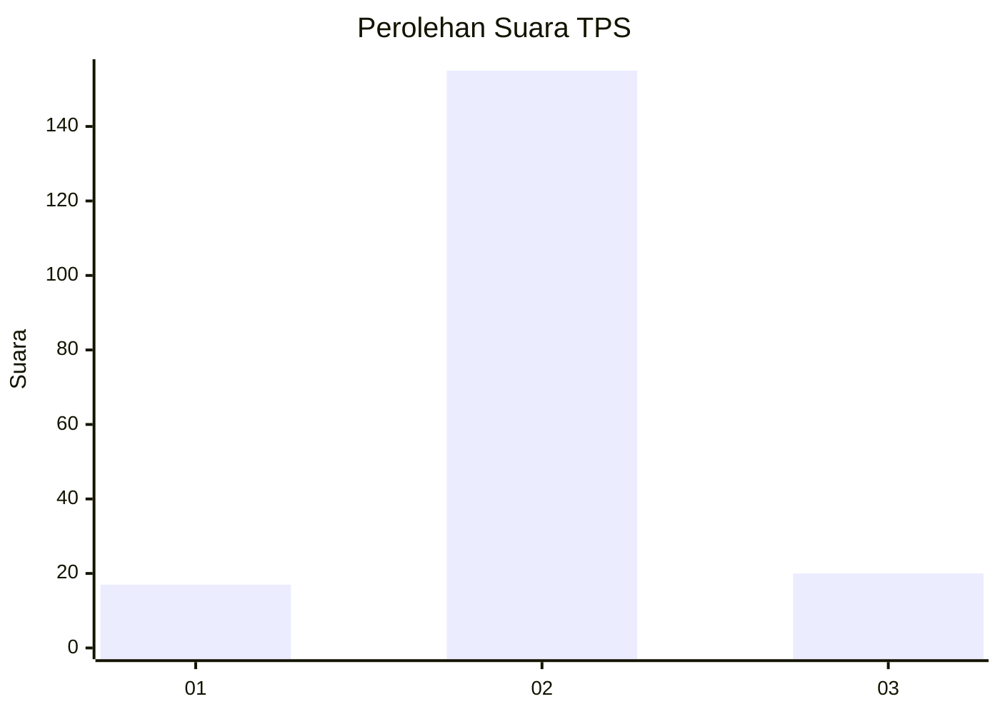
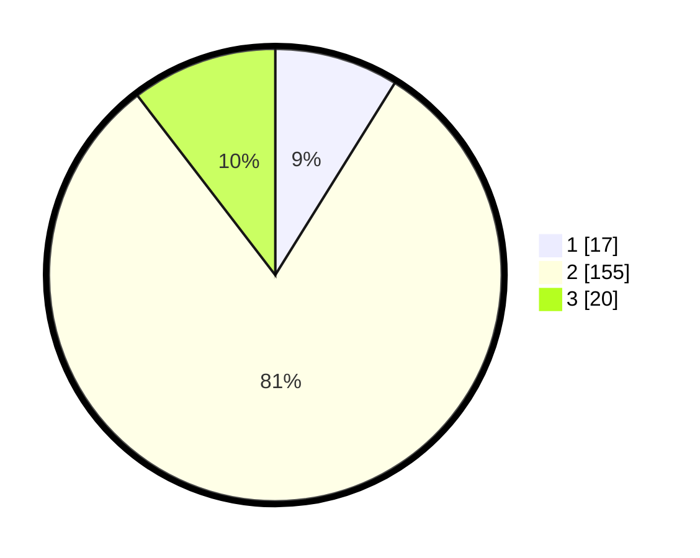

# Hasil

## Grafik

## Tabel

| No. | Nama Paslon    | Suara | Suara (raw) | Persentase |
|:--- |:-------------- | -----:| -----------:| ----------:|
| 1   | ANIES MUHAIMIN | 17    | [17][p-1]   | 8,85       |
| 2   | PRABOWO GIBRAN | 155   | [155][p-2]  | 80,73      |
| 3   | GANJAR MAHFUD  | 20    | [20][p-3]   | 10,42      |

[p-1]: https://github.com/gigit-pemilu/pemilu-2024/blob/main/pilpres/hitung-suara/sub/32-jawa-barat/sub/12-indramayu/sub/26-terisi/sub/2003-jatimunggul/sub/002-tps/sub/paslon-1.txt
[p-2]: https://github.com/gigit-pemilu/pemilu-2024/blob/main/pilpres/hitung-suara/sub/32-jawa-barat/sub/12-indramayu/sub/26-terisi/sub/2003-jatimunggul/sub/002-tps/sub/paslon-2.txt
[p-3]: https://github.com/gigit-pemilu/pemilu-2024/blob/main/pilpres/hitung-suara/sub/32-jawa-barat/sub/12-indramayu/sub/26-terisi/sub/2003-jatimunggul/sub/002-tps/sub/paslon-3.txt

## Foto C Plano

https://sirekap-obj-formc.kpu.go.id/49b4/pemilu/ppwp/32/12/26/20/03/3212262003002-20240217-084754--dcee674d-7af5-4b26-96fc-8d49e0ccfc69.jpg

https://sirekap-obj-formc.kpu.go.id/49b4/pemilu/ppwp/32/12/26/20/03/3212262003002-20240217-085836--b6607dff-fa49-480c-aa74-5c21791a0c09.jpg

https://sirekap-obj-formc.kpu.go.id/49b4/pemilu/ppwp/32/12/26/20/03/3212262003002-20240217-090549--90f215a4-2a90-4dec-a087-b448cc5dcbb6.jpg

## Metadata

| Key        | Value               |
| ---------- | ------------------- |
| Time Stamp | 2024-02-17 09:30:03 |

## DATA PEMILIH TETAP

Jumlah pemilih dalam DPT: **273**.
 * L: **146**.
 * P: **127**.

## DATA PENGGUNA HAK PILIH

Jumlah pengguna hak pilih dalam DPT: **201**.
 * L: **258**.
 * P: **93**.

Jumlah pengguna hak pilih dalam DPTb: **800**.
 * L: **8**.
 * P: **88**.

Jumlah pengguna hak pilih dalam DPK: **2**.
 * L: **6**.
 * P: **808**.

Jumlah pengguna hak pilih: **203**.
 * L: **509**.
 * P: **94**.

## JUMLAH SUARA SAH DAN TIDAK SAH

JUMLAH SELURUH SUARA SAH: **198**.

JUMLAH SUARA TIDAK SAH: **5**.

JUMLAH SELURUH SUARA SAH DAN SUARA TIDAK SAH: **203**.

