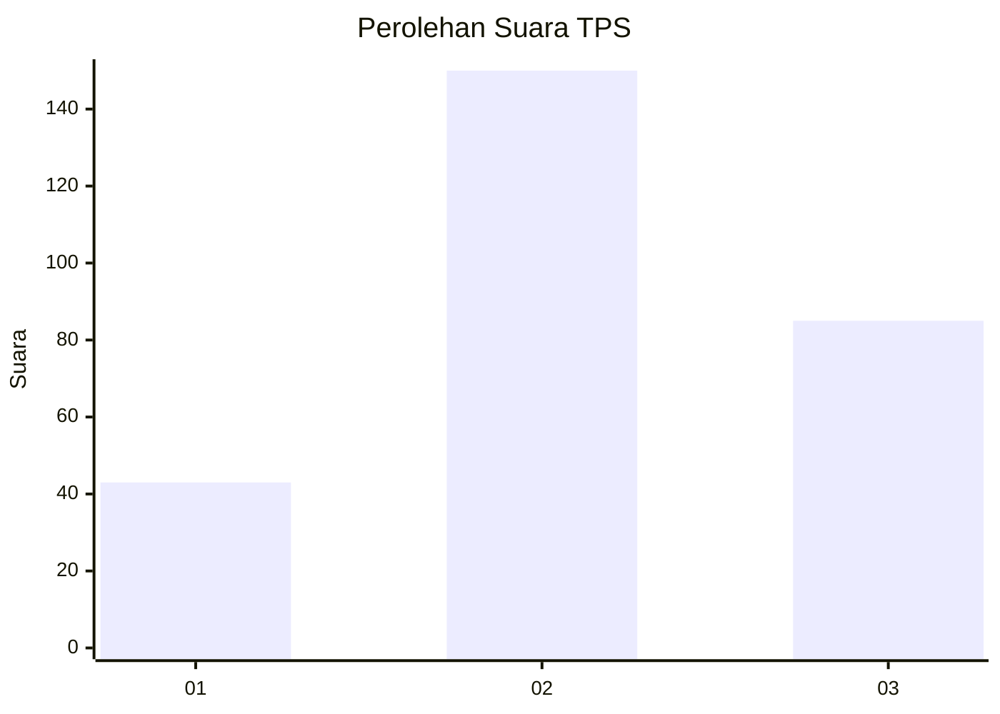
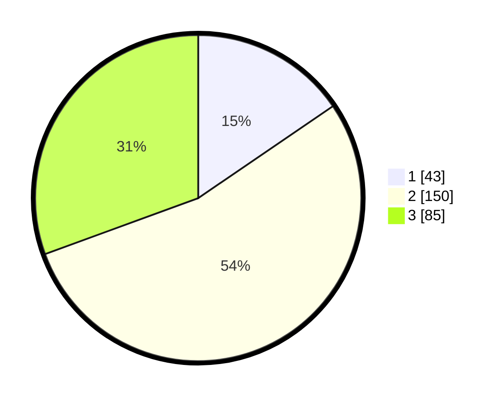

# Hasil

## Grafik

## Tabel

| No. | Nama Paslon    | Suara | Suara (raw) | Persentase |
|:--- |:-------------- | -----:| -----------:| ----------:|
| 1   | ANIES MUHAIMIN | 43    | [43][p-1]   | 15,47      |
| 2   | PRABOWO GIBRAN | 150   | [150][p-2]  | 53,96      |
| 3   | GANJAR MAHFUD  | 85    | [85][p-3]   | 30,58      |

[p-1]: https://github.com/gigit-pemilu/pemilu-2024-32-jawa-barat/blob/main/pilpres/hitung-suara/sub/32-jawa-barat/sub/12-indramayu/sub/30-tukdana/sub/2009-lajer/sub/006-tps/sub/paslon-1.txt
[p-2]: https://github.com/gigit-pemilu/pemilu-2024-32-jawa-barat/blob/main/pilpres/hitung-suara/sub/32-jawa-barat/sub/12-indramayu/sub/30-tukdana/sub/2009-lajer/sub/006-tps/sub/paslon-2.txt
[p-3]: https://github.com/gigit-pemilu/pemilu-2024-32-jawa-barat/blob/main/pilpres/hitung-suara/sub/32-jawa-barat/sub/12-indramayu/sub/30-tukdana/sub/2009-lajer/sub/006-tps/sub/paslon-3.txt

## Foto C Plano

https://sirekap-obj-formc.kpu.go.id/7258/pemilu/ppwp/32/12/30/20/09/3212302009006-20240221-085430--1359c03a-a1c2-453d-ba0a-8d8de8ed7ed9.jpg

https://sirekap-obj-formc.kpu.go.id/7258/pemilu/ppwp/32/12/30/20/09/3212302009006-20240221-085728--7c3324dc-7a78-431f-a4dc-5668b3942b46.jpg

https://sirekap-obj-formc.kpu.go.id/7258/pemilu/ppwp/32/12/30/20/09/3212302009006-20240221-085841--6a2578f7-f46f-4300-b756-7993b8a5b56d.jpg

## Metadata

| Key        | Value               |
| ---------- | ------------------- |
| Time Stamp | 2024-02-21 09:00:00 |

## DATA PEMILIH TETAP

Jumlah pemilih dalam DPT: **259**.
 * L: **438**.
 * P: **432**.

## DATA PENGGUNA HAK PILIH

Jumlah pengguna hak pilih dalam DPT: **488**.
 * L: **82**.
 * P: **496**.

Jumlah pengguna hak pilih dalam DPTb: **800**.
 * L: **0**.
 * P: **0**.

Jumlah pengguna hak pilih dalam DPK: **802**.
 * L: **2**.
 * P: **0**.

Jumlah pengguna hak pilih: **459**.
 * L: **486**.
 * P: **436**.

## JUMLAH SUARA SAH DAN TIDAK SAH

JUMLAH SELURUH SUARA SAH: **888**.

JUMLAH SUARA TIDAK SAH: **222**.

JUMLAH SELURUH SUARA SAH DAN SUARA TIDAK SAH: **490**.

