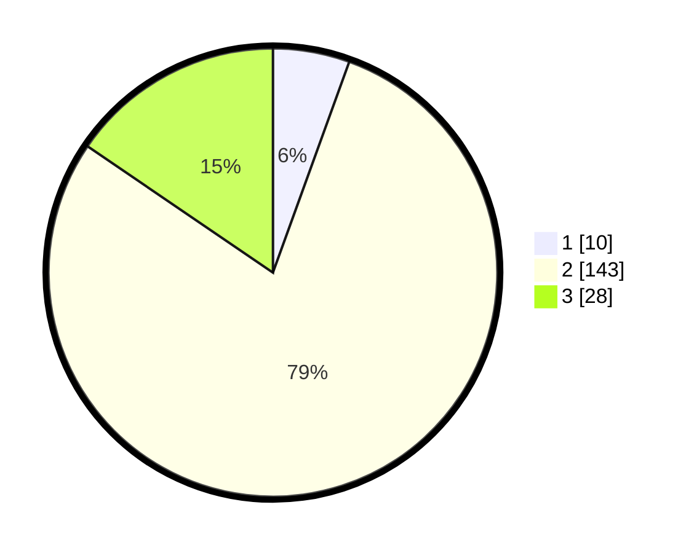

# Hasil

## Grafik

## Tabel

| No. | Nama Paslon    | Suara | Suara (raw) | Persentase |
|:--- |:-------------- | -----:| -----------:| ----------:|
| 1   | ANIES MUHAIMIN | 10    | [10][p-1]   | 5,52       |
| 2   | PRABOWO GIBRAN | 143   | [143][p-2]  | 79,01      |
| 3   | GANJAR MAHFUD  | 28    | [28][p-3]   | 15,47      |

[p-1]: https://github.com/gigit-pemilu/pemilu-2024-32-jawa-barat/blob/main/pilpres/hitung-suara/sub/32-jawa-barat/sub/12-indramayu/sub/31-patrol/sub/2001-limpas/sub/001-tps/sub/paslon-1.txt
[p-2]: https://github.com/gigit-pemilu/pemilu-2024-32-jawa-barat/blob/main/pilpres/hitung-suara/sub/32-jawa-barat/sub/12-indramayu/sub/31-patrol/sub/2001-limpas/sub/001-tps/sub/paslon-2.txt
[p-3]: https://github.com/gigit-pemilu/pemilu-2024-32-jawa-barat/blob/main/pilpres/hitung-suara/sub/32-jawa-barat/sub/12-indramayu/sub/31-patrol/sub/2001-limpas/sub/001-tps/sub/paslon-3.txt

## Foto C Plano

https://sirekap-obj-formc.kpu.go.id/29ab/pemilu/ppwp/32/12/31/20/01/3212312001001-20240220-152334--8513c24b-ef1c-4a03-bbd2-d55f1d003834.jpg

https://sirekap-obj-formc.kpu.go.id/29ab/pemilu/ppwp/32/12/31/20/01/3212312001001-20240220-152450--eb40759e-0f0f-4122-a9d0-5636c654de46.jpg

https://sirekap-obj-formc.kpu.go.id/29ab/pemilu/ppwp/32/12/31/20/01/3212312001001-20240220-152539--5e602962-0dbf-4648-b422-91a8b7334ec6.jpg

## Metadata

| Key        | Value               |
| ---------- | ------------------- |
| Time Stamp | 2024-02-21 15:00:00 |

