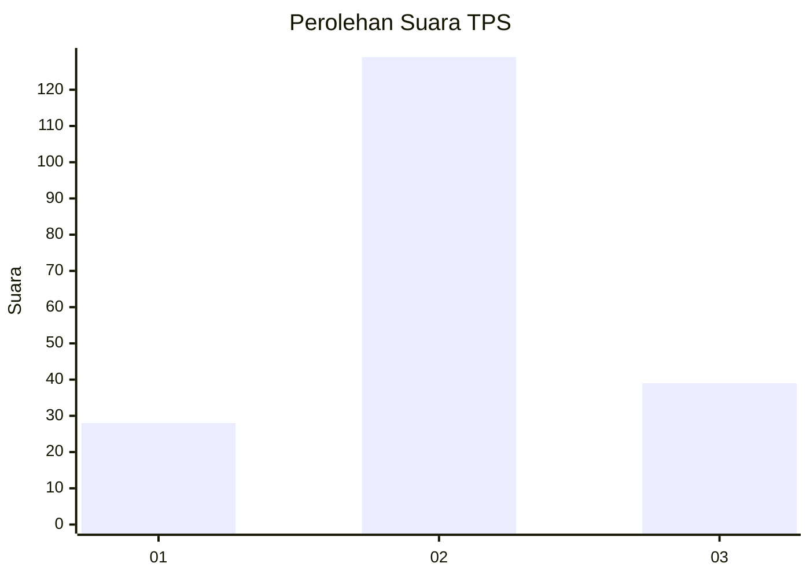
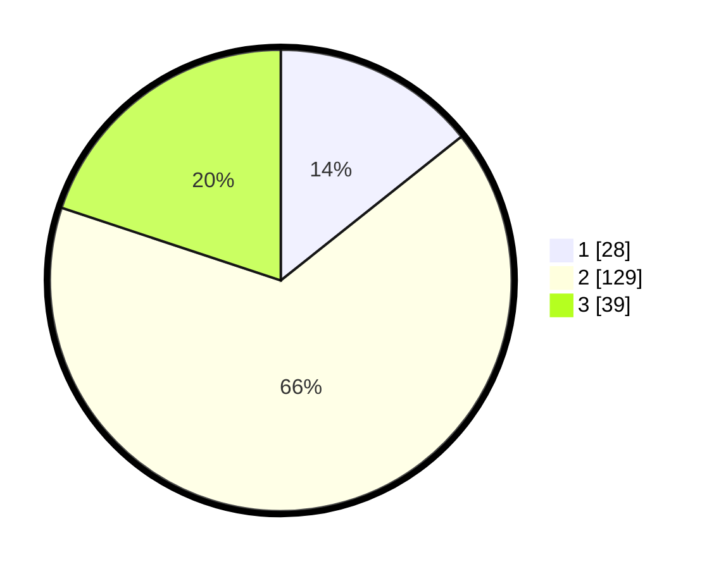

# Hasil

## Grafik

## Tabel

| No. | Nama Paslon    | Suara | Suara (raw) | Persentase |
|:--- |:-------------- | -----:| -----------:| ----------:|
| 1   | ANIES MUHAIMIN | 28    | [28][p-1]   | 14,29      |
| 2   | PRABOWO GIBRAN | 129   | [129][p-2]  | 65,82      |
| 3   | GANJAR MAHFUD  | 39    | [39][p-3]   | 19,90      |

[p-1]: https://github.com/gigit-pemilu/pemilu-2024-32-jawa-barat/blob/main/pilpres/hitung-suara/sub/32-jawa-barat/sub/12-indramayu/sub/31-patrol/sub/2001-limpas/sub/004-tps/sub/paslon-1.txt
[p-2]: https://github.com/gigit-pemilu/pemilu-2024-32-jawa-barat/blob/main/pilpres/hitung-suara/sub/32-jawa-barat/sub/12-indramayu/sub/31-patrol/sub/2001-limpas/sub/004-tps/sub/paslon-2.txt
[p-3]: https://github.com/gigit-pemilu/pemilu-2024-32-jawa-barat/blob/main/pilpres/hitung-suara/sub/32-jawa-barat/sub/12-indramayu/sub/31-patrol/sub/2001-limpas/sub/004-tps/sub/paslon-3.txt

## Foto C Plano

https://sirekap-obj-formc.kpu.go.id/87cb/pemilu/ppwp/32/12/31/20/01/3212312001004-20240215-115239--69c6c20c-2af2-4355-a2c0-80f3a4e0422d.jpg

https://sirekap-obj-formc.kpu.go.id/87cb/pemilu/ppwp/32/12/31/20/01/3212312001004-20240215-115241--54752f89-ddc4-4edd-a8f6-5721e299e49b.jpg

https://sirekap-obj-formc.kpu.go.id/87cb/pemilu/ppwp/32/12/31/20/01/3212312001004-20240215-115237--60145bf3-c544-4ef7-88b6-1714142ed8b4.jpg

## Metadata

| Key        | Value               |
| ---------- | ------------------- |
| Time Stamp | 2024-02-15 18:00:26 |

