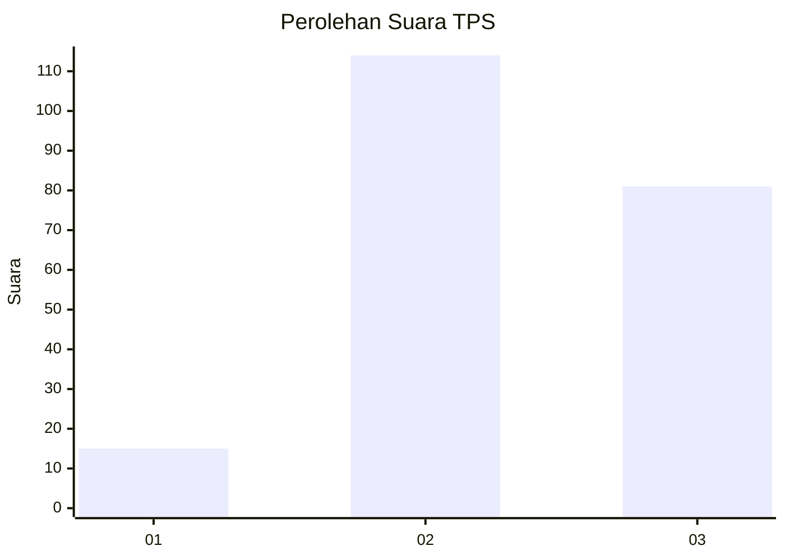
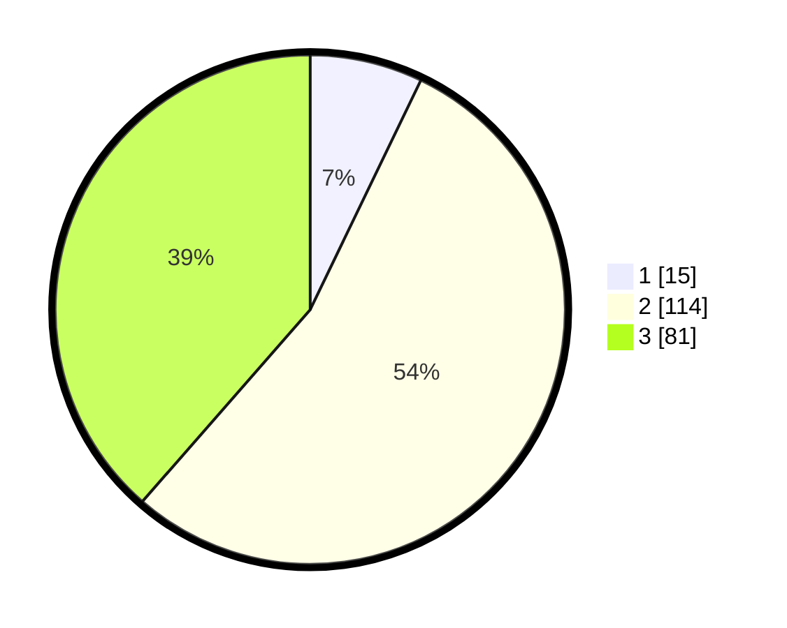

# Hasil

## Grafik

## Tabel

| No. | Nama Paslon    | Suara | Suara (raw) | Persentase |
|:--- |:-------------- | -----:| -----------:| ----------:|
| 1   | ANIES MUHAIMIN | 15    | [15][p-1]   | 7,14       |
| 2   | PRABOWO GIBRAN | 114   | [114][p-2]  | 54,29      |
| 3   | GANJAR MAHFUD  | 81    | [81][p-3]   | 38,57      |

[p-1]: https://github.com/gigit-pemilu/pemilu-2024-32-jawa-barat/blob/main/pilpres/hitung-suara/sub/32-jawa-barat/sub/12-indramayu/sub/31-patrol/sub/2001-limpas/sub/007-tps/sub/paslon-1.txt
[p-2]: https://github.com/gigit-pemilu/pemilu-2024-32-jawa-barat/blob/main/pilpres/hitung-suara/sub/32-jawa-barat/sub/12-indramayu/sub/31-patrol/sub/2001-limpas/sub/007-tps/sub/paslon-2.txt
[p-3]: https://github.com/gigit-pemilu/pemilu-2024-32-jawa-barat/blob/main/pilpres/hitung-suara/sub/32-jawa-barat/sub/12-indramayu/sub/31-patrol/sub/2001-limpas/sub/007-tps/sub/paslon-3.txt

## Foto C Plano

https://sirekap-obj-formc.kpu.go.id/11b0/pemilu/ppwp/32/12/31/20/01/3212312001007-20240215-000858--814bcd01-bc28-486a-b777-10d47e8e72c5.jpg

https://sirekap-obj-formc.kpu.go.id/11b0/pemilu/ppwp/32/12/31/20/01/3212312001007-20240215-000916--6eebe7ba-7198-477f-9d04-502f271fcc39.jpg

https://sirekap-obj-formc.kpu.go.id/11b0/pemilu/ppwp/32/12/31/20/01/3212312001007-20240215-000937--13318218-c31a-462b-8155-ca0579989b24.jpg

## Metadata

| Key        | Value               |
| ---------- | ------------------- |
| Time Stamp | 2024-02-15 18:00:26 |

