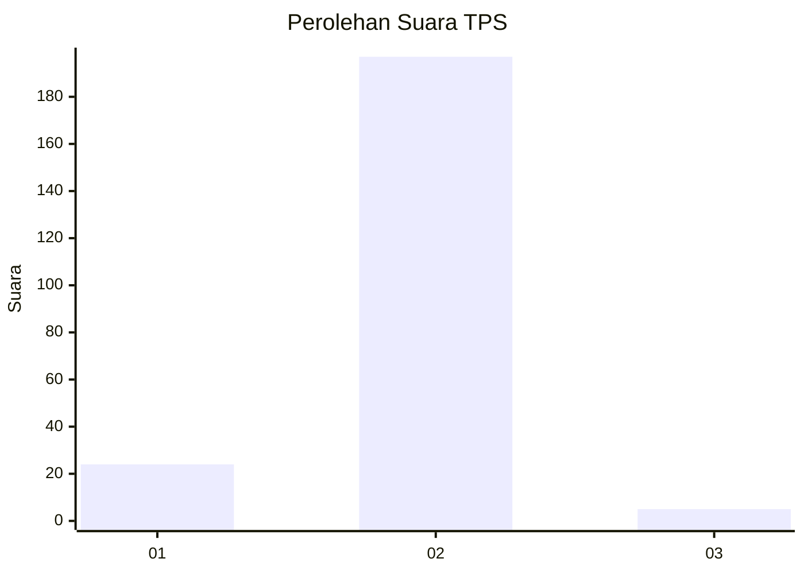
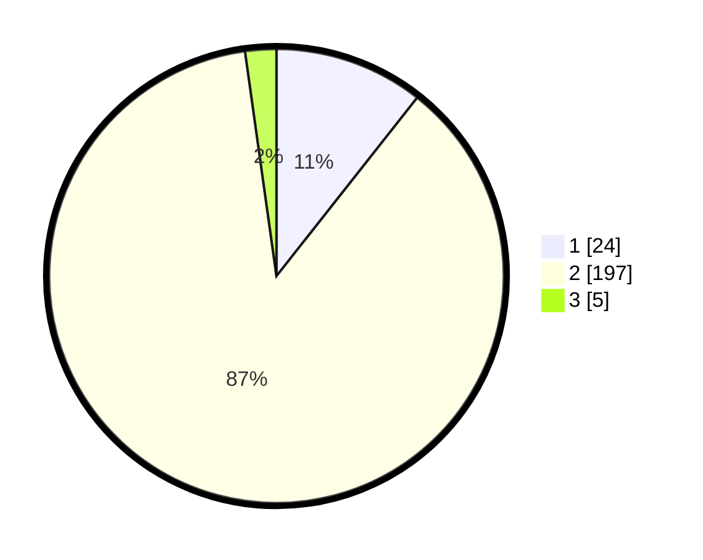

# Hasil

## Grafik

## Tabel

| No. | Nama Paslon    | Suara | Suara (raw) | Persentase |
|:--- |:-------------- | -----:| -----------:| ----------:|
| 1   | ANIES MUHAIMIN | 24    | [24][p-1]   | 10,62      |
| 2   | PRABOWO GIBRAN | 197   | [197][p-2]  | 87,17      |
| 3   | GANJAR MAHFUD  | 5     | [5][p-3]    | 2,21       |

[p-1]: https://github.com/gigit-pemilu/pemilu-2024/blob/main/pilpres/hitung-suara/sub/32-jawa-barat/sub/13-subang/sub/01-sagalaherang/sub/2010-curugagung/sub/003-tps/sub/paslon-1.txt
[p-2]: https://github.com/gigit-pemilu/pemilu-2024/blob/main/pilpres/hitung-suara/sub/32-jawa-barat/sub/13-subang/sub/01-sagalaherang/sub/2010-curugagung/sub/003-tps/sub/paslon-2.txt
[p-3]: https://github.com/gigit-pemilu/pemilu-2024/blob/main/pilpres/hitung-suara/sub/32-jawa-barat/sub/13-subang/sub/01-sagalaherang/sub/2010-curugagung/sub/003-tps/sub/paslon-3.txt

## Foto C Plano

https://sirekap-obj-formc.kpu.go.id/8bbc/pemilu/ppwp/32/13/01/20/10/3213012010003-20240215-185937--d017f1d4-ee5f-43ae-b1a6-70f56060bbad.jpg

https://sirekap-obj-formc.kpu.go.id/8bbc/pemilu/ppwp/32/13/01/20/10/3213012010003-20240215-190131--ba625e37-b3af-4ad8-82ca-ac277a040227.jpg

https://sirekap-obj-formc.kpu.go.id/8bbc/pemilu/ppwp/32/13/01/20/10/3213012010003-20240215-190139--4cb407a9-3a25-4d8a-8daf-b3f973b76962.jpg

## Metadata

| Key        | Value               |
| ---------- | ------------------- |
| Time Stamp | 2024-02-15 21:30:27 |

