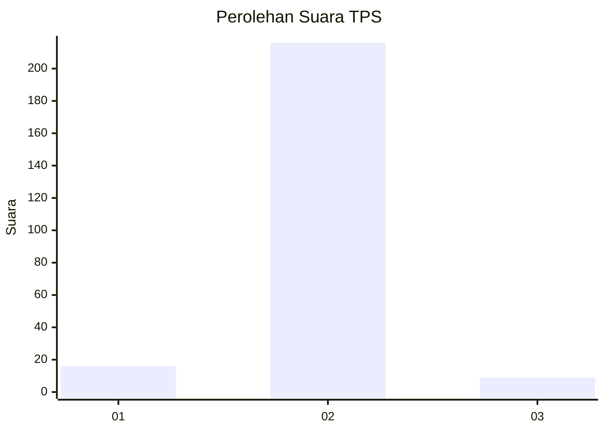
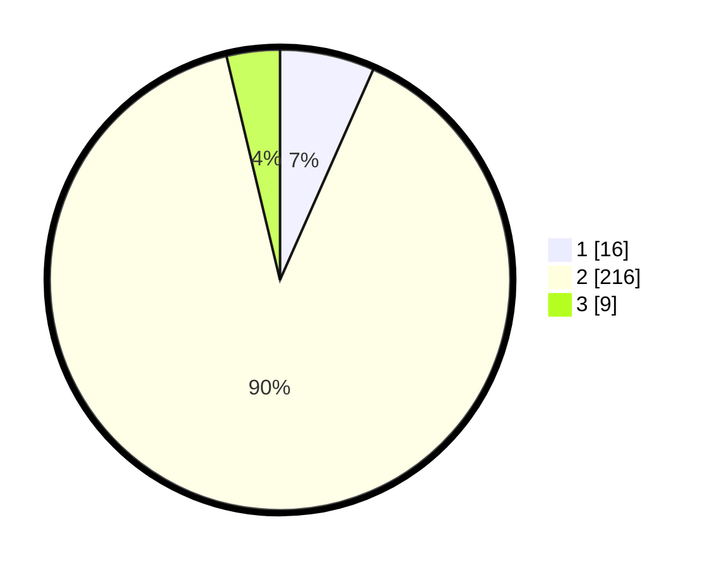

# Hasil

## Grafik

## Tabel

| No. | Nama Paslon    | Suara | Suara (raw) | Persentase |
|:--- |:-------------- | -----:| -----------:| ----------:|
| 1   | ANIES MUHAIMIN | 16    | [16][p-1]   | 6,64       |
| 2   | PRABOWO GIBRAN | 216   | [216][p-2]  | 89,63      |
| 3   | GANJAR MAHFUD  | 9     | [9][p-3]    | 3,73       |

[p-1]: https://github.com/gigit-pemilu/pemilu-2024/blob/main/pilpres/hitung-suara/sub/32-jawa-barat/sub/13-subang/sub/01-sagalaherang/sub/2010-curugagung/sub/009-tps/sub/paslon-1.txt
[p-2]: https://github.com/gigit-pemilu/pemilu-2024/blob/main/pilpres/hitung-suara/sub/32-jawa-barat/sub/13-subang/sub/01-sagalaherang/sub/2010-curugagung/sub/009-tps/sub/paslon-2.txt
[p-3]: https://github.com/gigit-pemilu/pemilu-2024/blob/main/pilpres/hitung-suara/sub/32-jawa-barat/sub/13-subang/sub/01-sagalaherang/sub/2010-curugagung/sub/009-tps/sub/paslon-3.txt

## Foto C Plano

https://sirekap-obj-formc.kpu.go.id/1b5c/pemilu/ppwp/32/13/01/20/10/3213012010009-20240215-000800--873554d5-1043-4276-88be-422897511433.jpg

https://sirekap-obj-formc.kpu.go.id/1b5c/pemilu/ppwp/32/13/01/20/10/3213012010009-20240215-001003--d56872b8-ba7e-4568-9542-ee50d4072c6d.jpg

https://sirekap-obj-formc.kpu.go.id/1b5c/pemilu/ppwp/32/13/01/20/10/3213012010009-20240215-001119--2389a587-2714-47f9-8c8d-9c86d59d9674.jpg

## Metadata

| Key        | Value               |
| ---------- | ------------------- |
| Time Stamp | 2024-02-19 17:00:00 |

