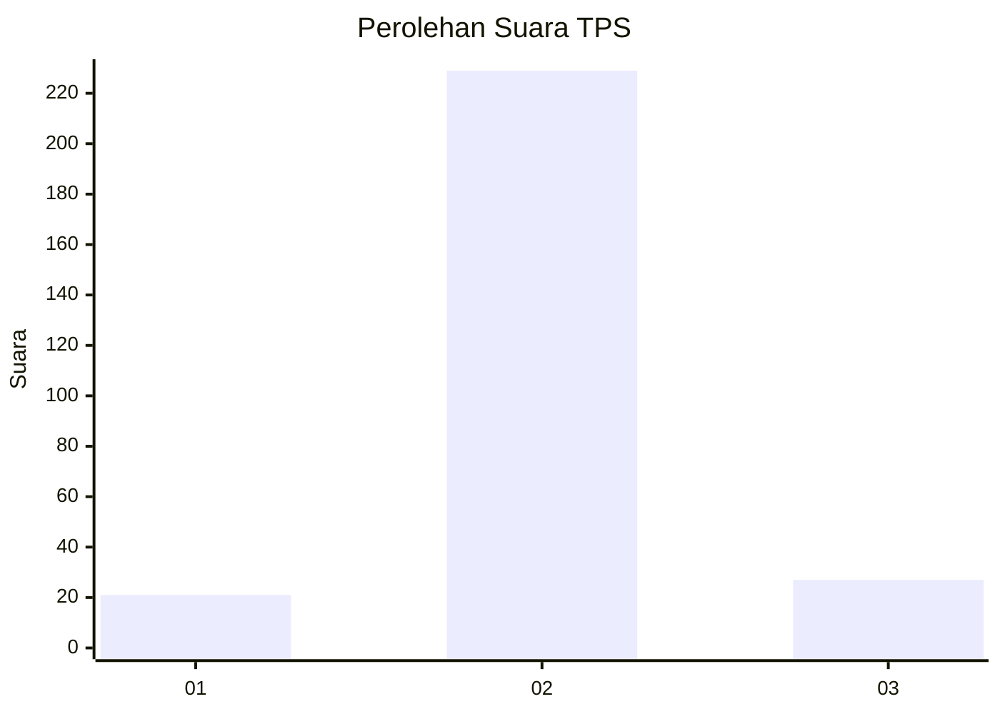
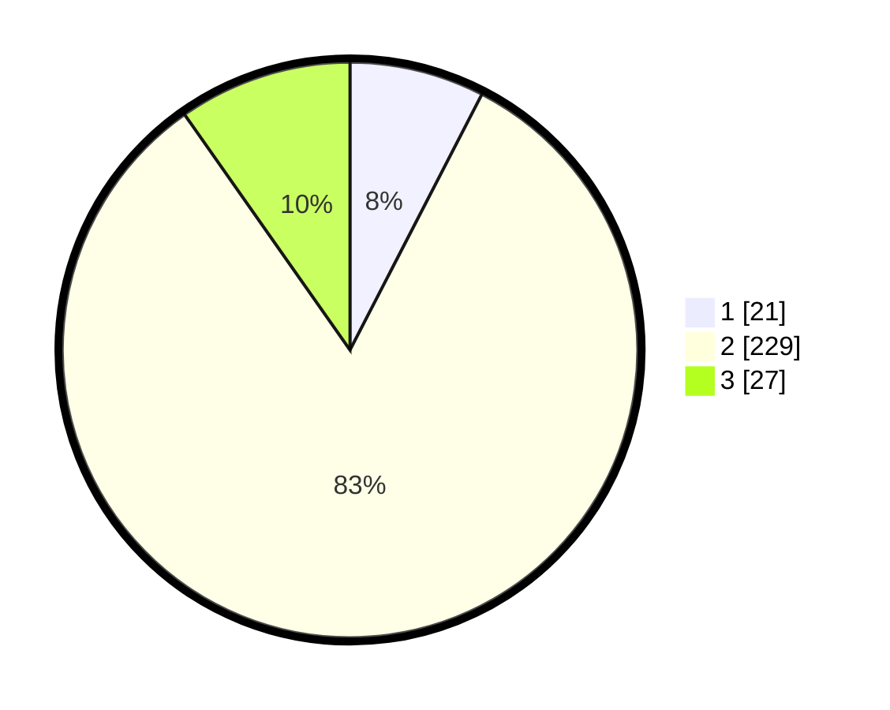

# Hasil

## Grafik

## Tabel

| No. | Nama Paslon    | Suara | Suara (raw) | Persentase |
|:--- |:-------------- | -----:| -----------:| ----------:|
| 1   | ANIES MUHAIMIN | 21    | [21][p-1]   | 7,58       |
| 2   | PRABOWO GIBRAN | 229   | [229][p-2]  | 82,67      |
| 3   | GANJAR MAHFUD  | 27    | [27][p-3]   | 9,75       |

[p-1]: https://github.com/gigit-pemilu/pemilu-2024/blob/main/pilpres/hitung-suara/sub/32-jawa-barat/sub/13-subang/sub/02-cisalak/sub/2001-cupunagara/sub/014-tps/sub/paslon-1.txt
[p-2]: https://github.com/gigit-pemilu/pemilu-2024/blob/main/pilpres/hitung-suara/sub/32-jawa-barat/sub/13-subang/sub/02-cisalak/sub/2001-cupunagara/sub/014-tps/sub/paslon-2.txt
[p-3]: https://github.com/gigit-pemilu/pemilu-2024/blob/main/pilpres/hitung-suara/sub/32-jawa-barat/sub/13-subang/sub/02-cisalak/sub/2001-cupunagara/sub/014-tps/sub/paslon-3.txt

## Foto C Plano

https://sirekap-obj-formc.kpu.go.id/7140/pemilu/ppwp/32/13/02/20/01/3213022001014-20240215-035936--b7c1fc1a-69e2-4f83-af50-c14ad0027a03.jpg

https://sirekap-obj-formc.kpu.go.id/7140/pemilu/ppwp/32/13/02/20/01/3213022001014-20240215-052020--cb9155a5-0b85-4e25-95f2-5c40a389dfce.jpg

https://sirekap-obj-formc.kpu.go.id/7140/pemilu/ppwp/32/13/02/20/01/3213022001014-20240215-040237--fa919608-c30c-49fc-bf4c-422c321b673a.jpg

## Metadata

| Key        | Value               |
| ---------- | ------------------- |
| Time Stamp | 2024-02-19 17:00:00 |

