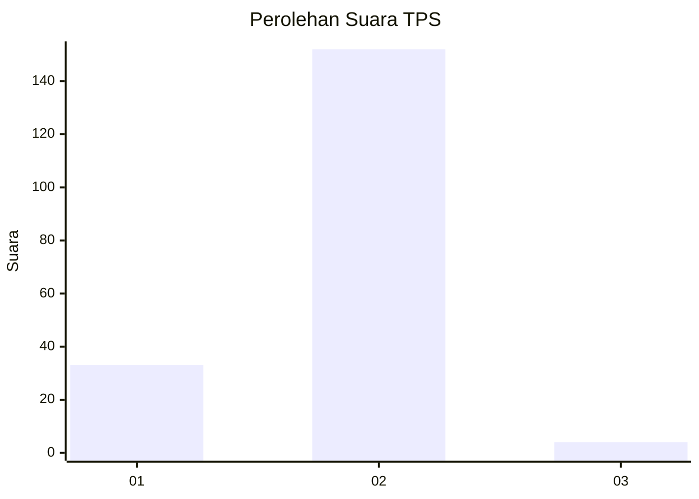
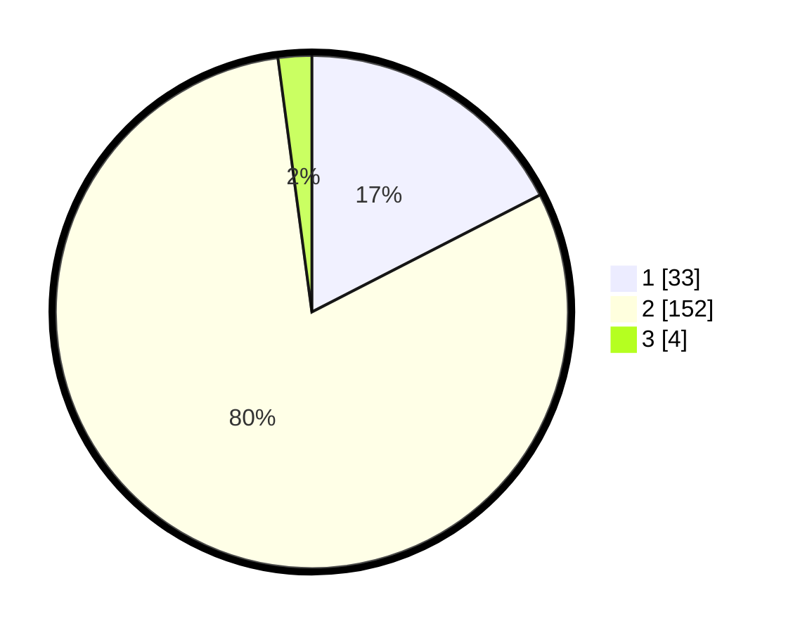

# Hasil

## Grafik

## Tabel

| No. | Nama Paslon    | Suara | Suara (raw) | Persentase |
|:--- |:-------------- | -----:| -----------:| ----------:|
| 1   | ANIES MUHAIMIN | 33    | [33][p-1]   | 17,46      |
| 2   | PRABOWO GIBRAN | 152   | [152][p-2]  | 80,42      |
| 3   | GANJAR MAHFUD  | 4     | [4][p-3]    | 2,12       |

[p-1]: https://github.com/gigit-pemilu/pemilu-2024-32-jawa-barat/blob/main/pilpres/hitung-suara/sub/32-jawa-barat/sub/13-subang/sub/03-subang/sub/1001-parung/sub/002-tps/sub/paslon-1.txt
[p-2]: https://github.com/gigit-pemilu/pemilu-2024-32-jawa-barat/blob/main/pilpres/hitung-suara/sub/32-jawa-barat/sub/13-subang/sub/03-subang/sub/1001-parung/sub/002-tps/sub/paslon-2.txt
[p-3]: https://github.com/gigit-pemilu/pemilu-2024-32-jawa-barat/blob/main/pilpres/hitung-suara/sub/32-jawa-barat/sub/13-subang/sub/03-subang/sub/1001-parung/sub/002-tps/sub/paslon-3.txt

## Foto C Plano

https://sirekap-obj-formc.kpu.go.id/150b/pemilu/ppwp/32/13/03/10/01/3213031001002-20240217-114127--6efcda95-f63e-4f32-a6db-c41932f93c9d.jpg

https://sirekap-obj-formc.kpu.go.id/150b/pemilu/ppwp/32/13/03/10/01/3213031001002-20240217-114131--fafdb337-1a16-401e-904e-4ff40ae7471d.jpg

https://sirekap-obj-formc.kpu.go.id/150b/pemilu/ppwp/32/13/03/10/01/3213031001002-20240217-114133--19a1cb91-cd13-4611-a924-0454dec85952.jpg

## Metadata

| Key        | Value               |
| ---------- | ------------------- |
| Time Stamp | 2024-02-17 13:37:34 |

