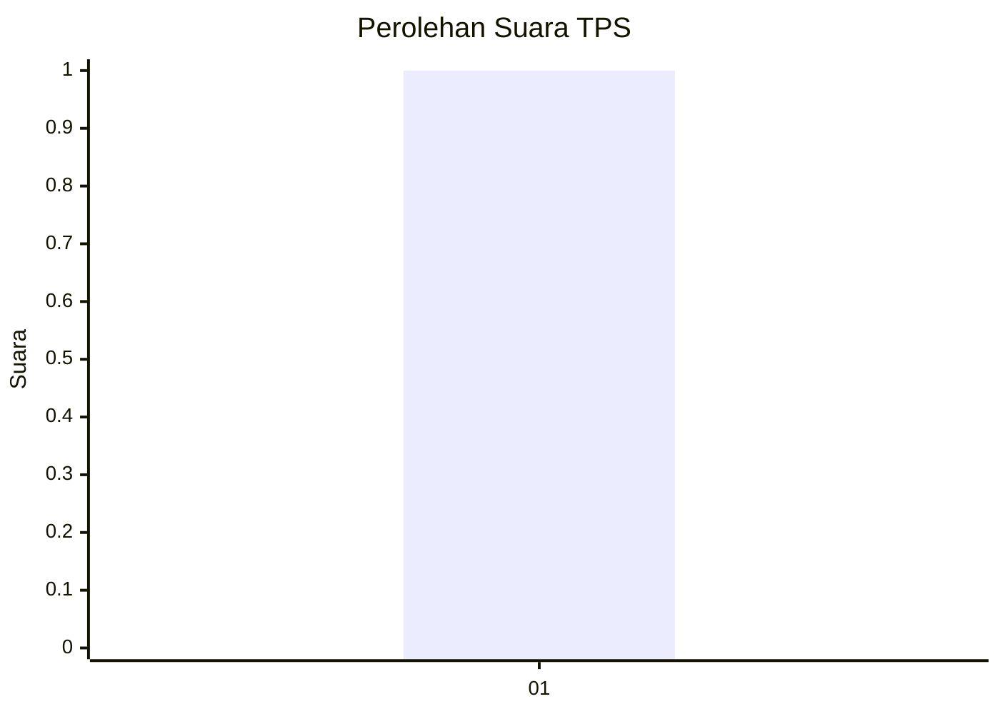
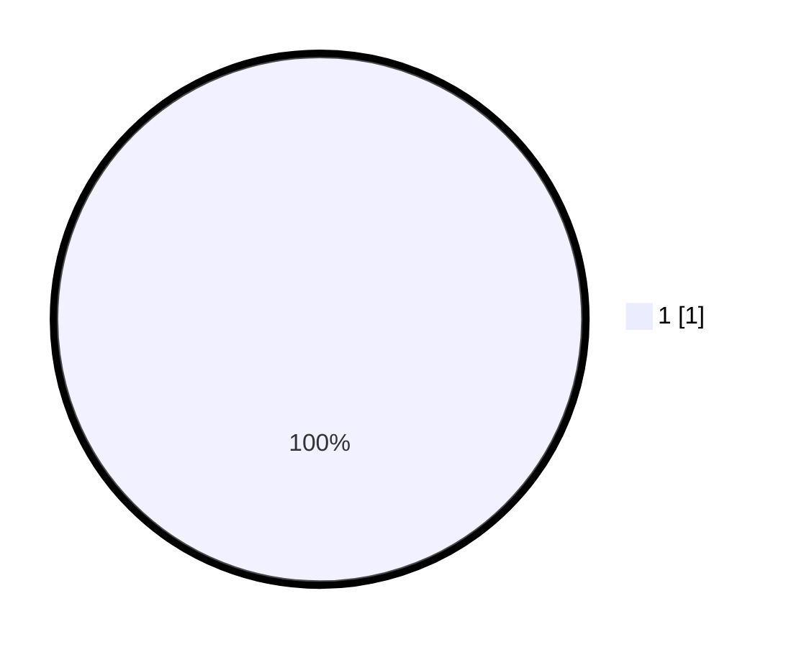

# Hasil

## Grafik

## Tabel

| No. | Nama Paslon    | Suara | Suara (raw) | Persentase |
|:--- |:-------------- | -----:| -----------:| ----------:|
| 1   | ANIES MUHAIMIN | 1     | [1][p-1]    | 100,00     |

[p-1]: https://github.com/gigit-pemilu/pemilu-2024/blob/main/pilpres/hitung-suara/sub/32-jawa-barat/sub/13-subang/sub/03-subang/sub/1001-parung/sub/005-tps/sub/paslon-1.txt
[p-2]: https://github.com/gigit-pemilu/pemilu-2024/blob/main/pilpres/hitung-suara/sub/32-jawa-barat/sub/13-subang/sub/03-subang/sub/1001-parung/sub/005-tps/sub/paslon-2.txt
[p-3]: https://github.com/gigit-pemilu/pemilu-2024/blob/main/pilpres/hitung-suara/sub/32-jawa-barat/sub/13-subang/sub/03-subang/sub/1001-parung/sub/005-tps/sub/paslon-3.txt

## Foto C Plano

https://sirekap-obj-formc.kpu.go.id/cbab/pemilu/ppwp/32/13/03/10/01/3213031001005-20240215-060417--407ba96c-fa5b-469a-ae49-87498e907c41.jpg

https://sirekap-obj-formc.kpu.go.id/cbab/pemilu/ppwp/32/13/03/10/01/3213031001005-20240215-023603--d76f9720-ff4e-415f-8889-70684222b948.jpg

https://sirekap-obj-formc.kpu.go.id/cbab/pemilu/ppwp/32/13/03/10/01/3213031001005-20240215-023704--f41ecf8c-329d-4be6-8792-1f618abf9857.jpg

## Metadata

| Key        | Value               |
| ---------- | ------------------- |
| Time Stamp | 2024-02-19 18:00:00 |

