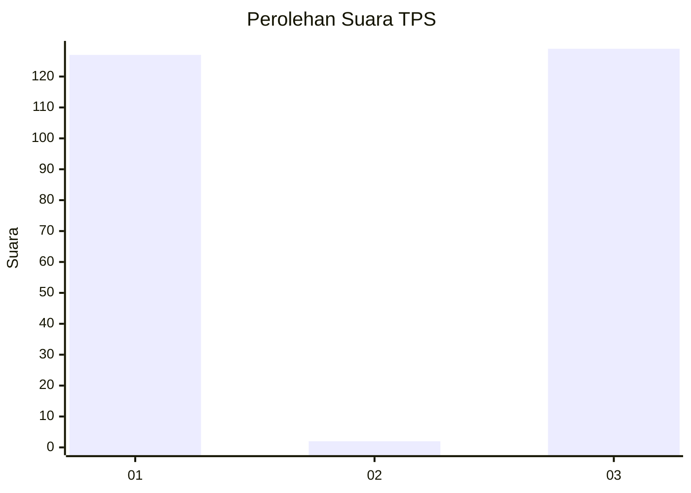
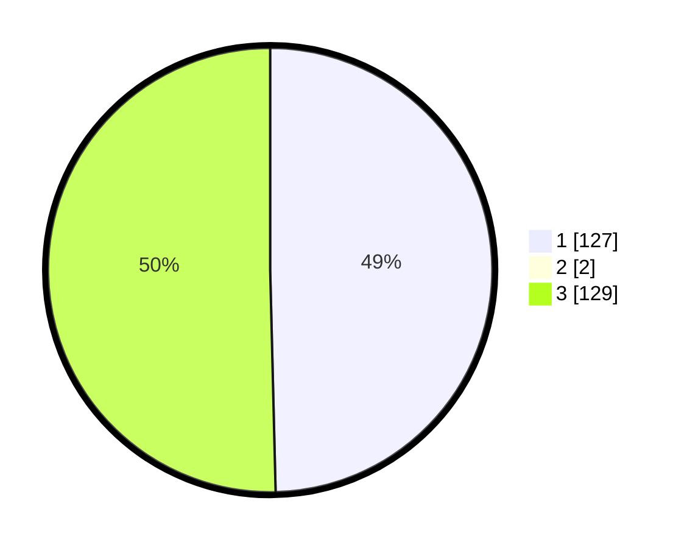

# Hasil

## Grafik

## Tabel

| No. | Nama Paslon    | Suara | Suara (raw) | Persentase |
|:--- |:-------------- | -----:| -----------:| ----------:|
| 1   | ANIES MUHAIMIN | 127   | [127][p-1]  | 49,22      |
| 2   | PRABOWO GIBRAN | 2     | [2][p-2]    | 0,78       |
| 3   | GANJAR MAHFUD  | 129   | [129][p-3]  | 50,00      |

[p-1]: https://github.com/gigit-pemilu/pemilu-2024/blob/main/pilpres/hitung-suara/sub/32-jawa-barat/sub/13-subang/sub/03-subang/sub/1001-parung/sub/030-tps/sub/paslon-1.txt
[p-2]: https://github.com/gigit-pemilu/pemilu-2024/blob/main/pilpres/hitung-suara/sub/32-jawa-barat/sub/13-subang/sub/03-subang/sub/1001-parung/sub/030-tps/sub/paslon-2.txt
[p-3]: https://github.com/gigit-pemilu/pemilu-2024/blob/main/pilpres/hitung-suara/sub/32-jawa-barat/sub/13-subang/sub/03-subang/sub/1001-parung/sub/030-tps/sub/paslon-3.txt

## Foto C Plano

https://sirekap-obj-formc.kpu.go.id/f77c/pemilu/ppwp/32/13/03/10/01/3213031001030-20240215-062905--0502c239-6c43-4b2f-9db0-ac75eddc3784.jpg

https://sirekap-obj-formc.kpu.go.id/f77c/pemilu/ppwp/32/13/03/10/01/3213031001030-20240215-063122--afd35081-17eb-42de-9122-be05496dd768.jpg

https://sirekap-obj-formc.kpu.go.id/f77c/pemilu/ppwp/32/13/03/10/01/3213031001030-20240215-035824--04853b9d-7546-4aff-95f4-557df8a7c7cd.jpg

## Metadata

| Key        | Value               |
| ---------- | ------------------- |
| Time Stamp | 2024-02-19 18:00:00 |

