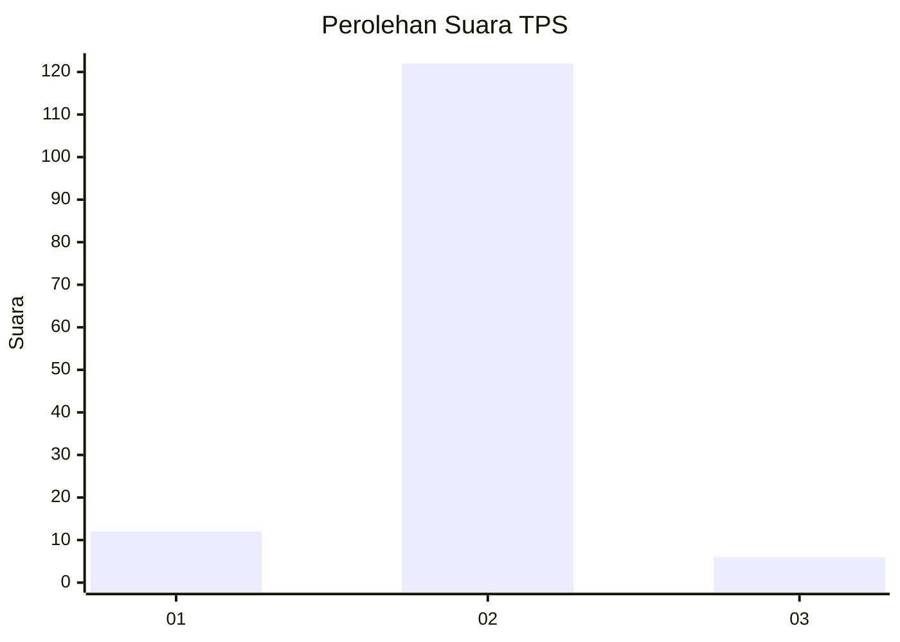
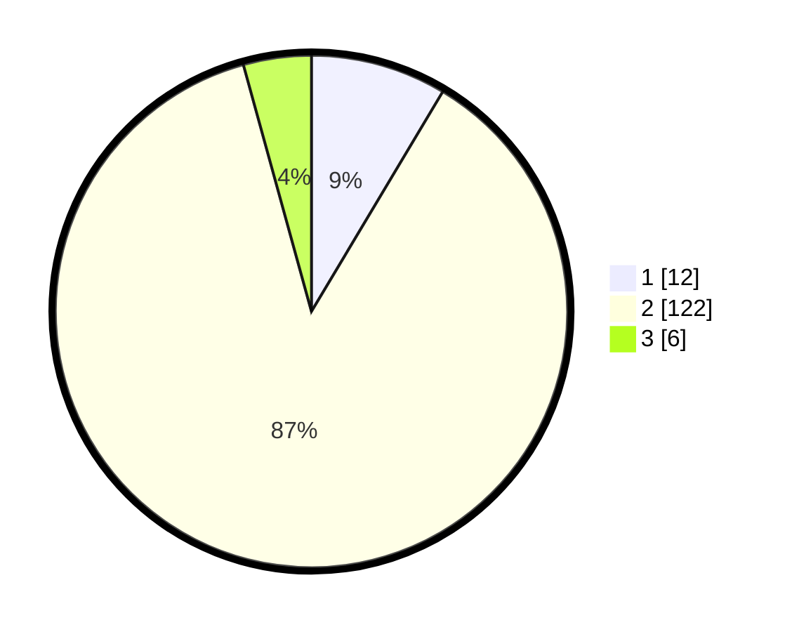

# Hasil

## Grafik

## Tabel

| No. | Nama Paslon    | Suara | Suara (raw) | Persentase |
|:--- |:-------------- | -----:| -----------:| ----------:|
| 1   | ANIES MUHAIMIN | 12    | [12][p-1]   | 8,57       |
| 2   | PRABOWO GIBRAN | 122   | [122][p-2]  | 87,14      |
| 3   | GANJAR MAHFUD  | 6     | [6][p-3]    | 4,29       |

[p-1]: https://github.com/gigit-pemilu/pemilu-2024/blob/main/pilpres/hitung-suara/sub/32-jawa-barat/sub/13-subang/sub/03-subang/sub/1003-pasirkareumbi/sub/001-tps/sub/paslon-1.txt
[p-2]: https://github.com/gigit-pemilu/pemilu-2024/blob/main/pilpres/hitung-suara/sub/32-jawa-barat/sub/13-subang/sub/03-subang/sub/1003-pasirkareumbi/sub/001-tps/sub/paslon-2.txt
[p-3]: https://github.com/gigit-pemilu/pemilu-2024/blob/main/pilpres/hitung-suara/sub/32-jawa-barat/sub/13-subang/sub/03-subang/sub/1003-pasirkareumbi/sub/001-tps/sub/paslon-3.txt

## Foto C Plano

https://sirekap-obj-formc.kpu.go.id/4d87/pemilu/ppwp/32/13/03/10/03/3213031003001-20240215-020146--d797eb6d-5fae-40e7-b552-1387f1b0bbe8.jpg

https://sirekap-obj-formc.kpu.go.id/4d87/pemilu/ppwp/32/13/03/10/03/3213031003001-20240215-015900--3f91048a-38d1-4f34-9d4c-9a4cd45a0413.jpg

https://sirekap-obj-formc.kpu.go.id/4d87/pemilu/ppwp/32/13/03/10/03/3213031003001-20240215-020017--236b973f-9859-48c8-959c-cfa9933db31f.jpg

## Metadata

| Key        | Value               |
| ---------- | ------------------- |
| Time Stamp | 2024-02-19 18:00:00 |

