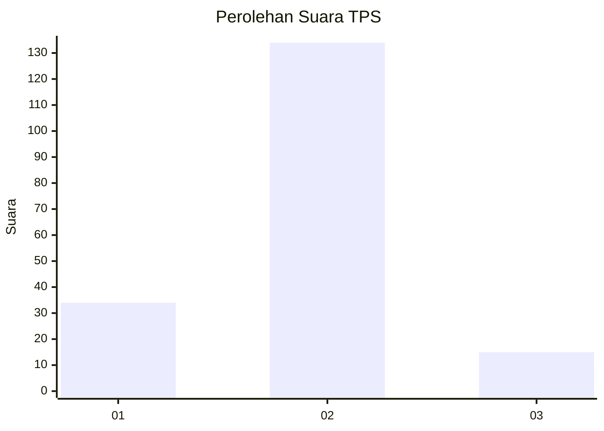
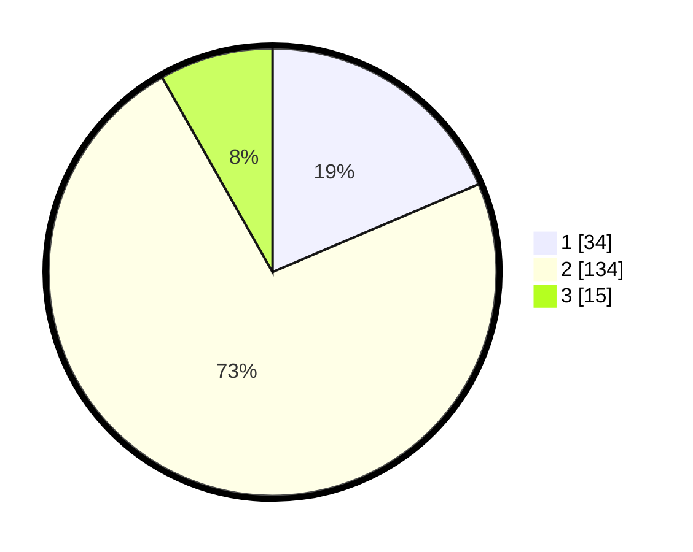

# Hasil

## Grafik

## Tabel

| No. | Nama Paslon    | Suara | Suara (raw) | Persentase |
|:--- |:-------------- | -----:| -----------:| ----------:|
| 1   | ANIES MUHAIMIN | 34    | [34][p-1]   | 18,58      |
| 2   | PRABOWO GIBRAN | 134   | [134][p-2]  | 73,22      |
| 3   | GANJAR MAHFUD  | 15    | [15][p-3]   | 8,20       |

[p-1]: https://github.com/gigit-pemilu/pemilu-2024/blob/main/pilpres/hitung-suara/sub/32-jawa-barat/sub/13-subang/sub/03-subang/sub/1003-pasirkareumbi/sub/004-tps/sub/paslon-1.txt
[p-2]: https://github.com/gigit-pemilu/pemilu-2024/blob/main/pilpres/hitung-suara/sub/32-jawa-barat/sub/13-subang/sub/03-subang/sub/1003-pasirkareumbi/sub/004-tps/sub/paslon-2.txt
[p-3]: https://github.com/gigit-pemilu/pemilu-2024/blob/main/pilpres/hitung-suara/sub/32-jawa-barat/sub/13-subang/sub/03-subang/sub/1003-pasirkareumbi/sub/004-tps/sub/paslon-3.txt

## Foto C Plano

https://sirekap-obj-formc.kpu.go.id/18c1/pemilu/ppwp/32/13/03/10/03/3213031003004-20240223-200415--5a91213c-3974-4216-872d-196523e56306.jpg

https://sirekap-obj-formc.kpu.go.id/18c1/pemilu/ppwp/32/13/03/10/03/3213031003004-20240215-030945--ce3d1e39-3d87-4458-81ea-778853c598b2.jpg

https://sirekap-obj-formc.kpu.go.id/18c1/pemilu/ppwp/32/13/03/10/03/3213031003004-20240215-031458--b329a5b4-29cf-47b5-95b7-e2e10a378ef6.jpg

## Metadata

| Key        | Value               |
| ---------- | ------------------- |
| Time Stamp | 2024-02-24 22:31:28 |

