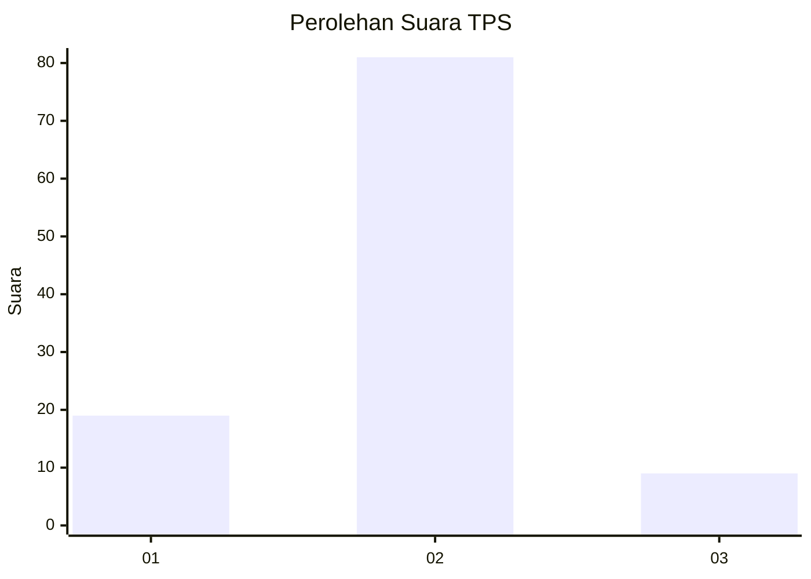
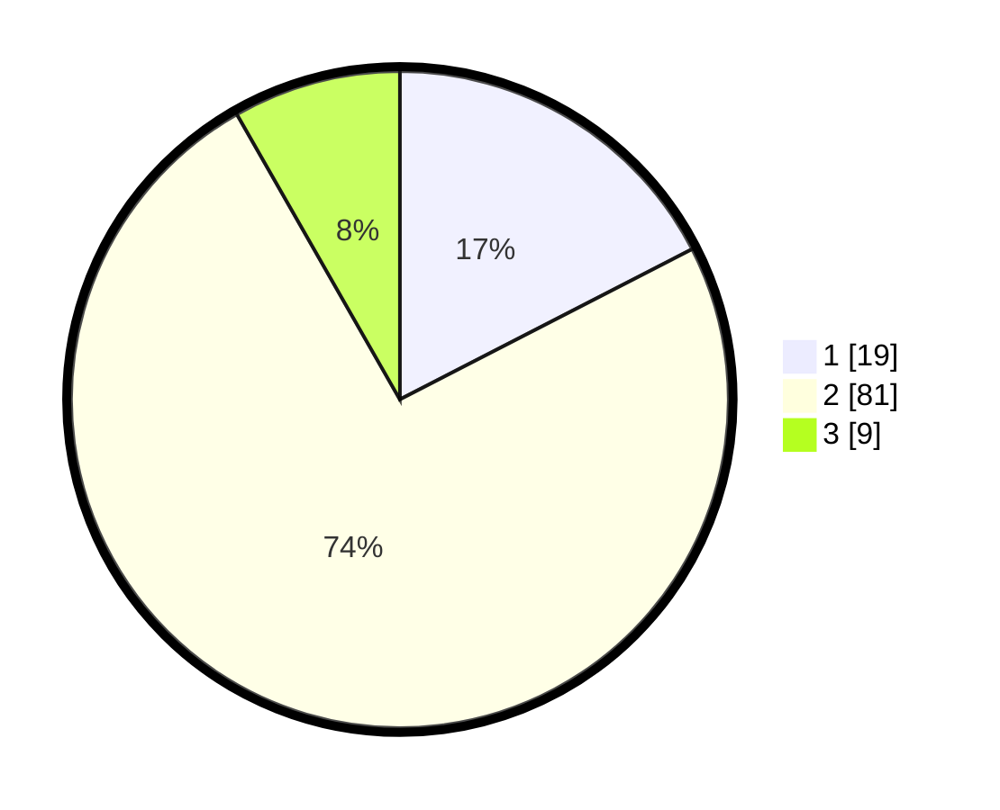

# Hasil

## Grafik

## Tabel

| No. | Nama Paslon    | Suara | Suara (raw) | Persentase |
|:--- |:-------------- | -----:| -----------:| ----------:|
| 1   | ANIES MUHAIMIN | 19    | [19][p-1]   | 17,43      |
| 2   | PRABOWO GIBRAN | 81    | [81][p-2]   | 74,31      |
| 3   | GANJAR MAHFUD  | 9     | [9][p-3]    | 8,26       |

[p-1]: https://github.com/gigit-pemilu/pemilu-2024-32-jawa-barat/blob/main/pilpres/hitung-suara/sub/32-jawa-barat/sub/13-subang/sub/03-subang/sub/1003-pasirkareumbi/sub/024-tps/sub/paslon-1.txt
[p-2]: https://github.com/gigit-pemilu/pemilu-2024-32-jawa-barat/blob/main/pilpres/hitung-suara/sub/32-jawa-barat/sub/13-subang/sub/03-subang/sub/1003-pasirkareumbi/sub/024-tps/sub/paslon-2.txt
[p-3]: https://github.com/gigit-pemilu/pemilu-2024-32-jawa-barat/blob/main/pilpres/hitung-suara/sub/32-jawa-barat/sub/13-subang/sub/03-subang/sub/1003-pasirkareumbi/sub/024-tps/sub/paslon-3.txt

## Foto C Plano

https://sirekap-obj-formc.kpu.go.id/f2be/pemilu/ppwp/32/13/03/10/03/3213031003024-20240215-000626--ad8cad63-dc82-4b28-9fff-332eaa28fdd2.jpg

https://sirekap-obj-formc.kpu.go.id/f2be/pemilu/ppwp/32/13/03/10/03/3213031003024-20240215-000817--0b1193a3-f3c4-44ab-955a-a5754aaa8509.jpg

https://sirekap-obj-formc.kpu.go.id/f2be/pemilu/ppwp/32/13/03/10/03/3213031003024-20240215-001031--b03790f4-e595-4e60-befb-2a1554d9be1f.jpg

## Metadata

| Key        | Value               |
| ---------- | ------------------- |
| Time Stamp | 2024-02-19 18:00:00 |

