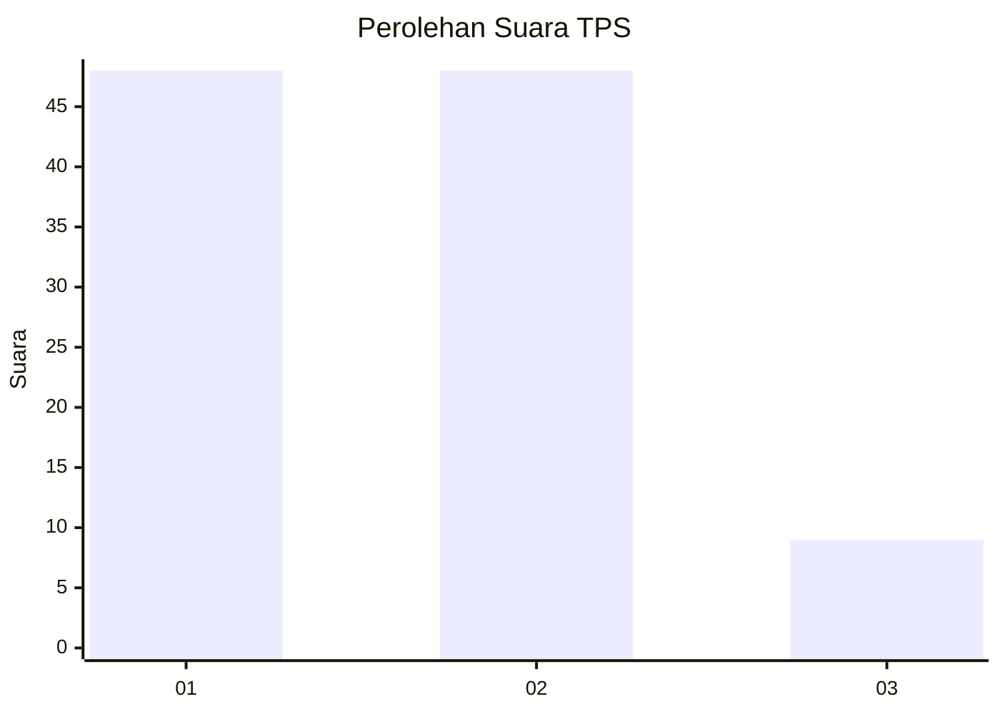
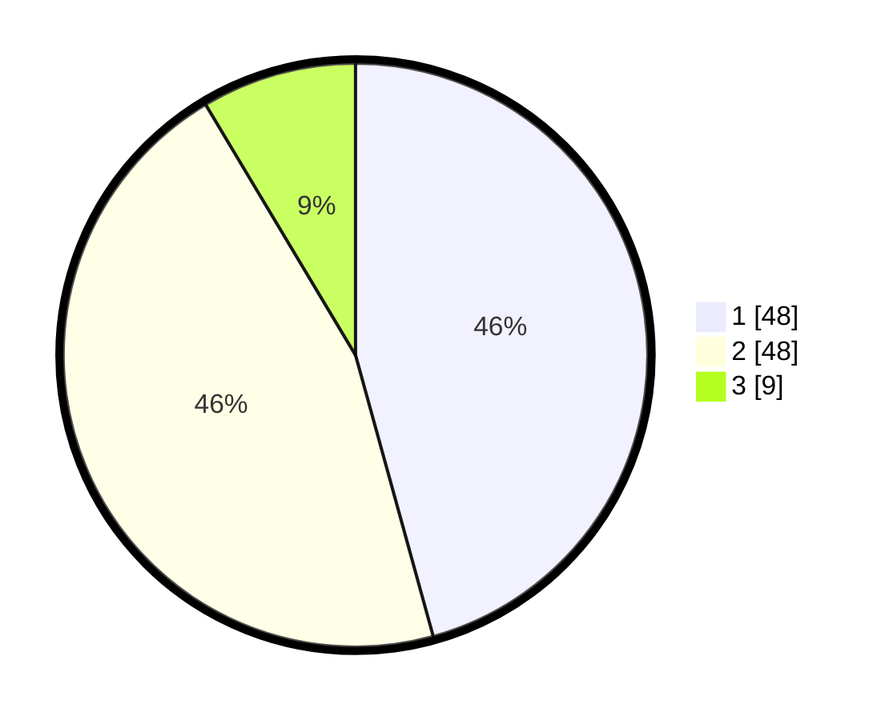

# Hasil

## Grafik

## Tabel

| No. | Nama Paslon    | Suara | Suara (raw) | Persentase |
|:--- |:-------------- | -----:| -----------:| ----------:|
| 1   | ANIES MUHAIMIN | 48    | [48][p-1]   | 45,71      |
| 2   | PRABOWO GIBRAN | 48    | [48][p-2]   | 45,71      |
| 3   | GANJAR MAHFUD  | 9     | [9][p-3]    | 8,57       |

[p-1]: https://github.com/gigit-pemilu/pemilu-2024/blob/main/pilpres/hitung-suara/sub/32-jawa-barat/sub/13-subang/sub/03-subang/sub/1003-pasirkareumbi/sub/049-tps/sub/paslon-1.txt
[p-2]: https://github.com/gigit-pemilu/pemilu-2024/blob/main/pilpres/hitung-suara/sub/32-jawa-barat/sub/13-subang/sub/03-subang/sub/1003-pasirkareumbi/sub/049-tps/sub/paslon-2.txt
[p-3]: https://github.com/gigit-pemilu/pemilu-2024/blob/main/pilpres/hitung-suara/sub/32-jawa-barat/sub/13-subang/sub/03-subang/sub/1003-pasirkareumbi/sub/049-tps/sub/paslon-3.txt

## Foto C Plano

https://sirekap-obj-formc.kpu.go.id/d6a4/pemilu/ppwp/32/13/03/10/03/3213031003049-20240214-224208--590ff0a4-af9e-424c-b804-5889c295cd85.jpg

https://sirekap-obj-formc.kpu.go.id/d6a4/pemilu/ppwp/32/13/03/10/03/3213031003049-20240214-224325--a4815438-da52-4a06-ab13-7a1df506ccbd.jpg

https://sirekap-obj-formc.kpu.go.id/d6a4/pemilu/ppwp/32/13/03/10/03/3213031003049-20240214-224410--4da997c3-c950-45f8-82dd-57811ac0fe62.jpg

## Metadata

| Key        | Value               |
| ---------- | ------------------- |
| Time Stamp | 2024-02-19 18:00:00 |

