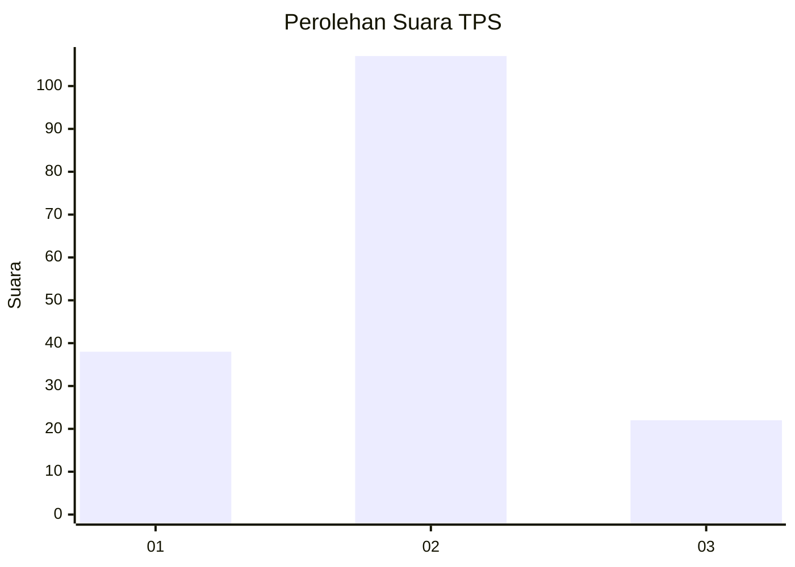
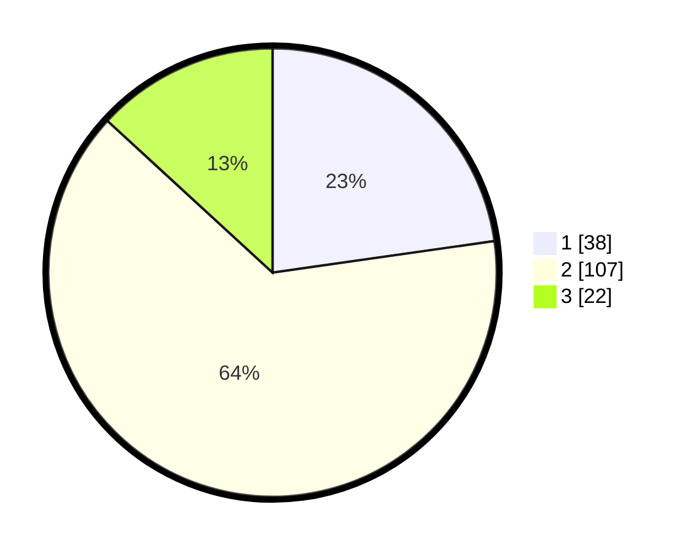

# Hasil

## Grafik

## Tabel

| No. | Nama Paslon    | Suara | Suara (raw) | Persentase |
|:--- |:-------------- | -----:| -----------:| ----------:|
| 1   | ANIES MUHAIMIN | 38    | [38][p-1]   | 22,75      |
| 2   | PRABOWO GIBRAN | 107   | [107][p-2]  | 64,07      |
| 3   | GANJAR MAHFUD  | 22    | [22][p-3]   | 13,17      |

[p-1]: https://github.com/gigit-pemilu/pemilu-2024/blob/main/pilpres/hitung-suara/sub/32-jawa-barat/sub/13-subang/sub/03-subang/sub/1006-sukamelang/sub/002-tps/sub/paslon-1.txt
[p-2]: https://github.com/gigit-pemilu/pemilu-2024/blob/main/pilpres/hitung-suara/sub/32-jawa-barat/sub/13-subang/sub/03-subang/sub/1006-sukamelang/sub/002-tps/sub/paslon-2.txt
[p-3]: https://github.com/gigit-pemilu/pemilu-2024/blob/main/pilpres/hitung-suara/sub/32-jawa-barat/sub/13-subang/sub/03-subang/sub/1006-sukamelang/sub/002-tps/sub/paslon-3.txt

## Foto C Plano

https://sirekap-obj-formc.kpu.go.id/b6e2/pemilu/ppwp/32/13/03/10/06/3213031006002-20240215-005840--06ef9fea-8a70-4ee7-bf75-8470beff02f2.jpg

https://sirekap-obj-formc.kpu.go.id/b6e2/pemilu/ppwp/32/13/03/10/06/3213031006002-20240215-005941--fe92ce57-12cb-425b-a71f-884cd5e1967c.jpg

https://sirekap-obj-formc.kpu.go.id/b6e2/pemilu/ppwp/32/13/03/10/06/3213031006002-20240215-010030--de23ea31-1516-49c9-b917-5294a8533e85.jpg

## Metadata

| Key        | Value               |
| ---------- | ------------------- |
| Time Stamp | 2024-02-19 19:00:00 |

