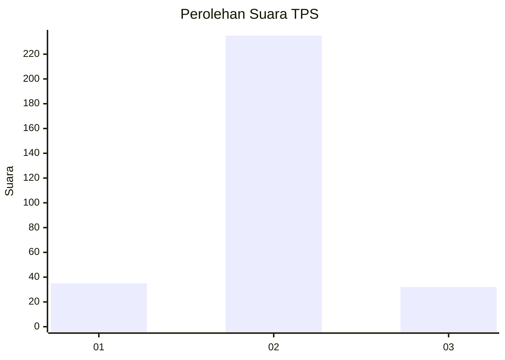
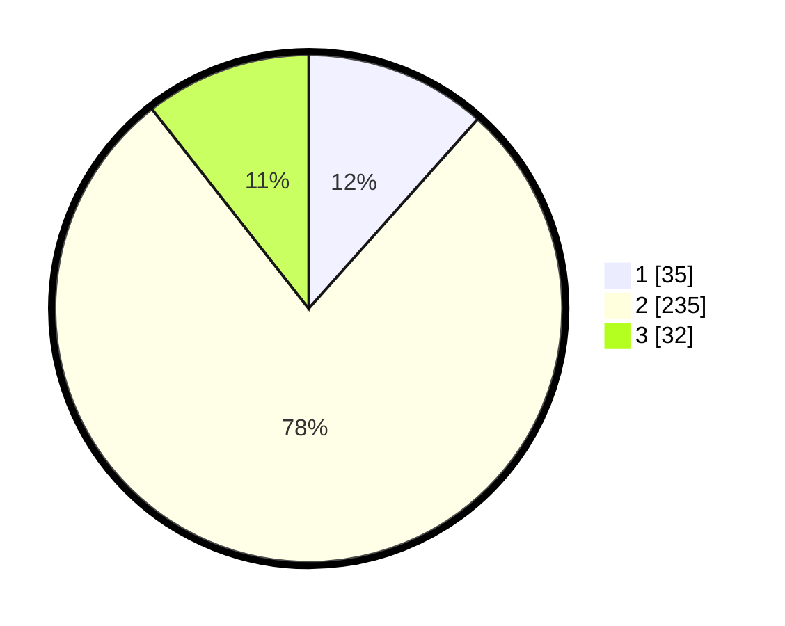

# Hasil

## Grafik

## Tabel

| No. | Nama Paslon    | Suara | Suara (raw) | Persentase |
|:--- |:-------------- | -----:| -----------:| ----------:|
| 1   | ANIES MUHAIMIN | 35    | [35][p-1]   | 11,59      |
| 2   | PRABOWO GIBRAN | 235   | [235][p-2]  | 77,81      |
| 3   | GANJAR MAHFUD  | 32    | [32][p-3]   | 10,60      |

[p-1]: https://github.com/gigit-pemilu/pemilu-2024-32-jawa-barat/blob/main/pilpres/hitung-suara/sub/32-jawa-barat/sub/13-subang/sub/03-subang/sub/1006-sukamelang/sub/007-tps/sub/paslon-1.txt
[p-2]: https://github.com/gigit-pemilu/pemilu-2024-32-jawa-barat/blob/main/pilpres/hitung-suara/sub/32-jawa-barat/sub/13-subang/sub/03-subang/sub/1006-sukamelang/sub/007-tps/sub/paslon-2.txt
[p-3]: https://github.com/gigit-pemilu/pemilu-2024-32-jawa-barat/blob/main/pilpres/hitung-suara/sub/32-jawa-barat/sub/13-subang/sub/03-subang/sub/1006-sukamelang/sub/007-tps/sub/paslon-3.txt

## Foto C Plano

https://sirekap-obj-formc.kpu.go.id/fb6f/pemilu/ppwp/32/13/03/10/06/3213031006007-20240216-135726--32edc0f4-fd90-4fee-a4b8-01a879431858.jpg

https://sirekap-obj-formc.kpu.go.id/fb6f/pemilu/ppwp/32/13/03/10/06/3213031006007-20240216-140052--079f04ee-cd80-42e7-87cd-9b6e35289fe3.jpg

https://sirekap-obj-formc.kpu.go.id/fb6f/pemilu/ppwp/32/13/03/10/06/3213031006007-20240216-135925--51eb7e62-370c-4485-b341-e8dfeccf9a4d.jpg

## Metadata

| Key        | Value               |
| ---------- | ------------------- |
| Time Stamp | 2024-02-19 19:00:00 |

