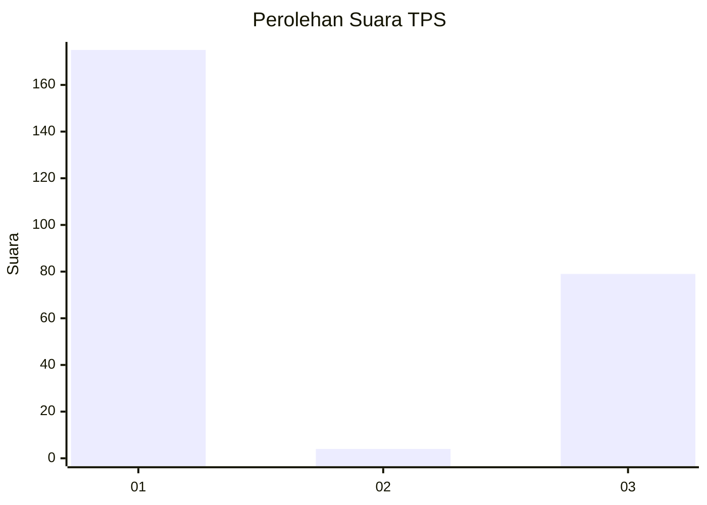
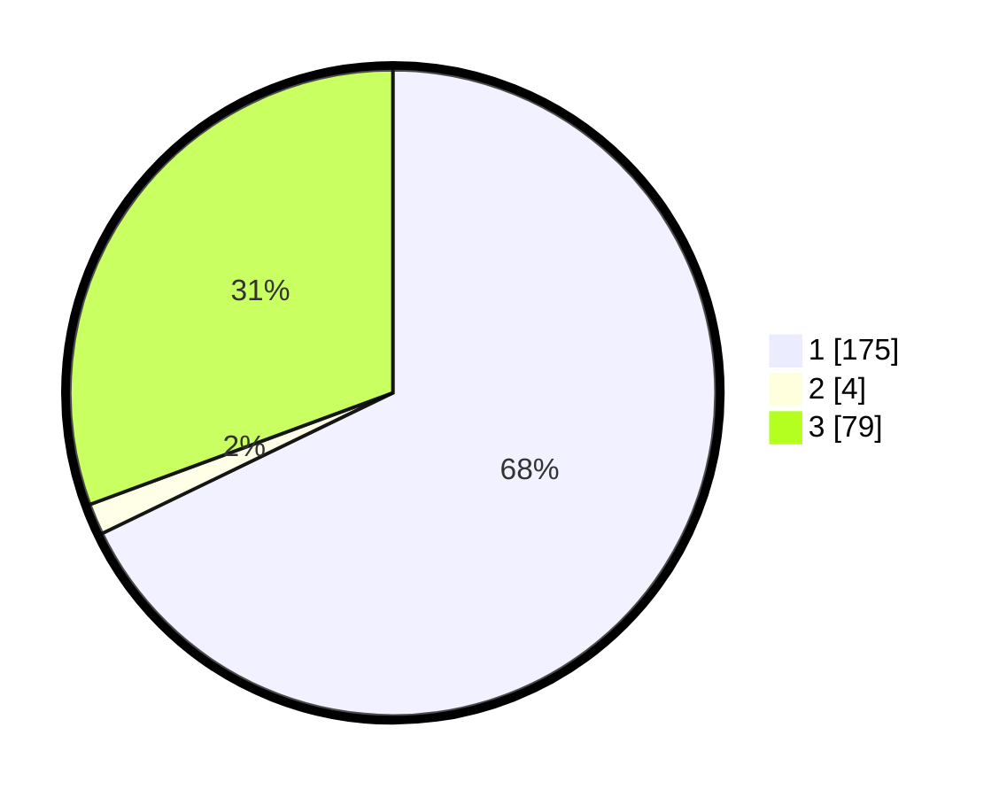

# Hasil

## Grafik

## Tabel

| No. | Nama Paslon    | Suara | Suara (raw) | Persentase |
|:--- |:-------------- | -----:| -----------:| ----------:|
| 1   | ANIES MUHAIMIN | 175   | [175][p-1]  | 67,83      |
| 2   | PRABOWO GIBRAN | 4     | [4][p-2]    | 1,55       |
| 3   | GANJAR MAHFUD  | 79    | [79][p-3]   | 30,62      |

[p-1]: https://github.com/gigit-pemilu/pemilu-2024-32-jawa-barat/blob/main/pilpres/hitung-suara/sub/32-jawa-barat/sub/13-subang/sub/03-subang/sub/1006-sukamelang/sub/025-tps/sub/paslon-1.txt
[p-2]: https://github.com/gigit-pemilu/pemilu-2024-32-jawa-barat/blob/main/pilpres/hitung-suara/sub/32-jawa-barat/sub/13-subang/sub/03-subang/sub/1006-sukamelang/sub/025-tps/sub/paslon-2.txt
[p-3]: https://github.com/gigit-pemilu/pemilu-2024-32-jawa-barat/blob/main/pilpres/hitung-suara/sub/32-jawa-barat/sub/13-subang/sub/03-subang/sub/1006-sukamelang/sub/025-tps/sub/paslon-3.txt

## Foto C Plano

https://sirekap-obj-formc.kpu.go.id/a779/pemilu/ppwp/32/13/03/10/06/3213031006025-20240214-213128--caac98eb-1340-49b8-bf45-7db279d6cf1e.jpg

https://sirekap-obj-formc.kpu.go.id/a779/pemilu/ppwp/32/13/03/10/06/3213031006025-20240214-225653--e570379e-bbea-4d7e-be2e-d40c7f4b678b.jpg

https://sirekap-obj-formc.kpu.go.id/a779/pemilu/ppwp/32/13/03/10/06/3213031006025-20240215-031200--27a1dff2-1b4b-4e4d-8d8e-81e32e6cb916.jpg

## Metadata

| Key        | Value               |
| ---------- | ------------------- |
| Time Stamp | 2024-02-19 19:00:00 |

