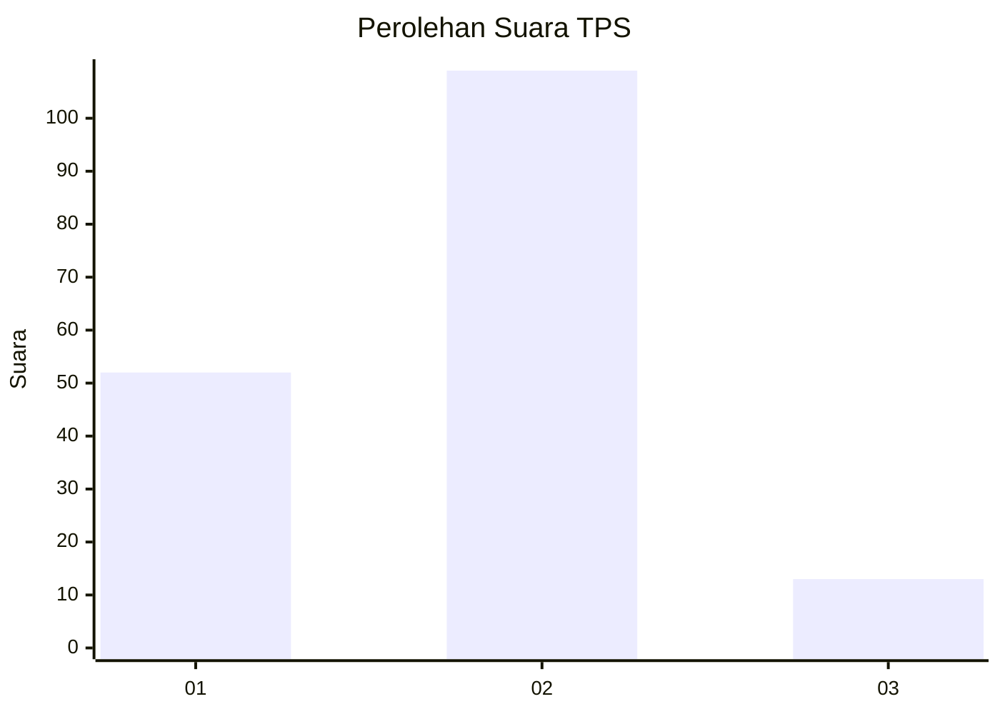
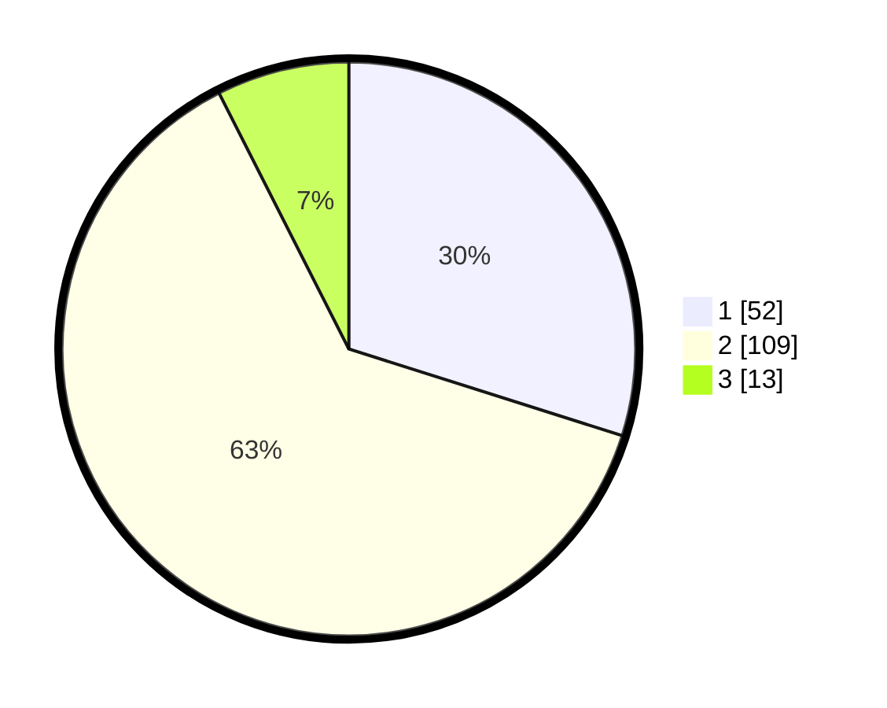

# Hasil

## Grafik

## Tabel

| No. | Nama Paslon    | Suara | Suara (raw) | Persentase |
|:--- |:-------------- | -----:| -----------:| ----------:|
| 1   | ANIES MUHAIMIN | 52    | [52][p-1]   | 29,89      |
| 2   | PRABOWO GIBRAN | 109   | [109][p-2]  | 62,64      |
| 3   | GANJAR MAHFUD  | 13    | [13][p-3]   | 7,47       |

[p-1]: https://github.com/gigit-pemilu/pemilu-2024/blob/main/pilpres/hitung-suara/sub/32-jawa-barat/sub/13-subang/sub/04-kalijati/sub/2006-marengmang/sub/010-tps/sub/paslon-1.txt
[p-2]: https://github.com/gigit-pemilu/pemilu-2024/blob/main/pilpres/hitung-suara/sub/32-jawa-barat/sub/13-subang/sub/04-kalijati/sub/2006-marengmang/sub/010-tps/sub/paslon-2.txt
[p-3]: https://github.com/gigit-pemilu/pemilu-2024/blob/main/pilpres/hitung-suara/sub/32-jawa-barat/sub/13-subang/sub/04-kalijati/sub/2006-marengmang/sub/010-tps/sub/paslon-3.txt

## Foto C Plano

https://sirekap-obj-formc.kpu.go.id/22c9/pemilu/ppwp/32/13/04/20/06/3213042006010-20240214-155145--a9d705eb-d45a-4c22-823b-8341841e26fd.jpg

https://sirekap-obj-formc.kpu.go.id/22c9/pemilu/ppwp/32/13/04/20/06/3213042006010-20240214-155208--80e306d5-12c1-47f1-8e41-fb1d9d87d3a6.jpg

https://sirekap-obj-formc.kpu.go.id/22c9/pemilu/ppwp/32/13/04/20/06/3213042006010-20240214-155240--367ccfa0-1ee4-4d0d-9c84-003f68ae960d.jpg

## Metadata

| Key        | Value               |
| ---------- | ------------------- |
| Time Stamp | 2024-02-19 06:16:00 |

