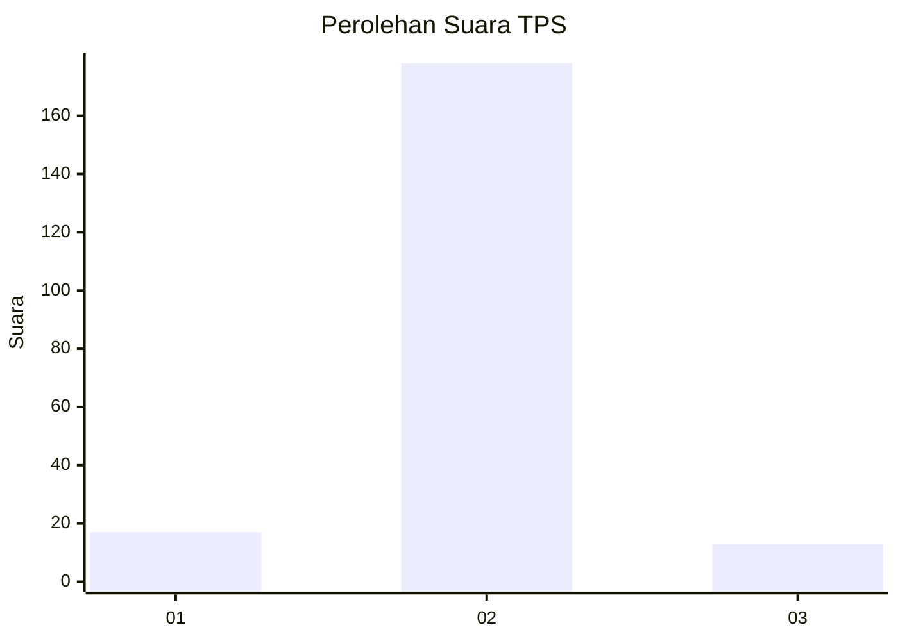
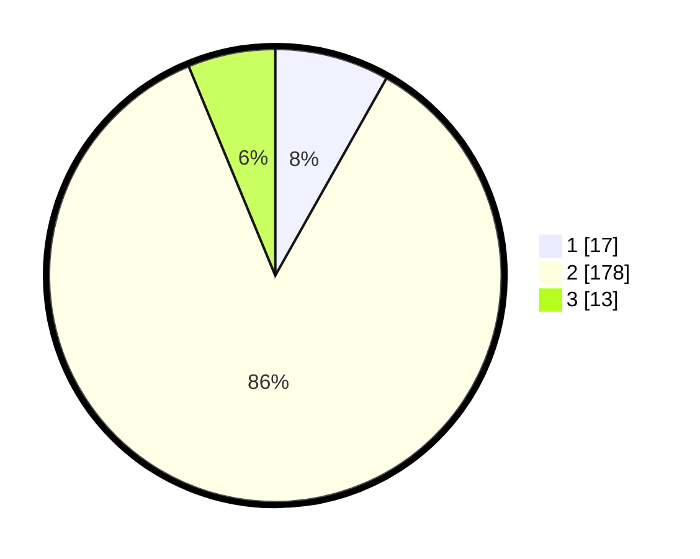

# Hasil

## Grafik

## Tabel

| No. | Nama Paslon    | Suara | Suara (raw) | Persentase |
|:--- |:-------------- | -----:| -----------:| ----------:|
| 1   | ANIES MUHAIMIN | 17    | [17][p-1]   | 8,17       |
| 2   | PRABOWO GIBRAN | 178   | [178][p-2]  | 85,58      |
| 3   | GANJAR MAHFUD  | 13    | [13][p-3]   | 6,25       |

[p-1]: https://github.com/gigit-pemilu/pemilu-2024/blob/main/pilpres/hitung-suara/sub/32-jawa-barat/sub/13-subang/sub/04-kalijati/sub/2006-marengmang/sub/014-tps/sub/paslon-1.txt
[p-2]: https://github.com/gigit-pemilu/pemilu-2024/blob/main/pilpres/hitung-suara/sub/32-jawa-barat/sub/13-subang/sub/04-kalijati/sub/2006-marengmang/sub/014-tps/sub/paslon-2.txt
[p-3]: https://github.com/gigit-pemilu/pemilu-2024/blob/main/pilpres/hitung-suara/sub/32-jawa-barat/sub/13-subang/sub/04-kalijati/sub/2006-marengmang/sub/014-tps/sub/paslon-3.txt

## Foto C Plano

https://sirekap-obj-formc.kpu.go.id/6ba3/pemilu/ppwp/32/13/04/20/06/3213042006014-20240214-194046--3a1c434e-58db-4914-9406-81071a600894.jpg

https://sirekap-obj-formc.kpu.go.id/6ba3/pemilu/ppwp/32/13/04/20/06/3213042006014-20240214-193003--6de94fc5-9324-419d-bb5d-c96663a25fd7.jpg

https://sirekap-obj-formc.kpu.go.id/6ba3/pemilu/ppwp/32/13/04/20/06/3213042006014-20240214-193256--3eaac6d8-c33d-479a-ad41-76c1d395f22f.jpg

## Metadata

| Key        | Value               |
| ---------- | ------------------- |
| Time Stamp | 2024-02-14 21:46:01 |

