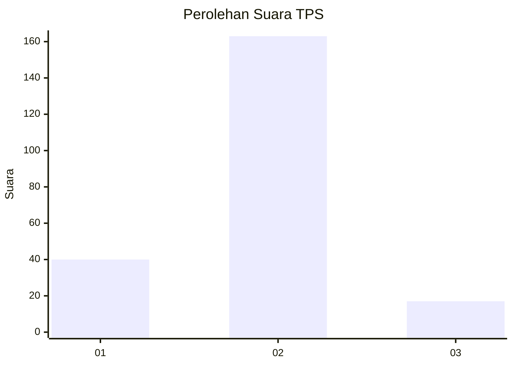
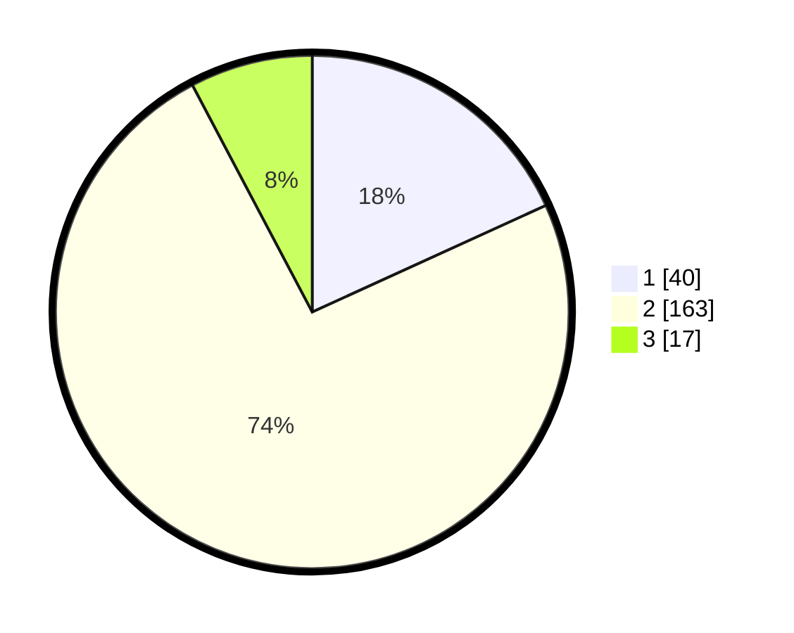

# Hasil

## Grafik

## Tabel

| No. | Nama Paslon    | Suara | Suara (raw) | Persentase |
|:--- |:-------------- | -----:| -----------:| ----------:|
| 1   | ANIES MUHAIMIN | 40    | [40][p-1]   | 18,18      |
| 2   | PRABOWO GIBRAN | 163   | [163][p-2]  | 74,09      |
| 3   | GANJAR MAHFUD  | 17    | [17][p-3]   | 7,73       |

[p-1]: https://github.com/gigit-pemilu/pemilu-2024-32-jawa-barat/blob/main/pilpres/hitung-suara/sub/32-jawa-barat/sub/13-subang/sub/05-pabuaran/sub/2001-cihambulu/sub/006-tps/sub/paslon-1.txt
[p-2]: https://github.com/gigit-pemilu/pemilu-2024-32-jawa-barat/blob/main/pilpres/hitung-suara/sub/32-jawa-barat/sub/13-subang/sub/05-pabuaran/sub/2001-cihambulu/sub/006-tps/sub/paslon-2.txt
[p-3]: https://github.com/gigit-pemilu/pemilu-2024-32-jawa-barat/blob/main/pilpres/hitung-suara/sub/32-jawa-barat/sub/13-subang/sub/05-pabuaran/sub/2001-cihambulu/sub/006-tps/sub/paslon-3.txt

## Foto C Plano

https://sirekap-obj-formc.kpu.go.id/4f74/pemilu/ppwp/32/13/05/20/01/3213052001006-20240214-221724--322f3c05-6f9d-4485-98e9-778e8fa82fbf.jpg

https://sirekap-obj-formc.kpu.go.id/4f74/pemilu/ppwp/32/13/05/20/01/3213052001006-20240214-221733--f59299c7-413d-41d0-bad4-cda933eb1854.jpg

https://sirekap-obj-formc.kpu.go.id/4f74/pemilu/ppwp/32/13/05/20/01/3213052001006-20240214-221739--736a238e-b402-4292-ac16-db6b3e8e987f.jpg

## Metadata

| Key        | Value               |
| ---------- | ------------------- |
| Time Stamp | 2024-02-19 06:16:00 |

