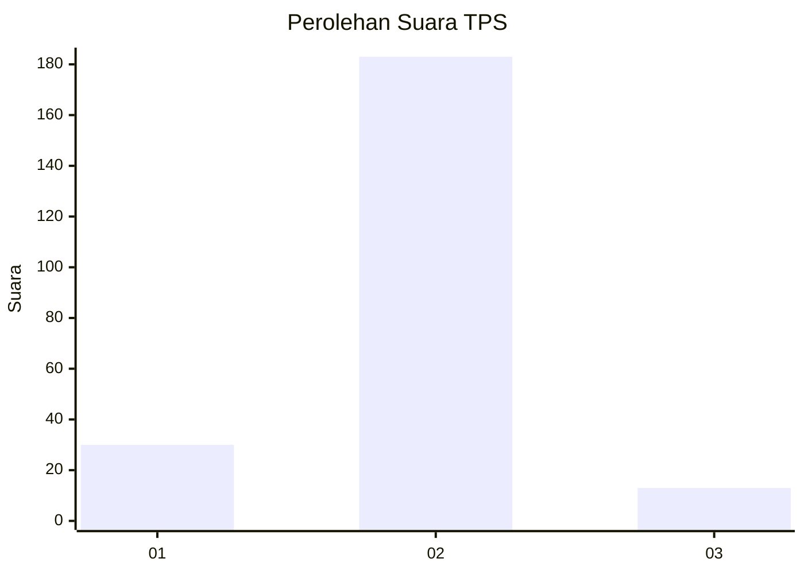
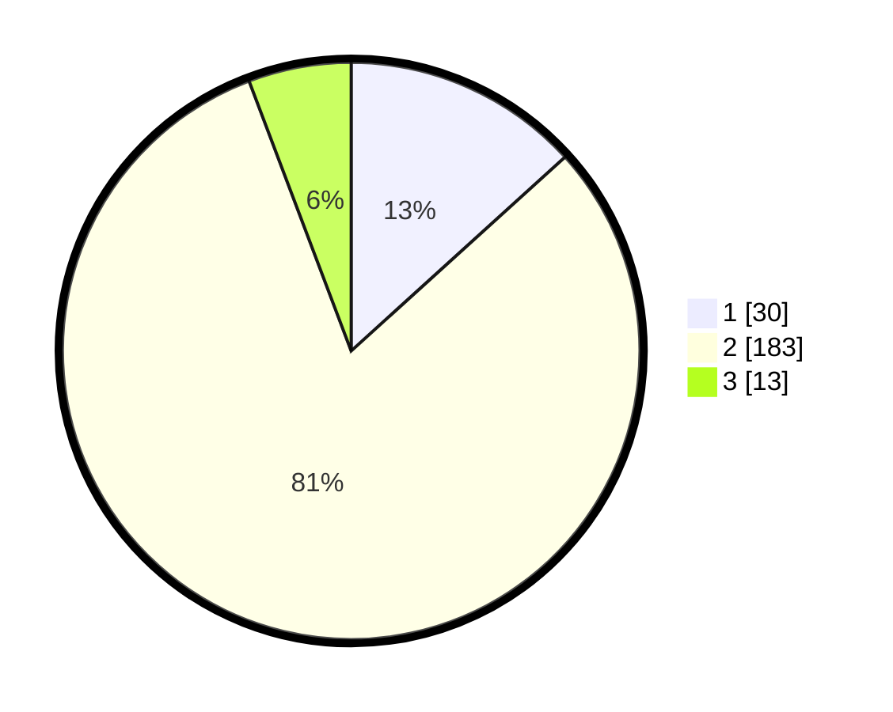

# Hasil

## Grafik

## Tabel

| No. | Nama Paslon    | Suara | Suara (raw) | Persentase |
|:--- |:-------------- | -----:| -----------:| ----------:|
| 1   | ANIES MUHAIMIN | 30    | [30][p-1]   | 13,27      |
| 2   | PRABOWO GIBRAN | 183   | [183][p-2]  | 80,97      |
| 3   | GANJAR MAHFUD  | 13    | [13][p-3]   | 5,75       |

[p-1]: https://github.com/gigit-pemilu/pemilu-2024/blob/main/pilpres/hitung-suara/sub/32-jawa-barat/sub/13-subang/sub/05-pabuaran/sub/2002-siluman/sub/009-tps/sub/paslon-1.txt
[p-2]: https://github.com/gigit-pemilu/pemilu-2024/blob/main/pilpres/hitung-suara/sub/32-jawa-barat/sub/13-subang/sub/05-pabuaran/sub/2002-siluman/sub/009-tps/sub/paslon-2.txt
[p-3]: https://github.com/gigit-pemilu/pemilu-2024/blob/main/pilpres/hitung-suara/sub/32-jawa-barat/sub/13-subang/sub/05-pabuaran/sub/2002-siluman/sub/009-tps/sub/paslon-3.txt

## Foto C Plano

https://sirekap-obj-formc.kpu.go.id/7eef/pemilu/ppwp/32/13/05/20/02/3213052002009-20240215-025146--384f31f5-5a95-465a-9f81-c3740c674f11.jpg

https://sirekap-obj-formc.kpu.go.id/7eef/pemilu/ppwp/32/13/05/20/02/3213052002009-20240215-025243--6f92daad-3d03-4b71-9459-798d2b852305.jpg

https://sirekap-obj-formc.kpu.go.id/7eef/pemilu/ppwp/32/13/05/20/02/3213052002009-20240215-025335--18d592c5-6d4f-4d08-b593-72d773b49ae5.jpg

## Metadata

| Key        | Value               |
| ---------- | ------------------- |
| Time Stamp | 2024-02-19 06:16:00 |

