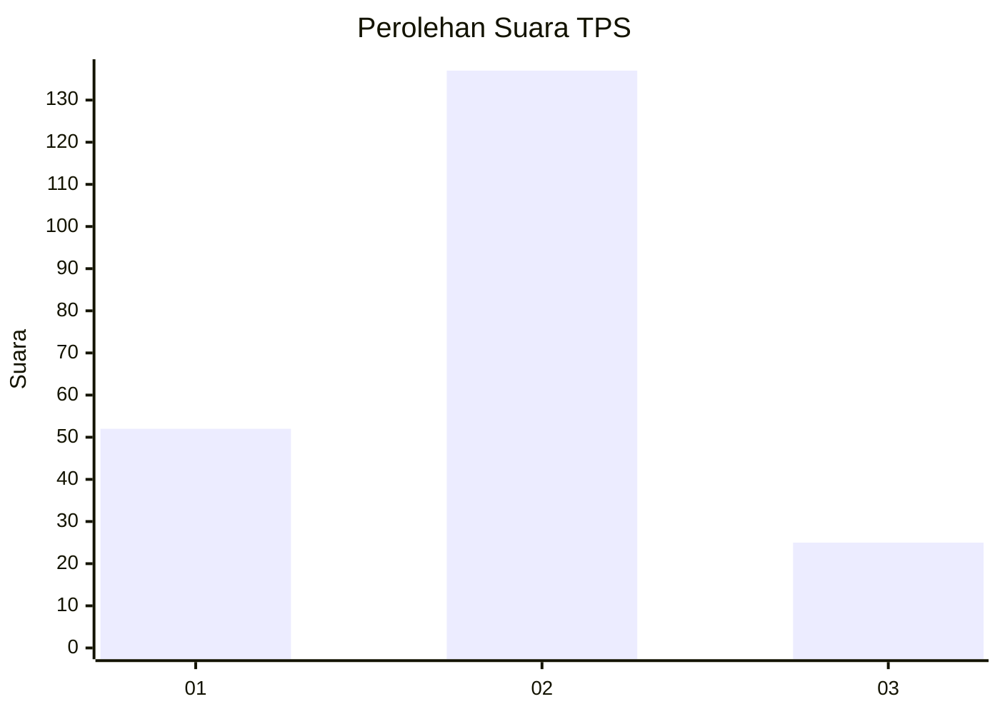
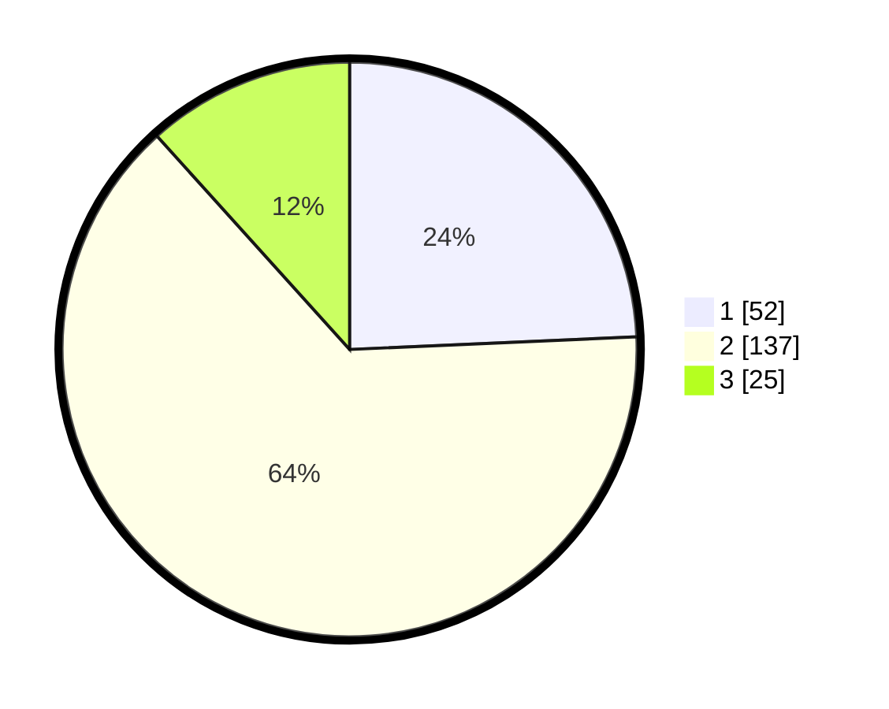

# Hasil

## Grafik

## Tabel

| No. | Nama Paslon    | Suara | Suara (raw) | Persentase |
|:--- |:-------------- | -----:| -----------:| ----------:|
| 1   | ANIES MUHAIMIN | 52    | [52][p-1]   | 24,30      |
| 2   | PRABOWO GIBRAN | 137   | [137][p-2]  | 64,02      |
| 3   | GANJAR MAHFUD  | 25    | [25][p-3]   | 11,68      |

[p-1]: https://github.com/gigit-pemilu/pemilu-2024-32-jawa-barat/blob/main/pilpres/hitung-suara/sub/32-jawa-barat/sub/13-subang/sub/05-pabuaran/sub/2002-siluman/sub/015-tps/sub/paslon-1.txt
[p-2]: https://github.com/gigit-pemilu/pemilu-2024-32-jawa-barat/blob/main/pilpres/hitung-suara/sub/32-jawa-barat/sub/13-subang/sub/05-pabuaran/sub/2002-siluman/sub/015-tps/sub/paslon-2.txt
[p-3]: https://github.com/gigit-pemilu/pemilu-2024-32-jawa-barat/blob/main/pilpres/hitung-suara/sub/32-jawa-barat/sub/13-subang/sub/05-pabuaran/sub/2002-siluman/sub/015-tps/sub/paslon-3.txt

## Foto C Plano

https://sirekap-obj-formc.kpu.go.id/929a/pemilu/ppwp/32/13/05/20/02/3213052002015-20240215-041120--fdf5fb3a-4b5b-422f-a825-1169fd6a1cb9.jpg

https://sirekap-obj-formc.kpu.go.id/929a/pemilu/ppwp/32/13/05/20/02/3213052002015-20240215-041243--5ac7690c-8fb2-4052-a515-c49112e49461.jpg

https://sirekap-obj-formc.kpu.go.id/929a/pemilu/ppwp/32/13/05/20/02/3213052002015-20240215-041344--3709802b-be9a-49da-ad92-17c230a69f16.jpg

## Metadata

| Key        | Value               |
| ---------- | ------------------- |
| Time Stamp | 2024-02-19 06:16:00 |

