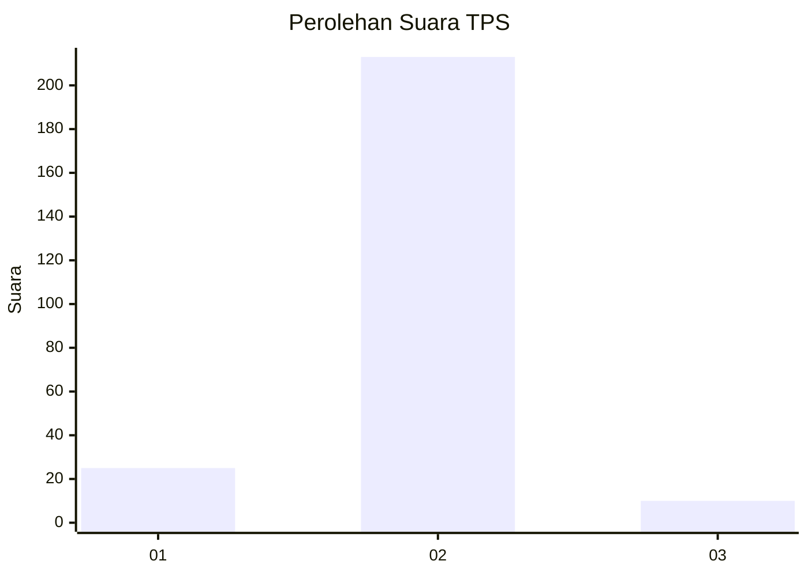
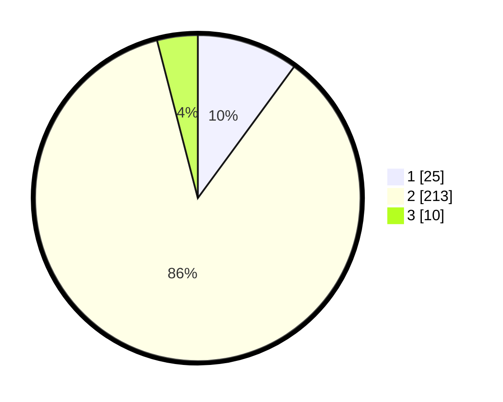

# Hasil

## Grafik

## Tabel

| No. | Nama Paslon    | Suara | Suara (raw) | Persentase |
|:--- |:-------------- | -----:| -----------:| ----------:|
| 1   | ANIES MUHAIMIN | 25    | [25][p-1]   | 10,08      |
| 2   | PRABOWO GIBRAN | 213   | [213][p-2]  | 85,89      |
| 3   | GANJAR MAHFUD  | 10    | [10][p-3]   | 4,03       |

[p-1]: https://github.com/gigit-pemilu/pemilu-2024/blob/main/pilpres/hitung-suara/sub/32-jawa-barat/sub/13-subang/sub/05-pabuaran/sub/2003-pringkasap/sub/002-tps/sub/paslon-1.txt
[p-2]: https://github.com/gigit-pemilu/pemilu-2024/blob/main/pilpres/hitung-suara/sub/32-jawa-barat/sub/13-subang/sub/05-pabuaran/sub/2003-pringkasap/sub/002-tps/sub/paslon-2.txt
[p-3]: https://github.com/gigit-pemilu/pemilu-2024/blob/main/pilpres/hitung-suara/sub/32-jawa-barat/sub/13-subang/sub/05-pabuaran/sub/2003-pringkasap/sub/002-tps/sub/paslon-3.txt

## Foto C Plano

https://sirekap-obj-formc.kpu.go.id/9136/pemilu/ppwp/32/13/05/20/03/3213052003002-20240214-221025--4562a2a6-9e55-4c25-9963-3524b8e98e8f.jpg

https://sirekap-obj-formc.kpu.go.id/9136/pemilu/ppwp/32/13/05/20/03/3213052003002-20240214-221108--174fbaab-d80e-4959-968a-9a19313aeeaa.jpg

https://sirekap-obj-formc.kpu.go.id/9136/pemilu/ppwp/32/13/05/20/03/3213052003002-20240214-221143--1875c67d-9275-4965-b0a1-0da9228ccbb2.jpg

## Metadata

| Key        | Value               |
| ---------- | ------------------- |
| Time Stamp | 2024-02-19 06:16:00 |

