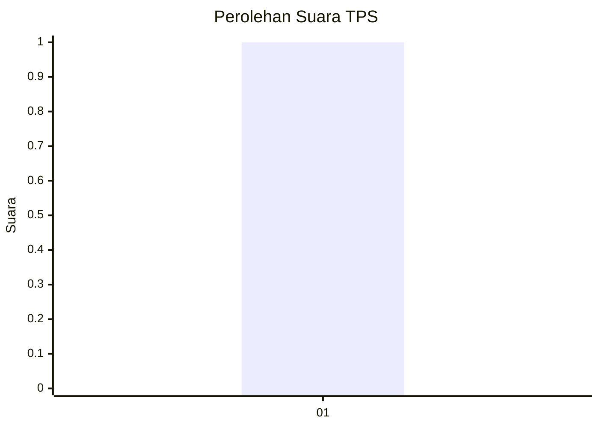
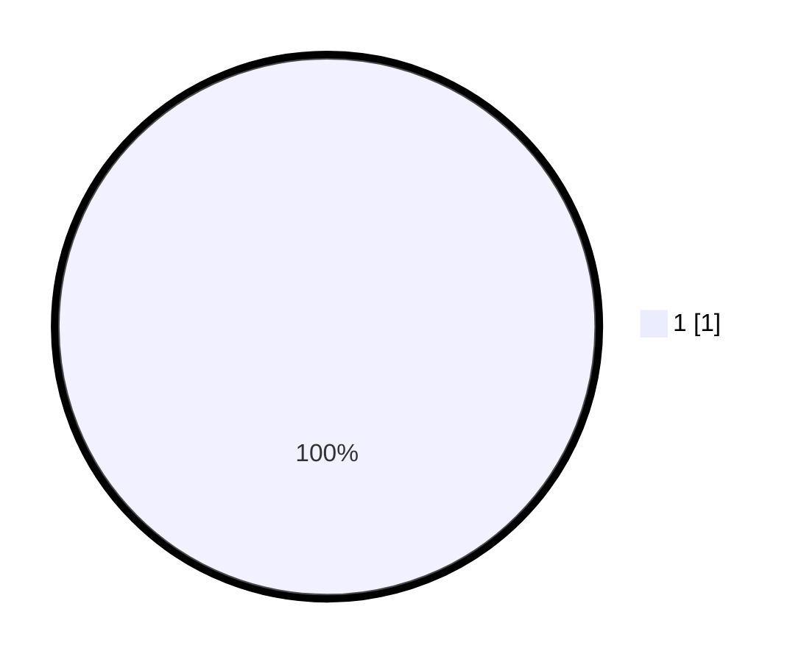

# Hasil

## Grafik

## Tabel

| No. | Nama Paslon    | Suara | Suara (raw) | Persentase |
|:--- |:-------------- | -----:| -----------:| ----------:|
| 1   | ANIES MUHAIMIN | 1     | [1][p-1]    | 100,00     |

[p-1]: https://github.com/gigit-pemilu/pemilu-2024-32-jawa-barat/blob/main/pilpres/hitung-suara/sub/32-jawa-barat/sub/13-subang/sub/05-pabuaran/sub/2006-salamjaya/sub/008-tps/sub/paslon-1.txt
[p-2]: https://github.com/gigit-pemilu/pemilu-2024-32-jawa-barat/blob/main/pilpres/hitung-suara/sub/32-jawa-barat/sub/13-subang/sub/05-pabuaran/sub/2006-salamjaya/sub/008-tps/sub/paslon-2.txt
[p-3]: https://github.com/gigit-pemilu/pemilu-2024-32-jawa-barat/blob/main/pilpres/hitung-suara/sub/32-jawa-barat/sub/13-subang/sub/05-pabuaran/sub/2006-salamjaya/sub/008-tps/sub/paslon-3.txt

## Foto C Plano

https://sirekap-obj-formc.kpu.go.id/0d64/pemilu/ppwp/32/13/05/20/06/3213052006008-20240215-000948--f79dbf0c-0d59-4654-bc07-5bbd2a704370.jpg

https://sirekap-obj-formc.kpu.go.id/0d64/pemilu/ppwp/32/13/05/20/06/3213052006008-20240215-001148--8c70c1be-5947-4595-9479-0611ec3e8fc1.jpg

https://sirekap-obj-formc.kpu.go.id/0d64/pemilu/ppwp/32/13/05/20/06/3213052006008-20240215-001315--237cbb07-fe1c-45df-9052-fa5b1e28e9df.jpg

## Metadata

| Key        | Value               |
| ---------- | ------------------- |
| Time Stamp | 2024-02-24 22:31:28 |

