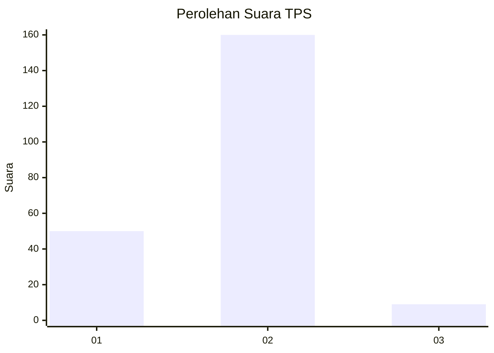
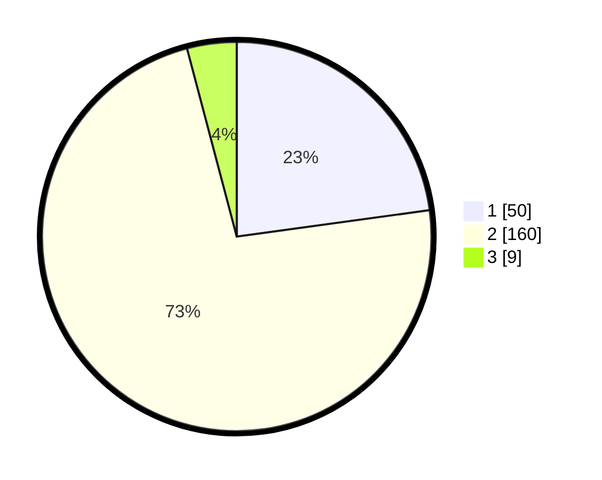

# Hasil

## Grafik

## Tabel

| No. | Nama Paslon    | Suara | Suara (raw) | Persentase |
|:--- |:-------------- | -----:| -----------:| ----------:|
| 1   | ANIES MUHAIMIN | 50    | [50][p-1]   | 22,83      |
| 2   | PRABOWO GIBRAN | 160   | [160][p-2]  | 73,06      |
| 3   | GANJAR MAHFUD  | 9     | [9][p-3]    | 4,11       |

[p-1]: https://github.com/gigit-pemilu/pemilu-2024-32-jawa-barat/blob/main/pilpres/hitung-suara/sub/32-jawa-barat/sub/13-subang/sub/06-purwadadi/sub/2001-wanakerta/sub/015-tps/sub/paslon-1.txt
[p-2]: https://github.com/gigit-pemilu/pemilu-2024-32-jawa-barat/blob/main/pilpres/hitung-suara/sub/32-jawa-barat/sub/13-subang/sub/06-purwadadi/sub/2001-wanakerta/sub/015-tps/sub/paslon-2.txt
[p-3]: https://github.com/gigit-pemilu/pemilu-2024-32-jawa-barat/blob/main/pilpres/hitung-suara/sub/32-jawa-barat/sub/13-subang/sub/06-purwadadi/sub/2001-wanakerta/sub/015-tps/sub/paslon-3.txt

## Foto C Plano

https://sirekap-obj-formc.kpu.go.id/811d/pemilu/ppwp/32/13/06/20/01/3213062001015-20240215-221807--ff78a2f4-9c87-4046-a756-087afa6f46e9.jpg

https://sirekap-obj-formc.kpu.go.id/811d/pemilu/ppwp/32/13/06/20/01/3213062001015-20240216-162505--82c14625-5e3e-4e13-aa8f-dc1d5ff2b5e9.jpg

https://sirekap-obj-formc.kpu.go.id/811d/pemilu/ppwp/32/13/06/20/01/3213062001015-20240217-170546--3341d215-094f-4074-baf0-ee542f6d2812.jpg

## Metadata

| Key        | Value               |
| ---------- | ------------------- |
| Time Stamp | 2024-02-17 17:30:00 |

