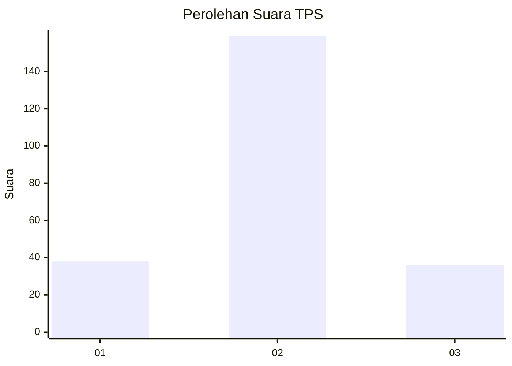
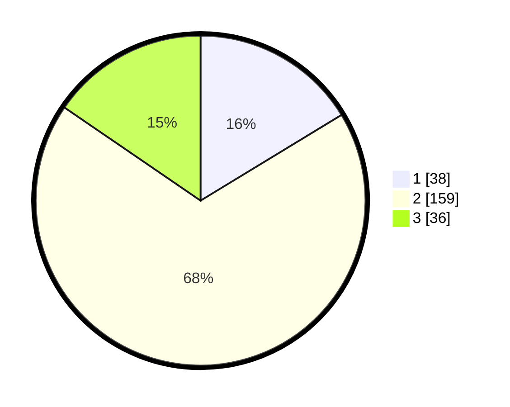

# Hasil

## Grafik

## Tabel

| No. | Nama Paslon    | Suara | Suara (raw) | Persentase |
|:--- |:-------------- | -----:| -----------:| ----------:|
| 1   | ANIES MUHAIMIN | 38    | [38][p-1]   | 16,31      |
| 2   | PRABOWO GIBRAN | 159   | [159][p-2]  | 68,24      |
| 3   | GANJAR MAHFUD  | 36    | [36][p-3]   | 15,45      |

[p-1]: https://github.com/gigit-pemilu/pemilu-2024/blob/main/pilpres/hitung-suara/sub/32-jawa-barat/sub/13-subang/sub/06-purwadadi/sub/2001-wanakerta/sub/017-tps/sub/paslon-1.txt
[p-2]: https://github.com/gigit-pemilu/pemilu-2024/blob/main/pilpres/hitung-suara/sub/32-jawa-barat/sub/13-subang/sub/06-purwadadi/sub/2001-wanakerta/sub/017-tps/sub/paslon-2.txt
[p-3]: https://github.com/gigit-pemilu/pemilu-2024/blob/main/pilpres/hitung-suara/sub/32-jawa-barat/sub/13-subang/sub/06-purwadadi/sub/2001-wanakerta/sub/017-tps/sub/paslon-3.txt

## Foto C Plano

https://sirekap-obj-formc.kpu.go.id/3cbe/pemilu/ppwp/32/13/06/20/01/3213062001017-20240214-234238--3a94f586-ca0f-4735-a6a3-f0805ca16caf.jpg

https://sirekap-obj-formc.kpu.go.id/3cbe/pemilu/ppwp/32/13/06/20/01/3213062001017-20240214-234601--aefda5f3-e46f-4b66-b9e8-6acde3597ca8.jpg

https://sirekap-obj-formc.kpu.go.id/3cbe/pemilu/ppwp/32/13/06/20/01/3213062001017-20240214-234828--351b7203-1325-4606-90fa-66d140a36615.jpg

## Metadata

| Key        | Value               |
| ---------- | ------------------- |
| Time Stamp | 2024-02-19 19:00:00 |

