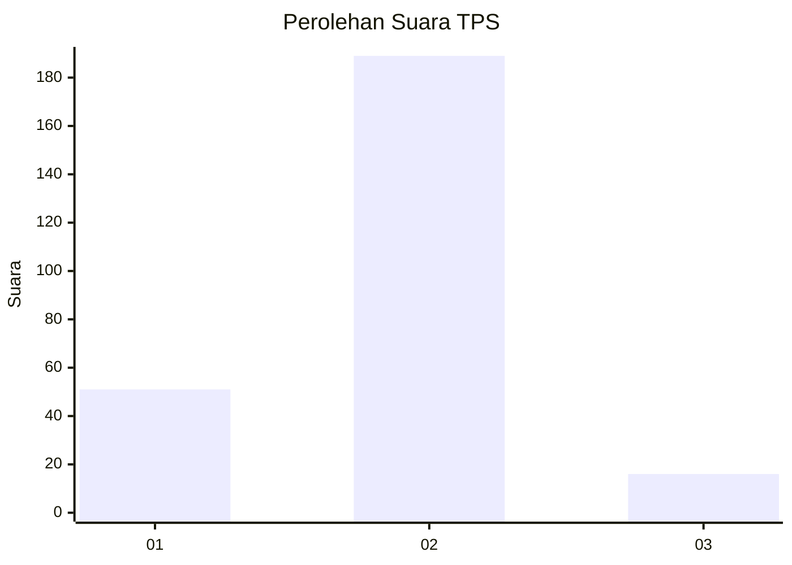

# Hasil

## Grafik

## Tabel

| No. | Nama Paslon    | Suara | Suara (raw) | Persentase |
|:--- |:-------------- | -----:| -----------:| ----------:|
| 1   | ANIES MUHAIMIN | 51    | [51][p-1]   | 19,92      |
| 2   | PRABOWO GIBRAN | 189   | [189][p-2]  | 73,83      |
| 3   | GANJAR MAHFUD  | 16    | [16][p-3]   | 6,25       |

[p-1]: https://github.com/gigit-pemilu/pemilu-2024/blob/main/pilpres/hitung-suara/sub/32-jawa-barat/sub/13-subang/sub/06-purwadadi/sub/2001-wanakerta/sub/022-tps/sub/paslon-1.txt
[p-2]: https://github.com/gigit-pemilu/pemilu-2024/blob/main/pilpres/hitung-suara/sub/32-jawa-barat/sub/13-subang/sub/06-purwadadi/sub/2001-wanakerta/sub/022-tps/sub/paslon-2.txt
[p-3]: https://github.com/gigit-pemilu/pemilu-2024/blob/main/pilpres/hitung-suara/sub/32-jawa-barat/sub/13-subang/sub/06-purwadadi/sub/2001-wanakerta/sub/022-tps/sub/paslon-3.txt

## Foto C Plano

https://sirekap-obj-formc.kpu.go.id/e4ff/pemilu/ppwp/32/13/06/20/01/3213062001022-20240214-192715--f892e0e3-2daa-46bf-a7ef-664710a86a70.jpg

https://sirekap-obj-formc.kpu.go.id/e4ff/pemilu/ppwp/32/13/06/20/01/3213062001022-20240214-194436--4b3fb689-a450-4d67-8ee5-aa93532c2152.jpg

https://sirekap-obj-formc.kpu.go.id/e4ff/pemilu/ppwp/32/13/06/20/01/3213062001022-20240214-185351--43f68730-e04b-4021-9a4a-ab81c8bd42a6.jpg

## Metadata

| Key        | Value               |
| ---------- | ------------------- |
| Time Stamp | 2024-02-14 21:46:01 |

