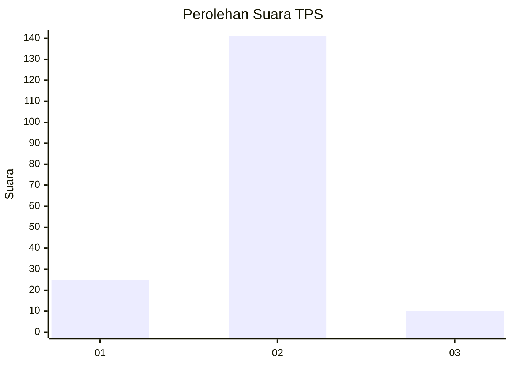
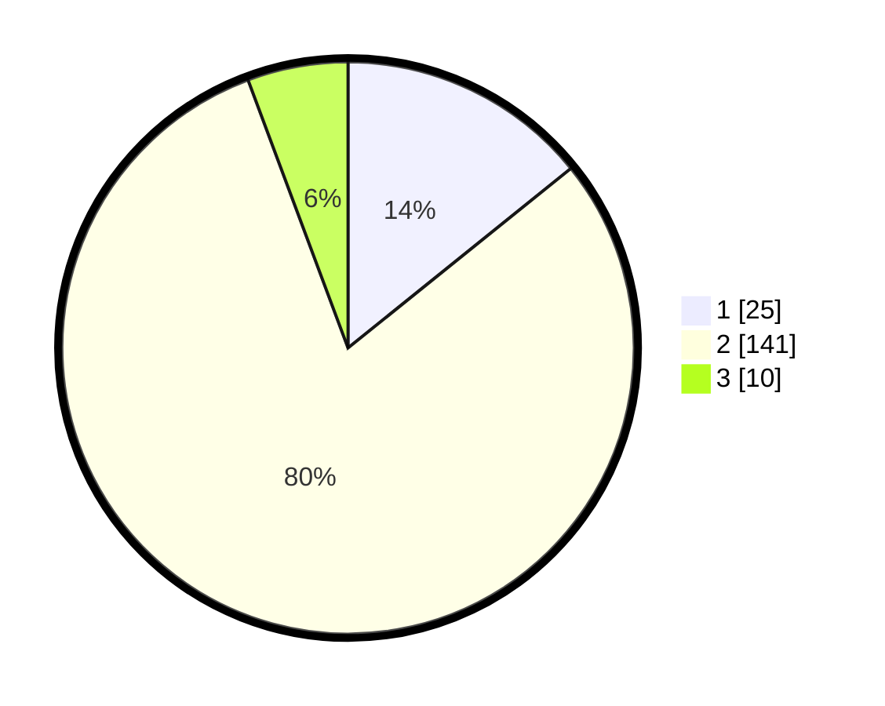

# Hasil

## Grafik

## Tabel

| No. | Nama Paslon    | Suara | Suara (raw) | Persentase |
|:--- |:-------------- | -----:| -----------:| ----------:|
| 1   | ANIES MUHAIMIN | 25    | [25][p-1]   | 14,20      |
| 2   | PRABOWO GIBRAN | 141   | [141][p-2]  | 80,11      |
| 3   | GANJAR MAHFUD  | 10    | [10][p-3]   | 5,68       |

[p-1]: https://github.com/gigit-pemilu/pemilu-2024-32-jawa-barat/blob/main/pilpres/hitung-suara/sub/32-jawa-barat/sub/13-subang/sub/06-purwadadi/sub/2002-pagon/sub/007-tps/sub/paslon-1.txt
[p-2]: https://github.com/gigit-pemilu/pemilu-2024-32-jawa-barat/blob/main/pilpres/hitung-suara/sub/32-jawa-barat/sub/13-subang/sub/06-purwadadi/sub/2002-pagon/sub/007-tps/sub/paslon-2.txt
[p-3]: https://github.com/gigit-pemilu/pemilu-2024-32-jawa-barat/blob/main/pilpres/hitung-suara/sub/32-jawa-barat/sub/13-subang/sub/06-purwadadi/sub/2002-pagon/sub/007-tps/sub/paslon-3.txt

## Foto C Plano

https://sirekap-obj-formc.kpu.go.id/bfbb/pemilu/ppwp/32/13/06/20/02/3213062002007-20240214-155831--9fa4f3c8-2574-4759-aca4-50f61192acdb.jpg

https://sirekap-obj-formc.kpu.go.id/bfbb/pemilu/ppwp/32/13/06/20/02/3213062002007-20240214-155451--0de9027b-8fb3-4c83-a358-25d334cb7e8e.jpg

https://sirekap-obj-formc.kpu.go.id/bfbb/pemilu/ppwp/32/13/06/20/02/3213062002007-20240214-155730--4d9e0321-1b52-4b95-a473-ba30dbe48583.jpg

## Metadata

| Key        | Value               |
| ---------- | ------------------- |
| Time Stamp | 2024-02-19 06:16:00 |

