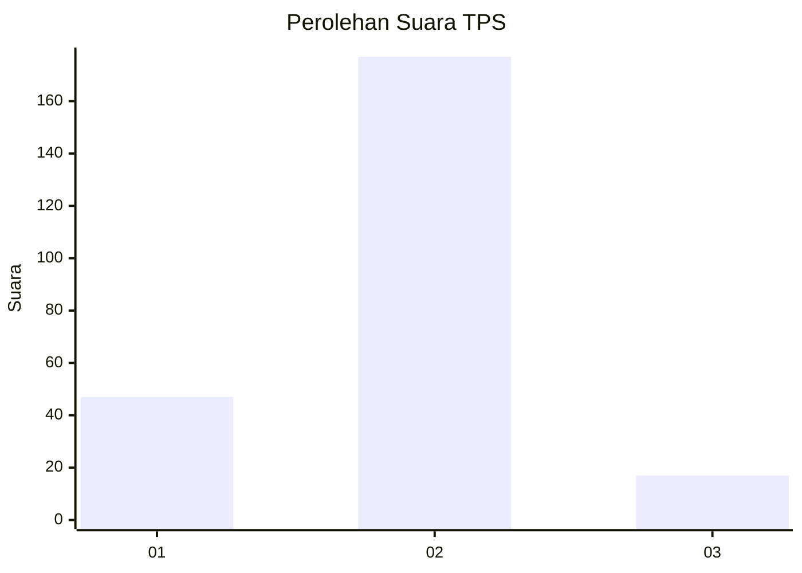
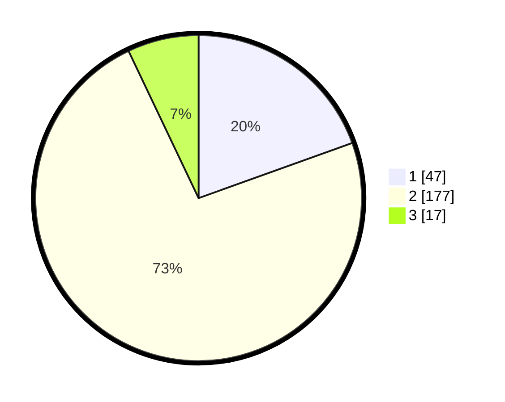

# Hasil

## Grafik

## Tabel

| No. | Nama Paslon    | Suara | Suara (raw) | Persentase |
|:--- |:-------------- | -----:| -----------:| ----------:|
| 1   | ANIES MUHAIMIN | 47    | [47][p-1]   | 19,50      |
| 2   | PRABOWO GIBRAN | 177   | [177][p-2]  | 73,44      |
| 3   | GANJAR MAHFUD  | 17    | [17][p-3]   | 7,05       |

[p-1]: https://github.com/gigit-pemilu/pemilu-2024-32-jawa-barat/blob/main/pilpres/hitung-suara/sub/32-jawa-barat/sub/13-subang/sub/07-pagaden/sub/2004-gunungsembung/sub/003-tps/sub/paslon-1.txt
[p-2]: https://github.com/gigit-pemilu/pemilu-2024-32-jawa-barat/blob/main/pilpres/hitung-suara/sub/32-jawa-barat/sub/13-subang/sub/07-pagaden/sub/2004-gunungsembung/sub/003-tps/sub/paslon-2.txt
[p-3]: https://github.com/gigit-pemilu/pemilu-2024-32-jawa-barat/blob/main/pilpres/hitung-suara/sub/32-jawa-barat/sub/13-subang/sub/07-pagaden/sub/2004-gunungsembung/sub/003-tps/sub/paslon-3.txt

## Foto C Plano

https://sirekap-obj-formc.kpu.go.id/ad19/pemilu/ppwp/32/13/07/20/04/3213072004003-20240214-204224--2b860f5e-4adf-41e7-93e5-fdb292a7c2e3.jpg

https://sirekap-obj-formc.kpu.go.id/ad19/pemilu/ppwp/32/13/07/20/04/3213072004003-20240214-204301--f150d6a2-743a-45dd-add2-8726ca133a1d.jpg

https://sirekap-obj-formc.kpu.go.id/ad19/pemilu/ppwp/32/13/07/20/04/3213072004003-20240215-015258--c50beb01-b919-4743-8263-d5e61d7c1cb1.jpg

## Metadata

| Key        | Value               |
| ---------- | ------------------- |
| Time Stamp | 2024-02-19 06:16:00 |

