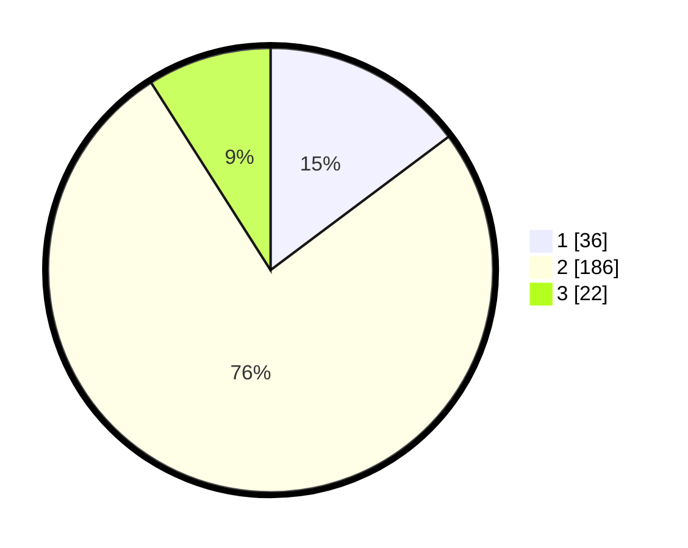

# Hasil

## Grafik

## Tabel

| No. | Nama Paslon    | Suara | Suara (raw) | Persentase |
|:--- |:-------------- | -----:| -----------:| ----------:|
| 1   | ANIES MUHAIMIN | 36    | [36][p-1]   | 14,75      |
| 2   | PRABOWO GIBRAN | 186   | [186][p-2]  | 76,23      |
| 3   | GANJAR MAHFUD  | 22    | [22][p-3]   | 9,02       |

[p-1]: https://github.com/gigit-pemilu/pemilu-2024-32-jawa-barat/blob/main/pilpres/hitung-suara/sub/32-jawa-barat/sub/13-subang/sub/07-pagaden/sub/2004-gunungsembung/sub/010-tps/sub/paslon-1.txt
[p-2]: https://github.com/gigit-pemilu/pemilu-2024-32-jawa-barat/blob/main/pilpres/hitung-suara/sub/32-jawa-barat/sub/13-subang/sub/07-pagaden/sub/2004-gunungsembung/sub/010-tps/sub/paslon-2.txt
[p-3]: https://github.com/gigit-pemilu/pemilu-2024-32-jawa-barat/blob/main/pilpres/hitung-suara/sub/32-jawa-barat/sub/13-subang/sub/07-pagaden/sub/2004-gunungsembung/sub/010-tps/sub/paslon-3.txt

## Foto C Plano

https://sirekap-obj-formc.kpu.go.id/4fc4/pemilu/ppwp/32/13/07/20/04/3213072004010-20240215-021848--35b7ed93-6b11-4bba-a024-e8b889116fb5.jpg

https://sirekap-obj-formc.kpu.go.id/4fc4/pemilu/ppwp/32/13/07/20/04/3213072004010-20240215-022002--d6dd904f-672b-457c-8504-90c4ebd862a2.jpg

https://sirekap-obj-formc.kpu.go.id/4fc4/pemilu/ppwp/32/13/07/20/04/3213072004010-20240215-022108--e76eecbc-4d98-4c7f-812a-fabb626a3732.jpg

## Metadata

| Key        | Value               |
| ---------- | ------------------- |
| Time Stamp | 2024-02-15 05:00:24 |

