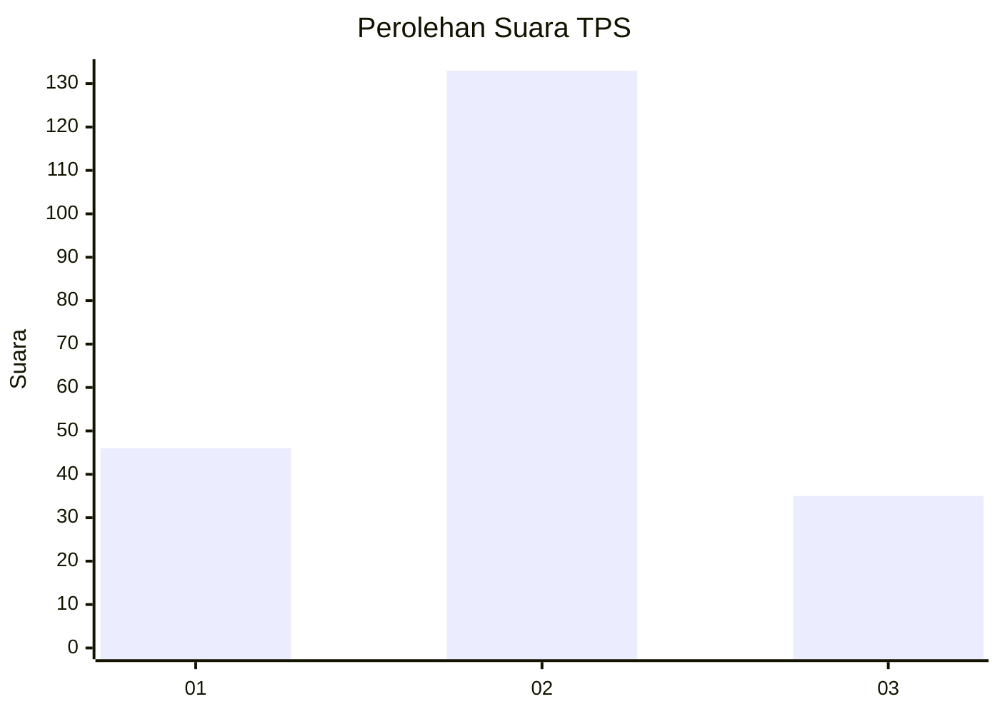

# Hasil

## Grafik

## Tabel

| No. | Nama Paslon    | Suara | Suara (raw) | Persentase |
|:--- |:-------------- | -----:| -----------:| ----------:|
| 1   | ANIES MUHAIMIN | 46    | [46][p-1]   | 21,50      |
| 2   | PRABOWO GIBRAN | 133   | [133][p-2]  | 62,15      |
| 3   | GANJAR MAHFUD  | 35    | [35][p-3]   | 16,36      |

[p-1]: https://github.com/gigit-pemilu/pemilu-2024/blob/main/pilpres/hitung-suara/sub/32-jawa-barat/sub/13-subang/sub/07-pagaden/sub/2011-pagaden/sub/010-tps/sub/paslon-1.txt
[p-2]: https://github.com/gigit-pemilu/pemilu-2024/blob/main/pilpres/hitung-suara/sub/32-jawa-barat/sub/13-subang/sub/07-pagaden/sub/2011-pagaden/sub/010-tps/sub/paslon-2.txt
[p-3]: https://github.com/gigit-pemilu/pemilu-2024/blob/main/pilpres/hitung-suara/sub/32-jawa-barat/sub/13-subang/sub/07-pagaden/sub/2011-pagaden/sub/010-tps/sub/paslon-3.txt

## Foto C Plano

https://sirekap-obj-formc.kpu.go.id/4974/pemilu/ppwp/32/13/07/20/11/3213072011010-20240215-021713--67d27b02-26f4-4a8e-a7a5-45432cf7c8fd.jpg

https://sirekap-obj-formc.kpu.go.id/4974/pemilu/ppwp/32/13/07/20/11/3213072011010-20240215-021837--289a2b32-7151-4dea-9491-ac075973b70a.jpg

https://sirekap-obj-formc.kpu.go.id/4974/pemilu/ppwp/32/13/07/20/11/3213072011010-20240215-021914--36fd2d64-9ce8-4b89-9ec7-06a358f60fac.jpg

## Metadata

| Key        | Value               |
| ---------- | ------------------- |
| Time Stamp | 2024-02-19 13:00:00 |

