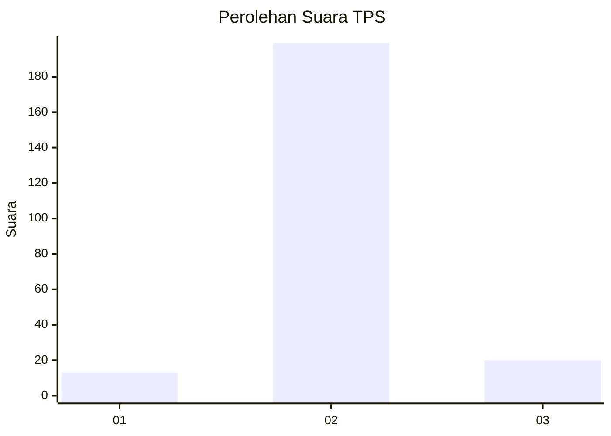
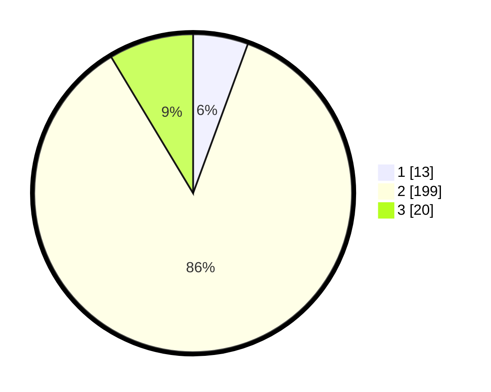

# Hasil

## Grafik

## Tabel

| No. | Nama Paslon    | Suara | Suara (raw) | Persentase |
|:--- |:-------------- | -----:| -----------:| ----------:|
| 1   | ANIES MUHAIMIN | 13    | [13][p-1]   | 5,60       |
| 2   | PRABOWO GIBRAN | 199   | [199][p-2]  | 85,78      |
| 3   | GANJAR MAHFUD  | 20    | [20][p-3]   | 8,62       |

[p-1]: https://github.com/gigit-pemilu/pemilu-2024/blob/main/pilpres/hitung-suara/sub/32-jawa-barat/sub/13-subang/sub/08-binong/sub/2016-karangwangi/sub/007-tps/sub/paslon-1.txt
[p-2]: https://github.com/gigit-pemilu/pemilu-2024/blob/main/pilpres/hitung-suara/sub/32-jawa-barat/sub/13-subang/sub/08-binong/sub/2016-karangwangi/sub/007-tps/sub/paslon-2.txt
[p-3]: https://github.com/gigit-pemilu/pemilu-2024/blob/main/pilpres/hitung-suara/sub/32-jawa-barat/sub/13-subang/sub/08-binong/sub/2016-karangwangi/sub/007-tps/sub/paslon-3.txt

## Foto C Plano

https://sirekap-obj-formc.kpu.go.id/fa6f/pemilu/ppwp/32/13/08/20/16/3213082016007-20240215-002510--281fea00-1cdf-45b0-b8c4-b5bcb6934e7d.jpg

https://sirekap-obj-formc.kpu.go.id/fa6f/pemilu/ppwp/32/13/08/20/16/3213082016007-20240215-002620--96ca6f82-12b9-4980-9456-2e0e4e90e5e3.jpg

https://sirekap-obj-formc.kpu.go.id/fa6f/pemilu/ppwp/32/13/08/20/16/3213082016007-20240215-003205--7d7d39ac-f7d5-4ab8-8a10-8da53c032093.jpg

## Metadata

| Key        | Value               |
| ---------- | ------------------- |
| Time Stamp | 2024-02-20 14:00:00 |

