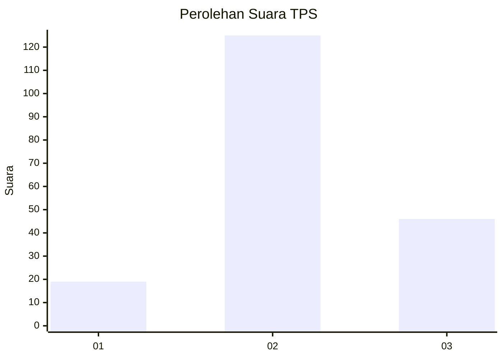
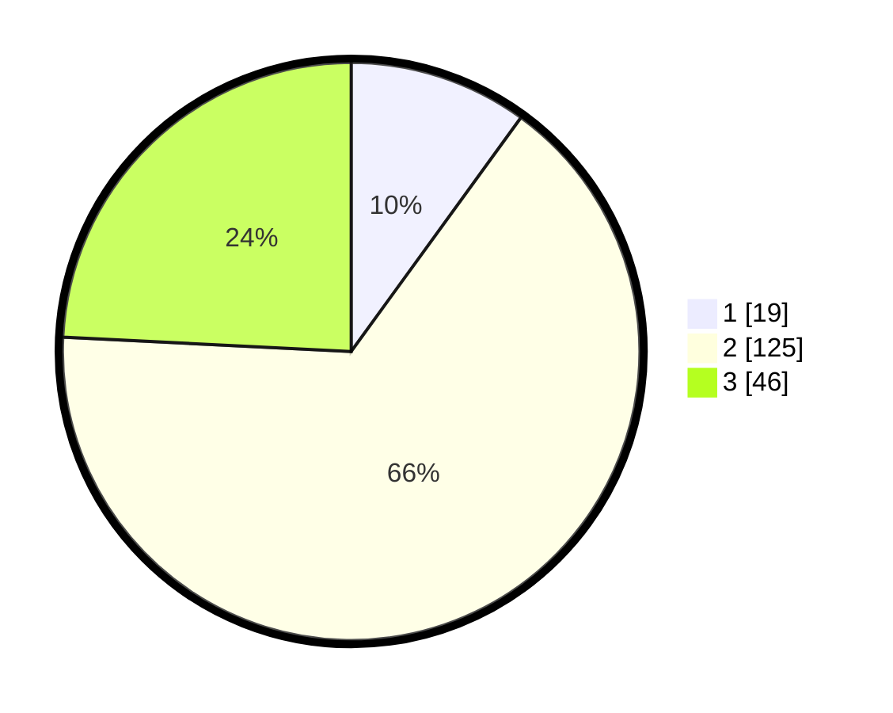

# Hasil

## Grafik

## Tabel

| No. | Nama Paslon    | Suara | Suara (raw) | Persentase |
|:--- |:-------------- | -----:| -----------:| ----------:|
| 1   | ANIES MUHAIMIN | 19    | [19][p-1]   | 10,00      |
| 2   | PRABOWO GIBRAN | 125   | [125][p-2]  | 65,79      |
| 3   | GANJAR MAHFUD  | 46    | [46][p-3]   | 24,21      |

[p-1]: https://github.com/gigit-pemilu/pemilu-2024-32-jawa-barat/blob/main/pilpres/hitung-suara/sub/32-jawa-barat/sub/13-subang/sub/09-ciasem/sub/2001-ciasem-girang/sub/001-tps/sub/paslon-1.txt
[p-2]: https://github.com/gigit-pemilu/pemilu-2024-32-jawa-barat/blob/main/pilpres/hitung-suara/sub/32-jawa-barat/sub/13-subang/sub/09-ciasem/sub/2001-ciasem-girang/sub/001-tps/sub/paslon-2.txt
[p-3]: https://github.com/gigit-pemilu/pemilu-2024-32-jawa-barat/blob/main/pilpres/hitung-suara/sub/32-jawa-barat/sub/13-subang/sub/09-ciasem/sub/2001-ciasem-girang/sub/001-tps/sub/paslon-3.txt

## Foto C Plano

https://sirekap-obj-formc.kpu.go.id/d71a/pemilu/ppwp/32/13/09/20/01/3213092001001-20240214-155636--9cccd20f-6a4a-4806-a830-7e2483b0939e.jpg

https://sirekap-obj-formc.kpu.go.id/d71a/pemilu/ppwp/32/13/09/20/01/3213092001001-20240215-023726--bd4be925-8284-4136-94f3-94da42cd1536.jpg

https://sirekap-obj-formc.kpu.go.id/d71a/pemilu/ppwp/32/13/09/20/01/3213092001001-20240215-023539--2a497d00-630b-42ba-b873-aae851455316.jpg

## Metadata

| Key        | Value               |
| ---------- | ------------------- |
| Time Stamp | 2024-02-19 19:00:00 |

