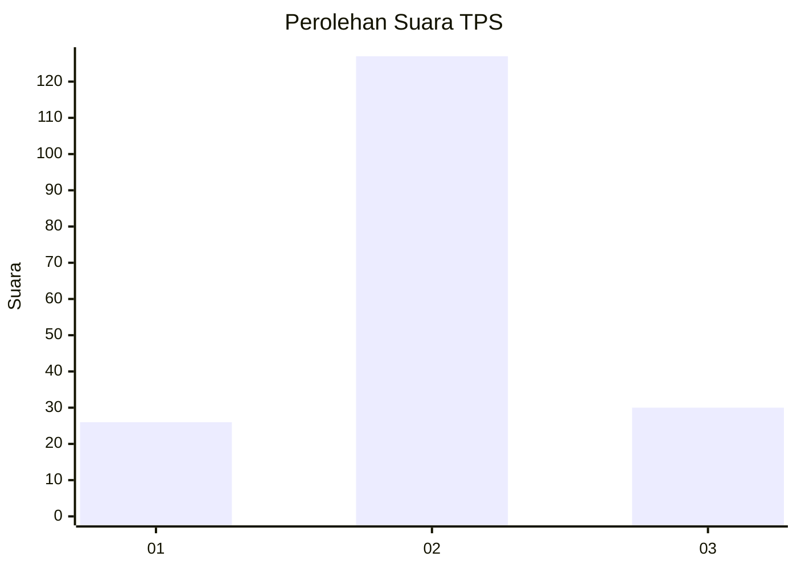
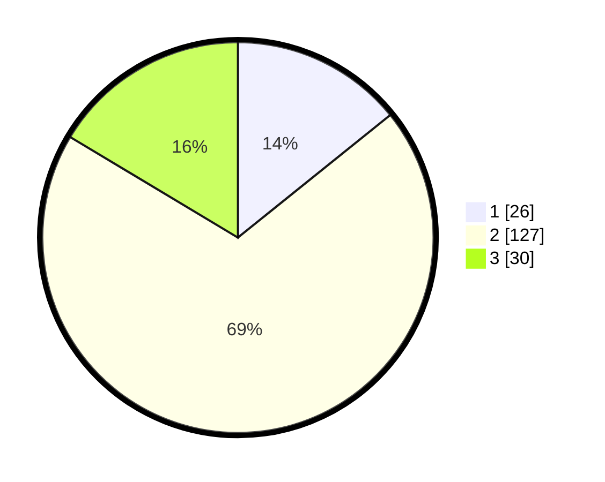

# Hasil

## Grafik

## Tabel

| No. | Nama Paslon    | Suara | Suara (raw) | Persentase |
|:--- |:-------------- | -----:| -----------:| ----------:|
| 1   | ANIES MUHAIMIN | 26    | [26][p-1]   | 14,21      |
| 2   | PRABOWO GIBRAN | 127   | [127][p-2]  | 69,40      |
| 3   | GANJAR MAHFUD  | 30    | [30][p-3]   | 16,39      |

[p-1]: https://github.com/gigit-pemilu/pemilu-2024-32-jawa-barat/blob/main/pilpres/hitung-suara/sub/32-jawa-barat/sub/13-subang/sub/09-ciasem/sub/2001-ciasem-girang/sub/005-tps/sub/paslon-1.txt
[p-2]: https://github.com/gigit-pemilu/pemilu-2024-32-jawa-barat/blob/main/pilpres/hitung-suara/sub/32-jawa-barat/sub/13-subang/sub/09-ciasem/sub/2001-ciasem-girang/sub/005-tps/sub/paslon-2.txt
[p-3]: https://github.com/gigit-pemilu/pemilu-2024-32-jawa-barat/blob/main/pilpres/hitung-suara/sub/32-jawa-barat/sub/13-subang/sub/09-ciasem/sub/2001-ciasem-girang/sub/005-tps/sub/paslon-3.txt

## Foto C Plano

https://sirekap-obj-formc.kpu.go.id/ee5d/pemilu/ppwp/32/13/09/20/01/3213092001005-20240214-214453--a68f97b7-9f09-4a0e-8dd5-03ea2ea79b8d.jpg

https://sirekap-obj-formc.kpu.go.id/ee5d/pemilu/ppwp/32/13/09/20/01/3213092001005-20240214-214552--09e2dfd9-5647-4d31-a4cc-b7d52c959d9a.jpg

https://sirekap-obj-formc.kpu.go.id/ee5d/pemilu/ppwp/32/13/09/20/01/3213092001005-20240214-214628--4b3fb943-d4ac-4c1e-aff3-3f2beb096618.jpg

## Metadata

| Key        | Value               |
| ---------- | ------------------- |
| Time Stamp | 2024-02-20 11:00:00 |

