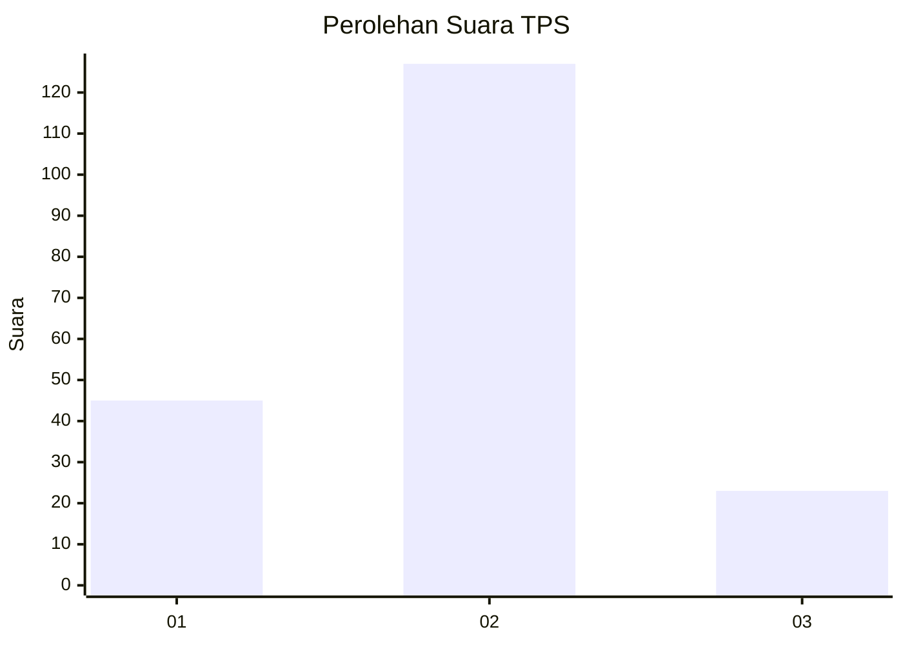
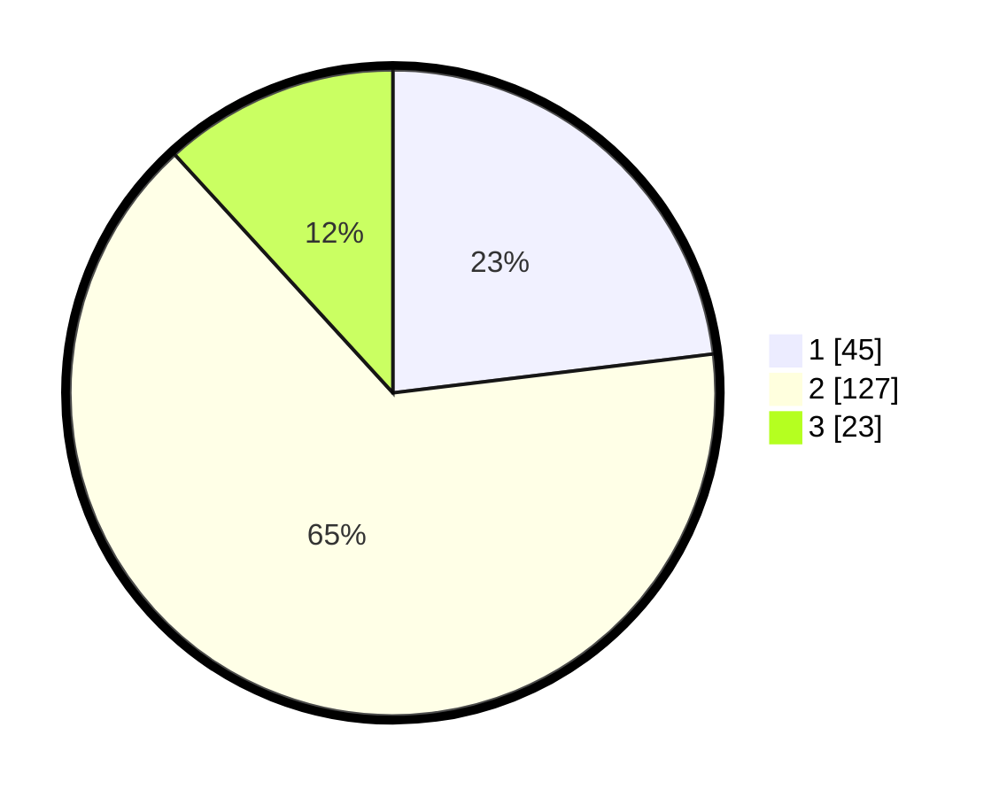

# Hasil

## Grafik

## Tabel

| No. | Nama Paslon    | Suara | Suara (raw) | Persentase |
|:--- |:-------------- | -----:| -----------:| ----------:|
| 1   | ANIES MUHAIMIN | 45    | [45][p-1]   | 23,08      |
| 2   | PRABOWO GIBRAN | 127   | [127][p-2]  | 65,13      |
| 3   | GANJAR MAHFUD  | 23    | [23][p-3]   | 11,79      |

[p-1]: https://github.com/gigit-pemilu/pemilu-2024-32-jawa-barat/blob/main/pilpres/hitung-suara/sub/32-jawa-barat/sub/13-subang/sub/09-ciasem/sub/2001-ciasem-girang/sub/009-tps/sub/paslon-1.txt
[p-2]: https://github.com/gigit-pemilu/pemilu-2024-32-jawa-barat/blob/main/pilpres/hitung-suara/sub/32-jawa-barat/sub/13-subang/sub/09-ciasem/sub/2001-ciasem-girang/sub/009-tps/sub/paslon-2.txt
[p-3]: https://github.com/gigit-pemilu/pemilu-2024-32-jawa-barat/blob/main/pilpres/hitung-suara/sub/32-jawa-barat/sub/13-subang/sub/09-ciasem/sub/2001-ciasem-girang/sub/009-tps/sub/paslon-3.txt

## Foto C Plano

https://sirekap-obj-formc.kpu.go.id/47ab/pemilu/ppwp/32/13/09/20/01/3213092001009-20240214-214527--79d6b287-66ba-461f-b440-ec35cc3672f2.jpg

https://sirekap-obj-formc.kpu.go.id/47ab/pemilu/ppwp/32/13/09/20/01/3213092001009-20240214-214648--25c1f7a0-9689-4a63-b70e-ef7f4866ee17.jpg

https://sirekap-obj-formc.kpu.go.id/47ab/pemilu/ppwp/32/13/09/20/01/3213092001009-20240214-214742--013f74fe-d2eb-4b15-911e-a6c503ba0649.jpg

## Metadata

| Key        | Value               |
| ---------- | ------------------- |
| Time Stamp | 2024-02-19 14:00:00 |

